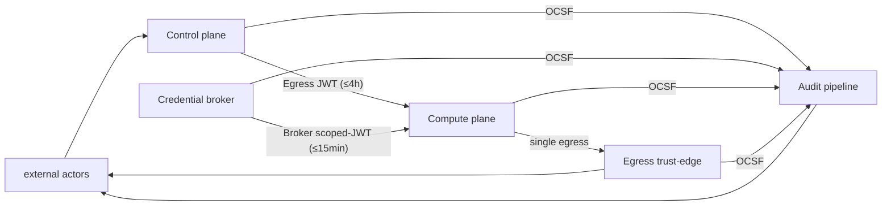

<!-- SPDX-License-Identifier: FSL-1.1-Apache-2.0 -->
<!-- Copyright (c) 2025 Open Computer Use Contributors -->

---
status: proposed
last-reviewed: 2026-05-27
owner: "@Wide-Moat/architects"
applies-to: next/v1
---

## 1. Purpose and scope

Our scope: `MCP interface / control-plane RPC → guest agent → sandbox runtime → Egress trust-edge + Credential broker`. Everything else is either an external actor (§3) or an outbound endpoint behind the egress policy.

Ownership per row is named in [`02-nfrs.md`](manifesto/02-nfrs.md) §"Scope ownership": DELIVER (we ship + are accountable), ENABLE (we publish the contract/telemetry, customer owns the policy), REVISIT (claims more than our scope; flagged for re-cut). §02 marks each REVISIT row inline as `[REVISIT — non-gating]` so CI and verifier passes do not enforce it; the substantive re-cut of those rows lands in a follow-up PR.

Product invariant from [NFR-SEC-16](manifesto/02-nfrs.md): the distributed configuration ships no outbound paths to vendor-controlled endpoints. On-prem deployments use only outbound paths the customer enabled.

Measurable targets are in [`02-nfrs.md`](manifesto/02-nfrs.md); component internals are in [`components/`](./components/); threat content is out of scope here and lands when the threat-model artifact opens.

## 2. Drawn zones

| # | Zone | One-line role | §02 anchor |
|---|---|---|---|
| 1 | **Control plane** | Orchestrator + RPC surface + session lifecycle + MCP server. Single instance per deployment. Holds no outbound path to upstream; all upstream traffic originates in the Compute plane and traverses the Egress trust-edge. The Control plane is not a model proxy. | [NFR-IC-04](manifesto/02-nfrs.md) |
| 2 | **Credential broker** | Per-VM secrets-injection service. Host-side. Bound to loopback / vsock / UDS. Holds real upstream creds; guest never does. | [NFR-SEC-23](manifesto/02-nfrs.md) |
| 3 | **Compute plane** | Session sandbox, one per session, lifecycle bound to session. Runtime tier per [§02 "Sandbox tier — workload-driven selection"](manifesto/02-nfrs.md): `runc` for solo / dev; `gVisor` for v1 hardened; microVM (hardware-virt) for post-v1. Guest agent is PID 1. Cross-session network reachability disabled per [NFR-SEC-22](manifesto/02-nfrs.md); per-tenant network isolation is a deployment property of this zone. | [NFR-SEC-02](manifesto/02-nfrs.md) |
| 4 | **Egress trust-edge** | Single outbound path. Network-bound egress identity per [NFR-SEC-27](manifesto/02-nfrs.md) — request arrival from the sandbox is the identity. Transparent pass-through by default; MITM with customer CA opt-in (DLP-ICAP is a configuration of MITM, not a third mode). MCP allow-list enforcement sits here. AI-guardrail / prompt-content policy is customer's own AI gateway, not ours ([NFR-COMP-26](manifesto/02-nfrs.md) revisit). | [NFR-SEC-05](manifesto/02-nfrs.md) |
| 5 | **Audit pipeline** | Durable bus + hash-chained store + bridges to customer sinks. Retention floor, RPO, and tamper-evidence differ from Control plane, so it is its own zone. Compute-time metering emits as audit events on this pipeline. | [NFR-SEC-03](manifesto/02-nfrs.md) |

Secondary NFR anchors per zone (consolidated to satisfy the CLAUDE.md ≤ 3-links-per-H2 rule):

- Control plane — [NFR-FLEX-14](manifesto/02-nfrs.md), [NFR-REL-01](manifesto/02-nfrs.md).
- Credential broker — [NFR-SEC-29](manifesto/02-nfrs.md), [NFR-SEC-25](manifesto/02-nfrs.md).
- Compute plane — [NFR-SEC-14](manifesto/02-nfrs.md), [NFR-SEC-22](manifesto/02-nfrs.md), [NFR-FLEX-02](manifesto/02-nfrs.md). Performance targets for this zone live in component specs.
- Egress trust-edge — [NFR-SEC-08](manifesto/02-nfrs.md), [NFR-SEC-17](manifesto/02-nfrs.md), [NFR-SEC-27](manifesto/02-nfrs.md), [NFR-FLEX-15](manifesto/02-nfrs.md), [NFR-COMP-28](manifesto/02-nfrs.md).
- Audit pipeline — [NFR-REL-12](manifesto/02-nfrs.md), [NFR-REL-03](manifesto/02-nfrs.md), [NFR-COMP-01](manifesto/02-nfrs.md), [NFR-COST-05](manifesto/02-nfrs.md), [NFR-MAINT-AUDIT-SCHEMA](manifesto/02-nfrs.md).

**Skill registry boundary** is reserved as a TBD-stub per CLAUDE.md §v1-non-goals.

Cross-component encryption-in-transit invariant per [NFR-SEC-37](manifesto/02-nfrs.md): inter-zone traffic between Wide-Moat components is encrypted in transit. Two carve-outs apply, both decrypted by design and re-encrypted on the upstream leg: (a) the Egress trust-edge inspection point when MITM-inspecting mode is active (see §7); (b) the DLP-ICAP hook inside that mode.

## 3. External actors

Outbound endpoints behind the egress policy — LLM upstream, customer MCP servers, object stores, internal APIs — are drawn in the diagram for visual orientation only. They are not actors against our contracts: the Egress trust-edge gates them and the Credential broker selects the scoped token.

| Actor | Boundary it crosses | Contract | Optional? |
|---|---|---|---|
| MCP client (the thing that calls our MCP server) | client → Control plane | MCP authorization spec, audience-validated tokens | required |
| Customer IdP (SAML / OIDC) | IdP → Control plane | relying-party (we are RP) | required on the hardened tier and above |
| Customer SIEM | Audit pipeline → SIEM | OCSF schema + bridge transport (transports per [NFR-MAINT-AUDIT-SCHEMA](manifesto/02-nfrs.md)) | optional bridge — file-system sink on the solo / dev tier |
| Customer KMS / HSM | Credential broker / Audit pipeline → KMS | PKCS#11 + KMIP | optional — hardened tier and above only; solo / dev tier uses host-local keys |
| Customer outbound proxy | Egress trust-edge → customer proxy | chained-proxy contract | optional |
| Customer DLP-ICAP service | Egress trust-edge → ICAP | ICAP req-mod + resp-mod | optional — engaged only in MITM-inspecting mode |
| SOAR (incident automation) | Control plane ↔ SOAR | signed webhook + admin API | optional |
| Admin / Operator (PAM-JIT human) | Operator → Control plane | short-lived SAML-asserted attribute claim; no shared service accounts ([NFR-COMP-29](manifesto/02-nfrs.md)) | required |
| Transparency log | Audit pipeline → transparency log | submission envelope; log operator signs the Merkle head (§12 Open question 4) | optional — choose public or customer-private |

## 4. Per-tenant isolation menu

| Tier | Mechanism | Cross-tenant boundary | Where it sits |
|---|---|---|---|
| T0 logical | row-level filter; tenant_id column + app-side check | shared kernel, shared substrate | solo / dev / single-operator |
| T1 namespace | namespace + network policy + role-based access control + resource quota | shared kernel, shared control plane | single-tenant agent execution, OR multi-tenant for non-agent-execution workloads only |
| T2 VPC / VNet | per-tenant VPC, no peering | shared substrate, separate network | NPI baseline |
| T3 dedicated cluster | dedicated control plane per tenant | separate control plane, shared substrate | common deployment shape for DORA-CIF workloads |

**Multi-tenant agent-execution invariant.** Where the Compute plane runs LLM-issued tool calls / code from more than one tenant on the same node, the substrate MUST be hardware-virt OR user-space-kernel — not bare `runc`. Bare `runc` multi-tenant agent execution is forbidden; adversarial agent-issued code is not bounded by data classification. T1 namespace remains valid for single-tenant agent execution or for multi-tenant workloads that do not execute LLM-issued code (admin UIs, read-only dashboards, batch-data jobs).

Higher-isolation tiers (dedicated bare-metal node pool per tenant; customer-owned hardware in customer datacenter) are tracked in open question §12 item 1 ([#148](https://github.com/Wide-Moat/open-computer-use/issues/148)) as candidates for later promotion. Promote when a named workload requires them.

Boundary properties in §5–§11 hold for every tier; the tier picks the substrate, not the invariants. Measurable cross-tenant grading is in the same open question.

## 5. Trust-zone diagram

Canonical source: [`docs/architecture/diagrams/02-trust-boundaries.mmd`](./diagrams/02-trust-boundaries.mmd) — the canonical file encodes the convention "solid border = always present; dashed border = optional configuration" (CPROXY, SOAR, ICAP, SIEM, KMS, TLOG drawn dashed). The inline block above is a simplified overview that does not encode dashed-vs-solid; for the optional-vs-required reading, use the canonical file or §3 actor table.

## 6. Data classification taxonomy

Eight content-keyed classes. Per-tenant data residency ([NFR-COMP-13](manifesto/02-nfrs.md)) constrains where any class above PUBLIC may sit on the substrate.

| Class | NYDFS NPI | GLBA NPI | SEC MNPI | GDPR Art. 4 / 9 | EU AI Act | PCI DSS v4.0 | Retention floor |
|---|---|---|---|---|---|---|---|
| **PUBLIC** | n/a | excluded | n/a | not personal data | n/a | n/a | none |
| **INTERNAL** | n/a | n/a | n/a | not personal data | n/a | n/a | 1 yr ops |
| **CONFIDENTIAL (PII)** | NPI on consumers | NPI | n/a | personal data Art. 4(1) | Art. 10 training data | track 2 / track 1 (non-PAN) | NYDFS §500.13 |
| **RESTRICTED (NPI-financial)** | NPI tied to financial product | NPI | n/a if not material | personal data; Art. 6 lawful basis | high-risk-AI input | PAN, expiry, service code | 5 yr (CFR-cited financial-institution rules) |
| **RESTRICTED (MNPI)** | n/a | n/a | Reg FD / 10b-5 | n/a directly | n/a | n/a | until public + 2 yr legal hold |
| **SENSITIVE (special category)** | NPI plus health / biometric | NPI | n/a | Art. 9 special category | Annex III categories | n/a | per Art. 5(1)(e) |
| **REGULATED-AUDIT** | NYDFS §500.6 audit trail | n/a | SOX-trail | Art. 30 records of processing | Art. 12 logs of high-risk AI | PCI Req 10 | 7 y default / 10 y configurable (see §10) |
| **CRYPTO-KEYS / SECRETS** | implicit under §500.15(a) | implicit under Safeguards Rule | n/a | implicit | implicit | PCI Req 3.6 | rotation policy is the floor |

The default solo / dev deployment runs on `runc`, so its default scope is PUBLIC + INTERNAL. CONFIDENTIAL+ workloads require the hardened tier (gVisor) or, post-v1, the microVM tier (per [§02 "Sandbox tier — workload-driven selection"](manifesto/02-nfrs.md)) plus opt-in BYOK + customer-managed audit sink. Tier selection is workload-trust-driven, not data-class-driven (forbidden by AP-13).

Prompt content filtering, redaction, and AI-guardrail policy (PII masking, prompt-injection detection, jailbreak detection) are not our scope — that responsibility lives with the customer's AI gateway (commercial AI-gateway product or in-perimeter model with its own guardrails). Layer 3 routes the traffic and audits the egress event; what the gateway does with the prompt is its contract, not ours. [NFR-COMP-26](manifesto/02-nfrs.md) to be revisited in §02.

## 7. Egress posture — two modes

Two modes on the same binary, switched by configuration ([NFR-FLEX-15](manifesto/02-nfrs.md)).

| Mode | Default? | TLS termination | Customer CA in sandbox trust store | Plaintext carve-out ([NFR-SEC-37](manifesto/02-nfrs.md)) |
|---|---|---|---|---|
| **Transparent pass-through** | yes (minimal default; one-click solo install path) | none — proxy is in path, does not terminate | no | none |
| **MITM-inspecting** | opt-in | terminated at proxy, re-encrypted upstream | yes | proxy decrypt / re-encrypt segment |

DLP-ICAP ([NFR-COMP-28](manifesto/02-nfrs.md)) is a configuration of the MITM-inspecting mode, not a third mode: it adds an ICAP req-mod / resp-mod inspection hook between the decrypt and re-encrypt steps, with a corresponding plaintext segment at the ICAP wire.

Fail-closed: if the egress proxy is unreachable, the Compute plane drops outbound traffic, never bypasses the proxy. Same property on the IdP → Control plane path: IdP unreachable → new sessions denied; in-flight sessions continue under their existing token until either TTL expiry or an explicit revoke event.

Revoke is independent of IdP reachability. The Control plane holds a session denylist (kill-switch state). On the Compute-plane path the denylist is checked directly on every RPC. On the Egress trust-edge path the denylist is consulted indirectly: the Credential broker refuses to reissue scoped-JWT for revoked sessions, and the scoped-JWT TTL ([NFR-SEC-29](manifesto/02-nfrs.md), ≤ 15 min) caps egress revoke propagation on that path. Revoke propagation target is ≤5 min platform-wide per [NFR-SEC-04](manifesto/02-nfrs.md), independently of whether the customer IdP is reachable at revoke time. Kill switch ([NFR-SEC-01](manifesto/02-nfrs.md)) shares the same denylist; its ≤30 s p99 SLA covers Compute-plane stop, not the slower upstream-credential revoke path. The IdP participates in token issue, not in revoke — that is why ≤5 min revoke holds even during an IdP outage, which is the incident the target exists for.

Component-spec wiring lands under [`components/`](./components/) per [PROCESS.md](./PROCESS.md) when the egress-proxy spec opens.

## 8. Workload-identity floor

Token taxonomy is canonical here and matches [`manifesto/02-nfrs.md`](manifesto/02-nfrs.md) §"Token TTL taxonomy" verbatim. Three classes, each named, each with its own scope, TTL, signer, and consumer.

| Token class | Scope | TTL | Consumer | §02 anchor |
|---|---|---|---|---|
| **Egress JWT** | per session (Control plane → Compute plane; bound to `container_name`) | ≤ 4 h | Compute plane (guest agent) | NFR-SEC-10 |
| **Generic internal token** | inter-component RPC (Control plane ↔ broker ↔ audit, host-side) | ≤ 60 min | host-side service-to-service | NFR-SEC-23 |
| **Broker scoped-JWT** | per-resource (one filesystem prefix / one upstream API-key class) | ≤ 15 min | Compute plane consuming a brokered resource | NFR-SEC-29 |

| Property | Solo / dev tier | Hardened tier and above (v1 gVisor; microVM post-v1) | §02 anchor |
|---|---|---|---|
| Inter-component identity | Host-local signing key bound to `container_name` | Workload identity from customer PKI per tenant | NFR-SEC-26 / NFR-SEC-09 |
| Identity trust root | host-local signing key | HSM-rooted, FIPS 140-3 L3 | NFR-FLEX-04 |
| Tenant DEK rotation | ≤90 d | ≤90 d | NFR-SEC-04 |
| Tenant KEK rotation | ≤365 d | ≤365 d | NFR-SEC-04 |
| Revoke latency | ≤5 min | ≤5 min | NFR-SEC-04 |
| Per-tenant trust domain | n/a (single-tenant) | per-tenant trust domain | open question §12 item 1 |
| Internal mTLS substrate | TLS 1.3 enforced at the deployment overlay (substrate choice is a component-spec decision) | same, customer-CA-rooted | NFR-SEC-37 |

NFR anchors for §8 (consolidated): see [NFR-SEC-04](manifesto/02-nfrs.md), [NFR-SEC-09](manifesto/02-nfrs.md), [NFR-SEC-10](manifesto/02-nfrs.md), [NFR-SEC-23](manifesto/02-nfrs.md), [NFR-SEC-26](manifesto/02-nfrs.md), [NFR-SEC-29](manifesto/02-nfrs.md), [NFR-SEC-37](manifesto/02-nfrs.md), [NFR-FLEX-04](manifesto/02-nfrs.md).

Solo / dev tier: identity-binding ([NFR-SEC-09](manifesto/02-nfrs.md)) via host-local signing key on JWT ([NFR-SEC-26](manifesto/02-nfrs.md)); egress trust-store ([NFR-SEC-05](manifesto/02-nfrs.md)) via auto-generated self-signed CA. Hardened tier and above: workload identities from customer PKI + customer-rooted CA.

### 8.1 Signer identity per boundary

Each token class has its own signer; signer identity ties to the workload that issues the token. Solo / dev tier signers are host-local keys; hardened-tier-and-above signers are workload identities from the customer PKI. The full per-boundary table (six artifacts × four columns) lands with the PKI decision — tracked at §12 item 5 ([#152](https://github.com/Wide-Moat/open-computer-use/issues/152)).

## 9. Encryption matrix

Single invariant: inter-component traffic between Wide-Moat components is encrypted in transit ([NFR-SEC-37](manifesto/02-nfrs.md)). Tenant data at rest uses authenticated AES ([NFR-SEC-33](manifesto/02-nfrs.md)). Key custody on the solo / dev tier is host-local; on the hardened tier and above, HSM-rooted via PKCS#11 / KMIP per [NFR-FLEX-04](manifesto/02-nfrs.md). Per-tenant data residency ([NFR-COMP-13](manifesto/02-nfrs.md)) is enforced at Control-plane scheduling and Audit-pipeline routing — not an encryption boundary. The full per-boundary matrix (TLS version, at-rest cipher, key custody, rotation cadence) is component-spec material; it lands with each component spec.

## 10. Audit zone — mandatory in code, pluggable in sinks

Audit pipeline is mandatory in code ([NFR-SEC-03](manifesto/02-nfrs.md) hash-chained; [NFR-REL-12](manifesto/02-nfrs.md) durable bus on critical path; [NFR-COMP-01](manifesto/02-nfrs.md) retention floor — 7 y default, 10 y configurable, machine-enforced by the Audit pipeline retention policy). Sinks are pluggable: file-system at the solo / dev tier; OCSF v1.x JSON bridges to customer SIEM as opt-in per [NFR-MAINT-AUDIT-SCHEMA](manifesto/02-nfrs.md).

The pipeline is drawn as our zone; sinks are external actors. The contract is the OCSF v1.x JSON schema plus bridge transport (see §12 Open question 3).

Tamper-evidence: hash-chained store always; the daily batch is submitted to a transparency log of the customer's choice. The transparency log operator signs the Merkle head; we sign only the submission envelope ([NFR-SEC-03](manifesto/02-nfrs.md)).

## 11. Regulator citation map

Mapping is **indicative, not verbatim**. Verify every cell against the source text before reuse. Layer 3 does not represent these citations as audit evidence by itself; full source-verification is tracked at [#153](https://github.com/Wide-Moat/open-computer-use/issues/153).

| Our zone / boundary | NIST SP 800-207 | NYDFS Part 500 | DORA | EU AI Act | CCM v4 |
|---|---|---|---|---|---|
| Control plane | implicit-trust zone (§2.1) | § 500.7 access privileges (PAM) | Art. 6 ICT risk-management framework | Art. 14 human oversight | IAM-06 |
| Credential broker | PEP / PDP independence (§3, §3.2) | § 500.15(a) encryption + key custody | Art. 28 ICT third-party general | Art. 15 cybersecurity | CEK-08 |
| Compute plane (sandbox) | implicit-trust zone, scoped small | § 500.7 + § 500.15 | Art. 28(4) ITS register of information | Art. 15(4) accuracy, robustness, cybersecurity | IVS-06, IVS-09 |
| Egress trust-edge | PEP (§3.4.1) | § 500.5 vulnerability scanning (segmentation surfaces here, not § 500.7) | Art. 30 key contractual provisions (location of processing) | Art. 14 oversight | IVS-09 segmentation, DSP-05 DLP |
| Audit pipeline | (cross-cutting — no direct ZT mapping) | § 500.6 audit trail; § 500.13 retention policy | Art. 10 detection (logs) | Art. 12 logs of high-risk AI; Art. 19(1) 10-year retention floor | LOG-01, LOG-02 |
| MCP client → Control plane | untrusted → implicit-trust crossing | § 500.7 + § 500.12 MFA | Art. 30 contract clauses | Art. 13 transparency to deployer | IAM-08 |
| Egress trust-edge → upstream | implicit-trust → untrusted crossing | § 500.15 encryption in transit | Art. 28 ICT third-party general | Art. 15 cybersecurity | IVS-09 |
| Audit pipeline → SIEM | implicit-trust → external sink | § 500.6 audit trail readable by covered entity | Art. 10 detection (retention floor cited from SEC 17a-4 / FCA SYSC 9, see §10) | Art. 12 logs accessible | LOG-04 |

## 12. Open questions

1. Cross-tenant isolation grading — [#148](https://github.com/Wide-Moat/open-computer-use/issues/148) — measurable target ("tenant A cannot observe tenant B side-channel") not yet in §02. Also tracks higher-isolation tiers (dedicated hardware, customer-owned cage) as candidates for promotion when a named workload requires them.
2. Control-plane metadata-only gate — [#149](https://github.com/Wide-Moat/open-computer-use/issues/149) — DORA Art. 28(2)(c) requires a measurable gate that no customer payload crosses the Control plane.
3. SIEM-bridge transport and backpressure — [#150](https://github.com/Wide-Moat/open-computer-use/issues/150) — pluggable-sink contract needs measurable transport and end-to-end backpressure target.
4. Transparency-log publishing path — [#151](https://github.com/Wide-Moat/open-computer-use/issues/151) — submission path between Audit pipeline and the external transparency log (auth, retry, RPO if the log is unreachable), plus the prior question of "do we publish at all on the solo / dev tier".
5. PKI tool pick — [#152](https://github.com/Wide-Moat/open-computer-use/issues/152) — §8.1 names signer identity per boundary; the per-boundary signer table lands with the PKI ADR.
