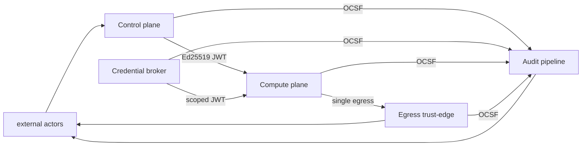

<!-- SPDX-License-Identifier: FSL-1.1-Apache-2.0 -->
<!-- Copyright (c) 2025 Open Computer Use Contributors -->

---
status: draft
last-reviewed: 2026-05-24
owner: "@Wide-Moat/architects"
applies-to: next/v1
---

Names the trust zones, the data classifications, the boundary properties that cross those zones, the signer identity at each boundary, and the regulator vocabulary every boundary must be readable through. Audience per `manifesto/01-audience-and-buyer.md`: InfoSec reviewer and self-hosting developer, same artifact.

## 1. Purpose and scope

Layer 3 is the zoning map: what zones exist, what data classes cross which boundary, who signs what, and how each boundary maps to regulator vocabulary. Measurable targets stay in `02-nfrs.md`; component internals stay in `components/*.md`; threat content stays in Layer 7.

Our scope as a platform is `MCP interface / control-plane RPC → guest agent → sandbox runtime → egress (proxy + credential broker)`. LLM hosting, chat UI, the caller of our MCP interface, customer IdPs, SIEM destinations, KMS — external actors, never zones we own.

Product invariant from NFR-SEC-16: the distributed configuration ships no outbound paths to vendor-controlled endpoints. On-prem deployments use only outbound paths the customer enabled.

## 2. Drawn zones

Five zones appear as subgraphs on the canonical diagram (§5).

Compute plane in this doc is `data-plane` in §02 (NFR-FLEX-12, NFR-MAINT-02) and `VM` in the §02 mermaid. Egress trust-edge is §02's `egress-proxy` (NFR-SEC-05).

| # | Zone | One-line role | §02 anchor |
|---|---|---|---|
| 1 | **Control plane** | Orchestrator + RPC surface + session lifecycle + MCP server + LLM-upstream proxy (we proxy, we do not host). Single instance per deployment. | NFR-IC-04, NFR-FLEX-14, NFR-REL-01 |
| 2 | **Credential broker** | Per-VM secrets-injection service. Host-side. Bound to loopback / vsock / UDS. Holds real upstream creds; guest never does. | NFR-SEC-23, NFR-SEC-29, NFR-SEC-25 |
| 3 | **Compute plane** | Session sandbox, one per session, lifecycle bound to session. Container substrate on the minimal-capability shelf; microVM (Kata-FC / Kata-CH) on the full-capability shelf. Guest agent is PID 1. Cross-session network reachability disabled per NFR-SEC-22; per-tenant network isolation is a deployment property of this zone. | NFR-SEC-02, NFR-SEC-14, NFR-SEC-22, NFR-FLEX-02, NFR-PERF-02/03 |
| 4 | **Egress trust-edge** | Single outbound path. Network-bound egress identity per NFR-SEC-27 — request arrival from the sandbox is the identity. Transparent pass-through by default; MITM with customer-CA opt-in; DLP-ICAP a separate opt-in. MCP allow-list enforcement (NFR-SEC-08) sits here. | NFR-SEC-05, NFR-SEC-08, NFR-SEC-17, NFR-SEC-27, NFR-FLEX-15, NFR-COMP-26, NFR-COMP-28 |
| 5 | **Audit pipeline** | Durable bus + hash-chained store + bridges to customer sinks. Retention floor, RPO, and tamper-evidence differ from control plane, so it is its own zone. Compute-time metering (NFR-COST-05) emits as audit events on this pipeline. | NFR-SEC-03, NFR-REL-12, NFR-REL-03, NFR-COMP-01, NFR-COST-05, NFR-MAINT-AUDIT-SCHEMA |

**Skill registry boundary** is reserved as a TBD-stub per `MANIFESTO.md` non-goals.

Cross-component encryption-in-transit invariant per NFR-SEC-37: every inter-zone arrow is encrypted in transit. The two carve-outs (MITM-proxy when MITM-tier active; DLP-ICAP hook) are listed in §7.

## 3. External actors

| Actor | Boundary it crosses | Contract owned by us |
|---|---|---|
| MCP client (the thing that calls our MCP server) | client → Control plane | yes — MCP authorization spec, audience-validated tokens |
| LLM upstream (Anthropic / Bedrock / Vertex / vLLM / Ollama) | Control plane → upstream | yes — `ModelProvider` abstraction |
| Customer IdP (SAML / OIDC) | IdP → Control plane | partial — we are a relying party |
| Customer SIEM (Splunk / Chronicle / Elastic / QRadar / Sentinel) | Audit pipeline → SIEM | yes — OCSF schema + bridge contract |
| Customer KMS / HSM (PKCS#11 / KMIP) | Credential broker / Audit pipeline → KMS | yes — PKCS#11 + KMIP contract |
| Customer object store (S3 / customer S3-compat) | guest → upstream | partial — guest connects via Egress trust-edge with broker-issued token |
| Customer outbound proxy (Zscaler / Symantec) | Egress trust-edge → customer proxy | yes — chained-proxy contract |
| Customer DLP-ICAP service | Egress trust-edge → ICAP | yes — RFC 3507 ICAP req-mod + resp-mod contract |
| SOAR (incident automation) | Control plane ↔ SOAR | yes — signed webhook + admin API |
| Admin / Operator (PAM-JIT human) | Operator → Control plane | yes — short-lived SAML-asserted attribute claim, no shared service accounts (NFR-COMP-29) |
| Transparency log (external; daily Merkle head) | Audit pipeline → transparency log | yes — RFC 9162 v2 publishing contract (see §13) |

## 4. Per-tenant isolation menu

| Tier | Mechanism | Cross-tenant boundary | Where it sits |
|---|---|---|---|
| T0 logical | row-level filter; tenant_id column + app-side check | shared kernel, shared substrate | dev / single-tenant minimal-capability |
| T1 namespace | Kubernetes namespace + NetworkPolicy + RBAC + ResourceQuota | shared kernel, shared control plane | non-NPI workloads |
| T2 VPC / VNet | per-tenant VPC, no peering | shared substrate, separate network | NPI baseline |
| T3 dedicated cluster | dedicated control plane per tenant | separate control plane, shared substrate | full-capability default for DORA-CIF workloads |
| T4 dedicated hardware | bare-metal node pool per tenant | no shared kernel | trading / settlement |
| T5 dedicated cage | customer-owned hardware in customer datacenter | customer-supplied substrate | defense / sovereign workloads |

Boundary properties in §5–§11 hold for every tier; the tier picks the substrate, not the invariants. Measurable cross-tenant grading: §13.1.

## 5. Trust-zone diagram

Canonical source: `docs/architecture/diagrams/02-trust-boundaries.mmd` (elk renderer, 11 external actors, optional-marking dashed strokes for opt-in configurations). Convention: solid border = always present; dashed border = optional configuration.

## 6. Data classification taxonomy

Eight content-keyed classes. Each class maps inbound to a regulator's term; the inverse mapping (our class → customer class) is what the contract binds. Per-tenant data residency (NFR-COMP-13) constrains where any class above PUBLIC may sit on the substrate.

| Class | NYDFS NPI | GLBA NPI | SEC MNPI | GDPR Art. 4 / 9 | EU AI Act | PCI DSS v4.0 | Retention floor |
|---|---|---|---|---|---|---|---|
| **PUBLIC** | n/a | excluded | n/a | not personal data | n/a | n/a | none |
| **INTERNAL** | n/a | n/a | n/a | not personal data | n/a | n/a | 1 yr ops |
| **CONFIDENTIAL (PII)** | NPI on consumers | NPI | n/a | personal data Art. 4(1) | Art. 10 training data | track 2 / track 1 (non-PAN) | NYDFS §500.13 |
| **RESTRICTED (NPI-financial)** | NPI tied to financial product | NPI | n/a if not material | personal data; Art. 6 lawful basis | high-risk-AI input | PAN, expiry, service code | 5 yr (CFR-cited financial-institution rules) |
| **RESTRICTED (MNPI)** | n/a | n/a | Reg FD / 10b-5 | n/a directly | n/a | n/a | until public + 2 yr legal hold |
| **SENSITIVE (special category)** | NPI plus health / biometric | NPI | n/a | Art. 9 special category | Annex III categories | n/a | per Art. 5(1)(e) |
| **REGULATED-AUDIT** | NYDFS §500.6 audit trail | n/a | SOX-trail | Art. 30 records of processing | Art. 12 logs of high-risk AI | PCI Req 10 | DORA Art. 12(2) 10 yr for critical functions |
| **CRYPTO-KEYS / SECRETS** | implicit under §500.15(a) | implicit under Safeguards Rule | n/a | implicit | implicit | PCI Req 3.6 | rotation policy is the floor |

Minimal-capability default scope: PUBLIC + INTERNAL only. CONFIDENTIAL+ requires opt-in configuration (BYOK + customer-managed audit sink). Minimal-config is not a compliance posture.

Prompt-redaction at the Egress trust-edge before the LLM upstream call is a configurable filter per NFR-COMP-26; redaction events are audited.

## 7. Egress posture — three modes

Three modes on the same binary, switched by configuration (NFR-FLEX-15).

| Mode | Default? | TLS termination | Customer-CA in sandbox trust store | DLP-ICAP hook | Plaintext carve-out (NFR-SEC-37) |
|---|---|---|---|---|---|
| **Transparent pass-through** | yes (minimal default) | none — proxy is in path, does not terminate | no | no | none |
| **MITM-inspecting** | opt-in | terminated at proxy, re-encrypted upstream | yes | no | proxy decrypt / re-encrypt segment |
| **DLP-ICAP** | opt-in (secondary configuration on MITM) | terminated at proxy, ICAP-inspected, re-encrypted | yes | yes — block-or-redact per tenant | ICAP req-mod / resp-mod segment |

Fail-closed: if the egress proxy is unreachable, the Compute plane drops outbound traffic, never bypasses the proxy. Same property on the IdP → Control plane path: IdP unreachable → new sessions denied; in-flight sessions continue under their existing token until TTL expiry.

Component-spec wiring lives in `components/<egress-proxy>.md`.

## 8. Workload-identity floor

| Property | Minimal-capability shelf | Full-capability shelf | §02 anchor |
|---|---|---|---|
| Inter-component identity | Ed25519 JWT bound to `container_name` | SPIFFE SVID per workload | NFR-SEC-26 (minimal), NFR-SEC-09 (full) |
| Token TTL — egress JWT | ≤4 h | ≤4 h | NFR-SEC-10 |
| Token TTL — generic internal | ≤60 min | ≤60 min | NFR-SEC-23 |
| Token TTL — broker scoped-JWT | ≤15 min | ≤15 min | NFR-SEC-29 |
| Identity trust root | host-local Ed25519 key | HSM-rooted, FIPS 140-3 L3 | NFR-FLEX-04 |
| Tenant DEK rotation | ≤90 d | ≤90 d | NFR-SEC-04 |
| Tenant KEK rotation | ≤365 d | ≤365 d | NFR-SEC-04 |
| Revoke latency | ≤5 min | ≤5 min | NFR-SEC-04 |
| Per-tenant trust domain | n/a (single-tenant) | per-tenant SPIFFE trust domain | open question §13.1 |
| Internal mTLS substrate | TLS 1.3 on Compose internal network / k8s service-mesh / microVM vsock per substrate | same, customer-CA-rooted | NFR-SEC-37 |

The minimal-capability shelf satisfies the identity-binding requirement of NFR-SEC-09 via the Ed25519 JWT primitive of NFR-SEC-26, and satisfies the trust-store requirement of NFR-SEC-05 via an auto-generated self-signed CA that the proxy ships. The full-capability shelf substitutes SPIFFE SVIDs and a customer-rooted CA.

### 8.1 Signer identity per boundary

Tool pick (cert-manager + Vault vs OpenBao PKI vs SPIRE upstream vs smallstep step-ca) is deferred to §13.5 ADR.

| Artifact | Signer identity (minimal) | Signer identity (full) | Rotation |
|---|---|---|---|
| Egress JWT (per-session, ≤4 h) | Control-plane host-local Ed25519 key | Per-tenant SPIRE-issued workload SVID rooted in customer PKI | ≤90 d signing-key rotation; 24 h overlap; `kid` (NFR-SEC-11) |
| Internal RPC token (≤60 min) | Same Control-plane Ed25519 key | Same per-tenant SPIRE workload SVID | NFR-SEC-11 |
| Broker scoped-JWT (≤15 min) | Credential-broker host-local Ed25519 key | Broker workload SVID; broker holds no master key in compliance-bearing tiers per NFR-SEC-29 (delegated STS) | NFR-SEC-11 |
| MITM cert (egress) | Auto-generated self-signed CA at first boot; CA injected into sandbox trust store at sandbox build time | Customer-CA (customer PKI root); injected per NFR-SEC-05; per-tenant intermediate | per customer PKI policy |
| Merkle head (audit) | Host-local Ed25519 signing key (software-signed per NFR-SEC-03 default) | HSM-rooted (PKCS#11 / KMIP per NFR-FLEX-04) | NFR-SEC-04 |
| Container / image admission | Cosign signature verified against Sigstore Rekor (SLSA L3 per release rules) | Same; key pinned per customer policy | per release |

Customer IdP signing keys (OIDC `kid` rotation, SAML metadata) are out of scope here — they live with the customer per §3.

## 9. Encryption matrix

| Boundary | TLS | At-rest | Key custody (minimal) | Key custody (full) |
|---|---|---|---|---|
| MCP client → Control plane | TLS 1.3 (1.2 opt-in disable) | n/a — request only | host-local | customer-CA root |
| Control plane → Compute plane | TLS 1.3 with Ed25519 JWT on WebSocket | n/a — request only | host-local | per-tenant trust domain |
| Credential broker → Compute plane | TLS 1.3 over loopback / vsock / UDS | n/a — token only | host-local | per-tenant trust domain |
| Compute plane → Egress trust-edge | TLS 1.3 | n/a — request only | host-local | customer-CA root |
| Egress trust-edge → LLM upstream | TLS 1.3 strict validation | n/a | upstream-controlled | upstream-controlled |
| Control plane / broker / proxy → Audit pipeline | TLS 1.3 | hash-chained at-rest | host-local | HSM-rooted (NFR-FLEX-04) |
| Audit pipeline → customer SIEM | TLS 1.3 per bridge | n/a | n/a | customer-controlled |
| Audit pipeline → transparency log | TLS 1.3 strict validation | n/a — append-only out | host-local Ed25519 | HSM-rooted |
| Tenant DEK / KEK ↔ KMS | TLS 1.3 | AES-256-GCM (NFR-SEC-33) | host-local | PKCS#11 / KMIP / BYOK |
| Per-tenant region pinning (compute + storage + logs) | n/a — network policy | n/a | host-local per-tenant tag | per-tenant region tag enforced at Control plane scheduling and Audit pipeline routing (NFR-COMP-13) |

## 10. Audit zone — mandatory in code, pluggable in sinks

Audit-pipeline is mandatory in code (NFR-SEC-03 hash-chained; NFR-REL-12 durable bus on critical path; NFR-COMP-01 7-year minimum retention). Sinks are pluggable: file-system at the minimal-capability shelf; OCSF v1.x JSON bridges to customer SIEM (Splunk, Chronicle, Elastic, QRadar, Sentinel, Kafka, S3, syslog) as opt-in per NFR-MAINT-AUDIT-SCHEMA.

The pipeline is drawn as our zone; sinks are external actors. The contract is the OCSF v1.x JSON schema plus bridge transport (§13.3).

Tamper-evidence: hash-chained store always; daily Merkle head software-signed by default; HSM-signed Merkle head at the full-capability shelf per NFR-SEC-03. Signing identity per §8.1.

## 11. Regulator citation map

Reviewers copy this into their workpapers; section / control IDs are verbatim, not paraphrased.

| Our zone / boundary | NIST SP 800-207 | NYDFS Part 500 | DORA | EU AI Act | CCM v4 | CRI Profile v2 |
|---|---|---|---|---|---|---|
| Control plane | implicit-trust zone (§2.1) | §500.7 access privileges | Art. 9 ICT risk management | Art. 14 human oversight | IAM-06 | PR.AC-1 |
| Credential broker | PEP / PDP independence (§3, §3.2) | §500.15(a) encryption + key custody | Art. 28(2)(c) ICT third-party | Art. 15 cybersecurity ("accuracy, `robustness` and cybersecurity") | CEK-08 | PR.DS-1, PR.DS-2 |
| Compute plane (sandbox) | implicit-trust zone, scoped small | §500.7 + §500.15 | Art. 28(4) ITS register of info | Art. 15(4) (accuracy, `robustness`, cybersecurity) | IVS-06, IVS-09 | PR.PT-3 |
| Egress trust-edge | PEP (§3.4.1) | §500.7 amendment 2023 segmentation | Art. 28(2)(c) location of processing | Art. 14 oversight | IVS-09 segmentation, DSP-05 DLP | PR.AC-5 |
| Audit pipeline | (no direct mapping — cross-cutting) | §500.6 audit trail, §500.13 retention | Art. 9 logs (governance), Art. 12(2) retention | Art. 12 logs of high-risk AI | LOG-01, LOG-02 | DE.AE-3 |
| MCP client → Control plane | untrusted → implicit-trust crossing | §500.7 + §500.12 MFA | Art. 30 contract clauses | Art. 13 transparency to deployer | IAM-08 | PR.AC-7 |
| Egress trust-edge → upstream | implicit-trust → untrusted crossing | §500.15 encryption in transit | Art. 28(2)(c) | Art. 15 (`robustness`) | IVS-09 | PR.PT-4 |
| Audit pipeline → SIEM | implicit-trust → external sink | §500.6 audit trail readable by covered entity | Art. 12(2) retention readable by competent authority | Art. 12 logs accessible | LOG-04 | DE.DP-2 |

## 12. See also

- `02-layer4-control-plane.md` — control-plane shape + RPC surface + LLM proxy semantics.
- `04b-credential-broker.md` — credential broker; "two planes, two mechanisms" (network identity vs resource authorization).
- `05-layer1-guest-agent.md` — guest agent contract.
- `07-security.md` — security cross-cutting concerns.
- `08-networking.md` — networking and egress shape.
- `10-observability.md` — audit pipeline and bus contract.

All under `docs/future-architecture/architecture/`.

## 13. Open questions

1. Cross-tenant isolation grading — `arch/cross-tenant-isolation-grading` (TBD GitHub issue) — multi-tenant grading sits on the Layer 3 / Layer 4 boundary; the measurable target ("tenant A cannot observe tenant B side-channel") is not yet in §02.
2. Control-plane metadata-only gate — `arch/control-plane-metadata-only-gate` (TBD GitHub issue) — DORA Art. 28(2)(c) requires a measurable gate that no customer payload crosses the control plane; not yet measurable in §02.
3. SIEM-bridge transport and backpressure — `arch/siem-bridge-transport-and-backpressure` (TBD GitHub issue) — pluggable-sink contract needs measurable transport (mTLS / Kafka SASL / etc.) and end-to-end backpressure target.
4. Transparency-log publishing path — `arch/transparency-log-publishing-path` (TBD GitHub issue) — RFC 9162 v2 publishing path between Audit pipeline and the external transparency log is not specified (auth, retry, RPO if the log is unreachable).
5. PKI tool pick — `arch/adr-pki-tool-pick` (TBD GitHub issue) — §8.1 names signer identity per boundary; the actual PKI tool (cert-manager + Vault, OpenBao PKI, SPIRE upstream, smallstep step-ca) needs an ADR. Layer 3 stays tool-agnostic.

Real GitHub issue URLs replace the slugs in a follow-up PR before draft → proposed.
