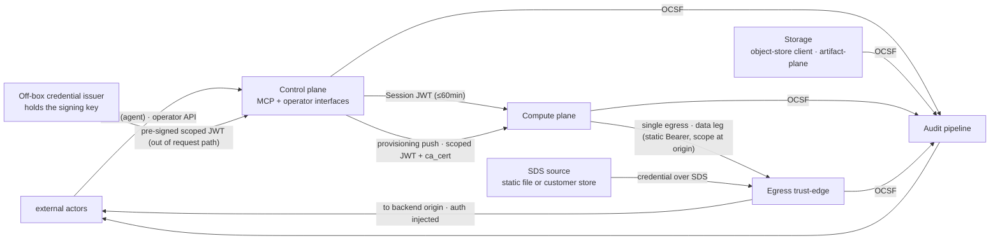

<!-- SPDX-License-Identifier: FSL-1.1-Apache-2.0 -->
<!-- Copyright (c) 2025 Open Computer Use Contributors -->

---
status: proposed
last-reviewed: 2026-06-14
owner: "@Wide-Moat/architects"
applies-to: next/v1
---

Defines the trust zones, the data classification, and the protocol/auth/encryption that crosses each boundary in the OCU sandbox. Audience: anyone auditing the control/data-plane split or wiring a component against a zone boundary.

## 1. Purpose and scope

Our scope: `MCP interface / control-plane RPC → guest agent → sandbox runtime → Egress trust-edge + Storage`. Everything else is either an external actor (§3) or an outbound endpoint subject to the egress policy enforced by the Egress trust-edge.

Ownership per row is named in [`02-nfrs.md`](manifesto/02-nfrs.md) §"Scope ownership": DELIVER (we ship + are accountable), ENABLE (we publish the contract/telemetry, customer owns the policy), REVISIT (claims more than our scope; flagged for re-cut). §02 marks each REVISIT row inline as `[REVISIT — non-gating]` so CI and verifier passes do not enforce it; the substantive re-cut of those rows lands in a follow-up PR.

Product invariant from [NFR-SEC-16](manifesto/02-nfrs.md): the distributed configuration ships no outbound paths to vendor-controlled endpoints. On-prem deployments use only outbound paths the customer enabled.

Measurable targets are in [`02-nfrs.md`](manifesto/02-nfrs.md); component internals are in [`components/`](./components/); threat content is out of scope here and lands when the threat-model artifact opens.

## 2. Drawn zones

| # | Zone | One-line role | §02 anchor |
|---|---|---|---|
| 1 | **Control plane** | Orchestrator + session lifecycle, exposing two interfaces of one zone: an agent-facing MCP interface (tool calls) and an operator/lifecycle interface (session lifecycle, quota, kill-switch). The kill-switch is reachable only on the operator interface, never over MCP. Single instance per deployment. Holds no outbound path to upstream; all upstream traffic originates in the Compute plane and traverses the Egress trust-edge. The Control plane is not a model proxy. The agent-facing / operator split becomes two containers at Layer 6; here it is one zone. | [NFR-IC-04](manifesto/02-nfrs.md) |
| 2 | **Storage** | The session's mutable user-data and the components that reach it. No component here holds a signing key or a backend credential: the [Storage-JWT](glossary.md#storage-jwt) is an off-box-issued, `filesystem_id`+workspace+org-scoped ES256 bearer delivered into the guest at provisioning, held in the mount config, and forwarded unmodified as a static `Authorization: Bearer`; the backend origin verifies the signature and enforces the scope ([NFR-SEC-25](manifesto/02-nfrs.md), [ADR-0013](adr/0013-storage-credential-custody.md)). The zone holds three components, each fronting a distinct counterparty ([ADR-0015](adr/0015-storage-decomposition-by-trust-plane.md)). The **mount-plane** is the guest's file-operation surface, scoped by `filesystem_id`, carrying a third authorization axis beyond scope and intent (`read` / `write` / `preview`) — a per-object `downloadable` tag resolved at read; a non-downloadable object is readable in-session but yields no egress-eligible artifact, and the tag reaches the Egress trust-edge as a deny signal ([NFR-SEC-73](manifesto/02-nfrs.md)). The **narrow object-store client** speaks the first-party filestore protocol; for the guest it is the in-guest mount client and its transport in one binary that dials the backend `service_url` guest-out over the single egress hop ([NFR-SEC-25](manifesto/02-nfrs.md), [NFR-SEC-85](manifesto/02-nfrs.md), [ADR-0014](adr/0014-storage-transport-tier-universal-network-leg.md)) — no host-side object-store-client hop carries the guest's request. The **artifact-plane** is OCU's own file-artifact API and embeddable SPA on a dedicated file/UI ingress, not the MCP listener ([NFR-SEC-78](manifesto/02-nfrs.md)); an external [Data-plane client](glossary.md#data-plane-client) (§3) reaches it, it verifies a peer-minted embed token and sets a first-party session ([NFR-SEC-82](manifesto/02-nfrs.md)), and an uploaded body is archive-validated and content-classified in a capability-free parser-sandbox before it becomes mount-visible ([NFR-SEC-80](manifesto/02-nfrs.md), [NFR-SEC-81](manifesto/02-nfrs.md)). Both the mount-plane and the artifact-plane emit OCSF file-activity, fail-closed ([NFR-SEC-79](manifesto/02-nfrs.md)). For multi-tenant deployments storage is instantiated per tenant — one principal per tenant filesystem scope ([NFR-SEC-76](manifesto/02-nfrs.md)). Mount substrate (FUSE / virtio-fs / 9p) is a component-spec choice. | [NFR-SEC-25](manifesto/02-nfrs.md) |
| 3 | **Compute plane** | Session sandbox, one per session, lifecycle bound to session. Runtime tier per [§02 "Sandbox tier — workload-driven selection"](manifesto/02-nfrs.md): `runc` for solo / dev; `gVisor` for v1 hardened; microVM (hardware-virt) for post-v1. Guest agent is PID 1. Cross-session network reachability disabled per [NFR-SEC-22](manifesto/02-nfrs.md); per-tenant network isolation is a deployment property of this zone. | [NFR-SEC-02](manifesto/02-nfrs.md) |
| 4 | **Egress trust-edge** | Single outbound path. Posture follows the §7 ladder (deny-all / transparent pass-through / egress-wide bump / external SDS source); injection happens at the egress-wide-bump rung, where the edge attaches the upstream authorization received over Envoy SDS from a static file (solo) or a customer-provided SDS-compatible store (enterprise). Injection is keyed on a presented scoped credential carried by the request, never on network origin — a request presenting none receives none ([ADR-0007](adr/0007-egress-auth-mechanism.md)); the guest carries no long-lived upstream secret on the egress leg. DLP-ICAP is a configuration of the bump rung, not a separate rung. Egress allow-list enforcement sits here (deny-by-default; an MCP server, LLM API, or object store is one allow-listed destination, not a separate control). AI-guardrail / prompt-content policy is customer's own AI gateway, not ours ([NFR-COMP-26](manifesto/02-nfrs.md) revisit). | [NFR-SEC-05](manifesto/02-nfrs.md) |
| 5 | **Audit pipeline** | Durable bus + hash-chained store + bridges to customer sinks. Retention floor, RPO, and tamper-evidence differ from Control plane, so it is its own zone. Compute-time metering emits as audit events on this pipeline. | [NFR-SEC-03](manifesto/02-nfrs.md) |

Secondary NFR anchors per zone:

- Control plane — [NFR-FLEX-14](manifesto/02-nfrs.md), [NFR-REL-01](manifesto/02-nfrs.md).
- Storage — [NFR-SEC-25](manifesto/02-nfrs.md), [NFR-SEC-15](manifesto/02-nfrs.md), [NFR-SEC-79](manifesto/02-nfrs.md); artifact-plane — [NFR-SEC-78](manifesto/02-nfrs.md), [NFR-SEC-80](manifesto/02-nfrs.md), [NFR-SEC-81](manifesto/02-nfrs.md), [NFR-SEC-82](manifesto/02-nfrs.md), [NFR-SEC-83](manifesto/02-nfrs.md), [NFR-SEC-84](manifesto/02-nfrs.md), [NFR-SEC-76](manifesto/02-nfrs.md).
- Compute plane — [NFR-SEC-14](manifesto/02-nfrs.md), [NFR-SEC-22](manifesto/02-nfrs.md), [NFR-FLEX-02](manifesto/02-nfrs.md). Performance targets for this zone live in component specs.
- Egress trust-edge — [NFR-SEC-08](manifesto/02-nfrs.md), [NFR-SEC-17](manifesto/02-nfrs.md), [NFR-SEC-23](manifesto/02-nfrs.md), [NFR-SEC-27](manifesto/02-nfrs.md), [NFR-SEC-29](manifesto/02-nfrs.md), [NFR-SEC-30](manifesto/02-nfrs.md), [NFR-FLEX-15](manifesto/02-nfrs.md), [NFR-COMP-28](manifesto/02-nfrs.md).
- Audit pipeline — [NFR-REL-12](manifesto/02-nfrs.md), [NFR-REL-03](manifesto/02-nfrs.md), [NFR-COMP-01](manifesto/02-nfrs.md), [NFR-COST-05](manifesto/02-nfrs.md), [NFR-MAINT-AUDIT-SCHEMA](manifesto/02-nfrs.md).

**Skill registry boundary** is reserved as a TBD-stub per CLAUDE.md §v1-non-goals.

Cross-component encryption-in-transit invariant per [NFR-SEC-37](manifesto/02-nfrs.md): inter-zone traffic between Wide-Moat components is encrypted in transit. Two carve-outs apply, both decrypted by design and re-encrypted on the upstream leg: (a) the Egress trust-edge inspection point at the egress-wide bump rung (see §7); (b) the DLP-ICAP hook at that rung.

## 3. External actors

Outbound endpoints behind the egress policy — LLM upstream, customer MCP servers, object stores, internal APIs — are drawn in the diagram for visual orientation only. They are not actors against our contracts: the Egress trust-edge gates them and attaches the upstream authorization, received over Envoy SDS from a static file (solo) or a customer-provided SDS-compatible store (enterprise).

| Actor | Boundary it crosses | Contract | Optional? |
|---|---|---|---|
| MCP client (the thing that calls our MCP server) | client → Control plane | MCP authorization spec, audience-validated tokens | required |
| Customer IdP (OIDC) | IdP → Control plane | relying-party (we are RP) | required on the full shelf; minimal shelf uses a host-rooted local operator credential; a SAML-only IdP federates in through Dex or Keycloak |
| Customer SIEM | Audit pipeline → SIEM | OCSF schema + bridge transport (transports per [NFR-MAINT-AUDIT-SCHEMA](manifesto/02-nfrs.md)) | optional bridge — file-system sink on the minimal shelf |
| Customer KMS / HSM | Storage / Audit pipeline → KMS | PKCS#11 + KMIP | optional — full shelf only; minimal shelf uses host-local keys |
| Customer outbound proxy | Egress trust-edge → customer proxy | chained-proxy contract | optional |
| Customer DLP-ICAP service | Egress trust-edge → ICAP | ICAP req-mod + resp-mod | optional — engaged only at the egress-wide bump rung |
| SOAR (incident automation) | Control plane ↔ SOAR | signed webhook + admin API | optional |
| Admin / Operator (PAM-JIT human) | Operator → Control plane | host-rooted local credential on the minimal shelf; short-lived OIDC-asserted claim on the full shelf; no shared service accounts on either ([NFR-COMP-29](manifesto/02-nfrs.md)) | required |
| Data-plane client (OCU SPA or headless caller) | client → artifact-plane | file-artifact data plane (upload / list / download / preview-render); embed token verified → first-party session ([NFR-SEC-78](manifesto/02-nfrs.md), [NFR-SEC-82](manifesto/02-nfrs.md)) | optional — absent in headless deployments |
| Transparency log | Audit pipeline → transparency log | submission envelope; log operator signs the Merkle head (§12 Open question 4) | optional — choose public or customer-private |

## 4. Per-tenant isolation menu

| Tier | Mechanism | Cross-tenant boundary | Where it sits |
|---|---|---|---|
| T0 logical | row-level filter; tenant_id column + app-side check | shared kernel, shared substrate | solo / dev / single-operator |
| T1 namespace | namespace + network policy + role-based access control + resource quota | shared kernel, shared control plane | single-tenant agent execution, OR multi-tenant for non-agent-execution workloads only |
| T2 VPC / VNet | per-tenant VPC, no peering | shared substrate, separate network | NPI baseline |
| T3 dedicated cluster | dedicated control plane per tenant | separate control plane, shared substrate | common deployment shape for DORA-CIF workloads |

**Multi-tenant agent-execution invariant.** Where the Compute plane runs LLM-issued tool calls / code from more than one tenant on the same node, the substrate MUST be hardware-virt OR user-space-kernel — not bare `runc`. Bare `runc` multi-tenant agent execution is forbidden; adversarial agent-issued code is not bounded by data classification. The microVM tier is tracked at [#161](https://github.com/Wide-Moat/open-computer-use/issues/161). T1 namespace remains valid for single-tenant agent execution or for multi-tenant workloads that do not execute LLM-issued code (admin UIs, read-only dashboards, batch-data jobs).

**Host-attested caller-identity invariant.** The control / exec channel stays off any network the guest can reach: the host opens it and the guest listens, over vsock (microVM) or a host-side unix socket (`gVisor`, `runc`), and a TCP listener — if used — rejects loopback and own-interface sources so guest-originated code cannot dial the supervisor through its own stack. Every host-facing call the guest makes — to the Control plane or the provisioning channel — carries a caller identity the host derives itself: a hypervisor-assigned context id (microVM), the kernel peer credentials of the per-session sandbox principal (`gVisor` sentry, `runc` per-session host uid), or a per-session socket path the guest cannot enumerate. A session, tenant, or principal id the guest supplies in a request body or header is at most a hint cross-checked against that host-attested identity, never the identity itself. A guest with in-sandbox root MUST NOT present another session's identity, nor reach the control channel through its own network. A guest-out reverse dial to a host-side bridge is a fallback only where the runtime makes a host-reachable guest listener unavailable; the bridge then holds no credential, runs unprivileged and syscall-confined, and authenticates the session before any privileged action. See [NFR-SEC-43](manifesto/02-nfrs.md).

Higher-isolation tiers (dedicated bare-metal node pool per tenant; customer-owned hardware in customer datacenter) are tracked in open question §12 item 1 ([#148](https://github.com/Wide-Moat/open-computer-use/issues/148)) as candidates for later promotion. Promote when a named workload requires them.

Boundary properties in §5–§11 hold for every tier; the tier picks the substrate, not the invariants. Measurable cross-tenant grading is in the same open question.

## 5. Trust-zone diagram

Canonical source: [`docs/architecture/diagrams/02-trust-boundaries.mmd`](./diagrams/02-trust-boundaries.mmd) — the canonical file encodes the convention "solid border = always present; dashed border = optional configuration" (CPROXY, SOAR, ICAP, SIEM, KMS, TLOG drawn dashed). The inline block above is a simplified overview that does not encode dashed-vs-solid; for the optional-vs-required reading, use the canonical file or §3 actor table.

## 6. Data classification taxonomy

Eight content-keyed classes. Per-tenant data residency ([NFR-COMP-13](manifesto/02-nfrs.md)) constrains where any class above PUBLIC may sit on the substrate.

| Class | NYDFS NPI | GLBA NPI | SEC MNPI | GDPR Art. 4 / 9 | EU AI Act | PCI DSS v4.0 | Regulatory retention floor (customer's store) |
|---|---|---|---|---|---|---|---|
| **PUBLIC** | n/a | excluded | n/a | not personal data | n/a | n/a | none |
| **INTERNAL** | n/a | n/a | n/a | not personal data | n/a | n/a | 1 yr ops |
| **CONFIDENTIAL (PII)** | NPI on consumers | NPI | n/a | personal data Art. 4(1) | Art. 10 training data | track 2 / track 1 (non-PAN) | NYDFS §500.13 |
| **RESTRICTED (NPI-financial)** | NPI tied to financial product | NPI | n/a if not material | personal data; Art. 6 lawful basis | high-risk-AI input | PAN, expiry, service code | 5 yr (CFR-cited financial-institution rules) |
| **RESTRICTED (MNPI)** | n/a | n/a | Reg FD / 10b-5 | n/a directly | n/a | n/a | until public + 2 yr legal hold |
| **SENSITIVE (special category)** | NPI plus health / biometric | NPI | n/a | Art. 9 special category | Annex III categories | n/a | per Art. 5(1)(e) |
| **REGULATED-AUDIT** | NYDFS §500.6 audit trail | n/a | SOX-trail | Art. 30 records of processing | Art. 12 logs of high-risk AI | PCI Req 10 | 7 y default / 10 y configurable (see §10) |
| **CRYPTO-KEYS / SECRETS** | implicit under §500.15(a) | implicit under Safeguards Rule | n/a | implicit | implicit | PCI Req 3.6 | rotation policy is the floor |

OCU is an ephemeral workspace and retains no customer file bytes for any class — bytes leave with the session (scrubbed at teardown, [NFR-SEC-65](manifesto/02-nfrs.md)) or go to the customer's store, so the retention-floor column is a floor for the customer's store. The only row that is an OCU duty is REGULATED-AUDIT: the 7 y / 10 y floor binds the audit record OCU keeps ([NFR-COMP-01](manifesto/02-nfrs.md), §10), not customer content.

The default solo / dev deployment runs on `runc` under the `trusted_operator` workload profile, so its default content scope is PUBLIC + INTERNAL. CONFIDENTIAL+ content triggers data-class obligations — opt-in BYOK ([NFR-SEC-04](manifesto/02-nfrs.md)), customer-managed audit sink ([NFR-MAINT-AUDIT-SCHEMA](manifesto/02-nfrs.md)), residency pinning ([NFR-COMP-13](manifesto/02-nfrs.md)) — but does not pick the runtime tier (AP-13). The tier is picked by the deployment's `workload_trust_profile` per [§02 "Sandbox tier — workload-driven selection"](manifesto/02-nfrs.md).

Prompt content filtering, redaction, and AI-guardrail policy (PII masking, prompt-injection detection, jailbreak detection) are not our scope — that responsibility lives with the customer's AI gateway (commercial AI-gateway product or in-perimeter model with its own guardrails). Layer 3 routes the traffic and audits the egress event; what the gateway does with the prompt is its contract, not ours. [NFR-COMP-26](manifesto/02-nfrs.md) to be revisited in §02.

## 7. Egress posture — a ladder by need

Egress posture follows what the deployment needs, not a fixed default ([NFR-FLEX-15](manifesto/02-nfrs.md), [ADR-0007](adr/0007-egress-auth-mechanism.md)). Each rung adds only what the rung above requires; the one-click solo path sits wherever the deployment's need sits, so a deployment that needs no authenticated egress carries no certificate authority.

| Rung | When | TLS termination | CA in sandbox trust store | Plaintext carve-out ([NFR-SEC-37](manifesto/02-nfrs.md)) |
|---|---|---|---|---|
| **deny-all** | no outbound need (no upstream, no model) | n/a — egress off | no | none |
| **transparent pass-through** | unauthenticated internet only; no upstream credential | none — proxy in path, does not terminate | no | none |
| **egress-wide bump** | an upstream credential is configured (default at this rung) | every outbound leg terminated and re-originated | yes — per-deployment CA, public cert auto-injected at start; private key only on the minter | proxy decrypt / re-encrypt segment |
| **external SDS source** | enterprise: credential lifecycle owned off-box | as bump | yes | as bump |

Bump is the default *only when an upstream credential is configured*; it is not imposed on a deployment that needs no outbound credential. "One-click" is preserved at the bump rung by automating the CA — generate per deployment, auto-inject the public certificate into the sandbox trust store at start — not by omitting it. DLP-ICAP ([NFR-COMP-28](manifesto/02-nfrs.md)) is a configuration of the bump rung, not a separate rung: an ICAP req-mod / resp-mod hook between the decrypt and re-encrypt steps, with a plaintext segment at the ICAP wire.

Upstream-authorization injection (NFR-SEC-23/27) requires the edge to originate the upstream connection — the L7 property the bump rung provides. Transparent pass-through does not terminate TLS and so cannot attach an upstream credential; it reaches only endpoints needing no upstream authorization. The mechanism that attaches the credential — edge injection at the bump rung, or a protocol broker for a high-value scoped credential — is selected per upstream by [ADR-0007](adr/0007-egress-auth-mechanism.md); v1 ships edge injection only. Upstreams that pin a certificate or require client-mTLS / proof-of-possession cannot be satisfied by edge injection and are tracked at [#176](https://github.com/Wide-Moat/open-computer-use/issues/176).

Fail-closed: if the egress proxy is unreachable, the Compute plane drops outbound traffic, never bypasses the proxy. Same property on the IdP → Control plane path: IdP unreachable → new sessions denied; in-flight sessions continue under their existing token until either TTL expiry or an explicit revoke event.

Egress denials carry a structured reason header (`x-deny-reason`) so audit and SOAR can classify outcomes without parsing free-text logs. Unallowed destinations are dropped at SNI pre-filter before TLS handshake (cheaper, lower forensic value); allowed destinations are inspected at L7 (richer, more expensive).

Revoke is independent of IdP reachability. The Control plane holds a session denylist (kill-switch state). On the Compute-plane path the denylist is checked directly on every RPC. On the Egress trust-edge path the denylist stops injection: the edge attaches no upstream authorization for a revoked session, independent of the credential's own validity window. The denylist propagates platform-wide within ≤5 min ([NFR-SEC-04](manifesto/02-nfrs.md)), so an explicit revoke cuts upstream access within ≤5 min. Upstream credential lifecycle — mint, rotation, revocation, and the credential's own TTL — belongs to the SDS source (a customer store on the enterprise shelf, a static file on the solo shelf), not to OCU ([NFR-SEC-29](manifesto/02-nfrs.md)). Kill switch ([NFR-SEC-01](manifesto/02-nfrs.md)) shares the same denylist; its ≤30 s p99 SLA covers Compute-plane stop. The IdP participates in token issue, not in revoke — that is why ≤5 min revoke holds even during an IdP outage, which is the incident the target exists for.

Component-spec wiring lands under [`components/`](./components/) per [PROCESS.md](./PROCESS.md) when the egress-proxy spec opens.

### 7.1 Two guest-data paths

The guest reaches data over two paths with different trust roots:

| Path | Direction | Zone | What the guest holds | Where the real credential lives |
|---|---|---|---|---|
| **Storage mount** | provisioning push (inbound) + data leg (guest-out) | Storage (§2 zone 2) | the scoped [Storage-JWT](glossary.md#storage-jwt) (held in the mount config, forwarded unmodified) | off-box credential issuer (signing key); the backend origin verifies and enforces scope |
| **Egress** | outbound to upstreams | Egress trust-edge (§2 zone 4) | no long-lived upstream secret on this leg | SDS source (static file or customer store), injected at the edge on a presented scoped credential |

The guest's file operations run through an in-guest mount client — the object-store client and its transport in one binary — that dials the backend `service_url` guest-out over the single egress hop and forwards the Storage-JWT unmodified as a static `Authorization: Bearer` ([ADR-0014](adr/0014-storage-transport-tier-universal-network-leg.md)). No host-side object-store-client hop carries the guest's request, and no component in the zone holds the signing key: it is off-box at the credential issuer, the Control plane delivers the pre-signed token in the provisioning push before the mount client starts, and the guest forwards it ([ADR-0013](adr/0013-storage-credential-custody.md)). The egress hop terminates TLS and forwards the bearer untouched — there is no per-request signature to preserve, the bearer is static ([NFR-SEC-85](manifesto/02-nfrs.md)). Scope is enforced at the backend origin: a foreign `filesystem_id` presented with the same token is rejected by the origin (401), not by the hop ([NFR-SEC-31](manifesto/02-nfrs.md)). Both paths share one invariant the table makes concrete: the guest holds a session-scoped bearer at most, never a signing key ([NFR-SEC-25](manifesto/02-nfrs.md), [NFR-SEC-23](manifesto/02-nfrs.md)).

The mount client opens no uncontrolled outbound path of its own: the data leg traverses the single governed egress hop, and a direct guest-to-origin dial that bypasses that hop is forbidden ([NFR-SEC-16](manifesto/02-nfrs.md)), because it would be an outbound path the control cannot see; the hop is that control, emitting an OCSF event a compromised guest cannot silence ([NFR-SEC-85](manifesto/02-nfrs.md)).

These are the two **guest** data paths. The Storage zone also fronts a third, non-guest path — the artifact-plane (§2 zone 2): an external Data-plane client (§3) reaches the host-side artifact-plane over the file-artifact ingress. That path is caller↔artifact-plane, host-side, not a guest channel, so the host-dials-guest invariant ([NFR-SEC-43](manifesto/02-nfrs.md)) is unaffected; its authorization (embed token, three-axis claim) and inbound-body controls (archive validation, content classification) are the artifact-plane NFRs anchored in §2 zone 2.

The skill-mount path (read-only shared content vs per-session mutable data) is governed by the `SkillProvider` abstraction, which is post-v1 ([NFR-SEC-24](manifesto/02-nfrs.md), [NFR-SEC-42](manifesto/02-nfrs.md)); its boundary is specified with that ADR, not here.

## 8. Workload-identity floor

Token taxonomy is canonical here; the three classes, their scopes, and their TTLs match [`manifesto/02-nfrs.md`](manifesto/02-nfrs.md) §"Token TTL taxonomy". Each is named with its own scope, TTL, signer, and consumer. The guest holds only session-scoped tokens — the session JWT and a storage-mount handle; the host-side generic internal token never reaches it. The upstream credential the Egress trust-edge attaches is not an OCU-issued token class: it is delivered over Envoy SDS from a static file (solo) or a customer-provided SDS-compatible store (enterprise), and its scope and TTL are the source's.

| Token class | Scope | TTL | Consumer | §02 anchor |
|---|---|---|---|---|
| **Session JWT** | per session (Control plane → Compute plane; bound to `container_name`) | ≤ 60 min, rotated | Compute plane (guest agent), proving session identity to the Control plane | NFR-SEC-10 |
| **Storage-JWT** | per session, scoped to one `filesystem_id` + workspace + org | ~6 h fixed, no refresh | Compute plane (guest), held in the mount config and forwarded to the backend origin as a static Bearer; carries no signing key | NFR-SEC-25 |
| **Generic internal token** | inter-component RPC (Control plane ↔ audit, host-side) | ≤ 60 min | host-side service-to-service | NFR-SEC-23 |

| Property | Minimal shelf | Full shelf | §02 anchor |
|---|---|---|---|
| Inter-component identity | Host-local signing key bound to `container_name` | Workload identity from customer PKI per tenant | NFR-SEC-26 / NFR-SEC-09 |
| Identity trust root | host-local signing key | HSM-rooted, FIPS 140-3 L3 | NFR-FLEX-04 |
| Tenant DEK rotation | ≤90 d | ≤90 d | NFR-SEC-04 |
| Tenant KEK rotation | ≤365 d | ≤365 d | NFR-SEC-04 |
| Revoke latency | ≤5 min | ≤5 min | NFR-SEC-04 |
| Per-tenant trust domain | n/a (single-tenant) | per-tenant trust domain | open question §12 item 1 |
| Internal mTLS substrate | TLS 1.3 enforced at the deployment overlay (substrate choice is a component-spec decision) | same, customer-CA-rooted | NFR-SEC-37 |

NFR anchors for §8 (consolidated): see [NFR-SEC-04](manifesto/02-nfrs.md), [NFR-SEC-09](manifesto/02-nfrs.md), [NFR-SEC-10](manifesto/02-nfrs.md), [NFR-SEC-23](manifesto/02-nfrs.md), [NFR-SEC-26](manifesto/02-nfrs.md), [NFR-SEC-29](manifesto/02-nfrs.md), [NFR-SEC-37](manifesto/02-nfrs.md), [NFR-FLEX-04](manifesto/02-nfrs.md).

Minimal shelf: identity-binding ([NFR-SEC-09](manifesto/02-nfrs.md)) via host-local signing key on JWT ([NFR-SEC-26](manifesto/02-nfrs.md)); egress trust-store ([NFR-SEC-05](manifesto/02-nfrs.md)) via auto-generated self-signed CA. Full shelf: workload identities from customer PKI + customer-rooted CA.

### 8.1 Signer identity per boundary

Each token class has its own signer; signer identity ties to the workload that issues the token. Minimal-shelf signers are host-local keys; full-shelf signers are workload identities from the customer PKI. The full per-boundary table (six artifacts × four columns) lands with the PKI decision — tracked at §12 item 5 ([#152](https://github.com/Wide-Moat/open-computer-use/issues/152)).

## 9. Encryption matrix

Single invariant: inter-component traffic between Wide-Moat components is encrypted in transit ([NFR-SEC-37](manifesto/02-nfrs.md)). Tenant data at rest uses authenticated AES ([NFR-SEC-33](manifesto/02-nfrs.md)). Key custody on the minimal shelf is host-local; on the full shelf, HSM-rooted via PKCS#11 / KMIP per [NFR-FLEX-04](manifesto/02-nfrs.md). Per-tenant data residency ([NFR-COMP-13](manifesto/02-nfrs.md)) is enforced at Control-plane scheduling and Audit-pipeline routing — not an encryption boundary. The full per-boundary matrix (TLS version, at-rest cipher, key custody, rotation cadence) is component-spec material; it lands with each component spec.

## 10. Audit zone — mandatory in code, pluggable in sinks

Audit pipeline is mandatory in code ([NFR-SEC-03](manifesto/02-nfrs.md) hash-chained; [NFR-REL-12](manifesto/02-nfrs.md) durable bus on critical path; [NFR-COMP-01](manifesto/02-nfrs.md) retention floor — 7 y default, 10 y configurable, machine-enforced by the Audit pipeline retention policy). Sinks are pluggable: file-system on the minimal shelf; OCSF v1.x JSON bridges to customer SIEM as opt-in per [NFR-MAINT-AUDIT-SCHEMA](manifesto/02-nfrs.md). [ADR-0009](adr/0009-audit-pipeline-pluggable-by-contract.md) sets where the mandatory-in-code / pluggable line falls: the chain of custody and a local durable commit are OCU's, while the bus product, WORM store, SIEM sink, and transparency-log endpoint are pluggable seams with solo-reference defaults.

The pipeline is drawn as our zone; sinks are external actors. The contract is the OCSF v1.x JSON schema plus bridge transport (see §12 Open question 3).

Tamper-evidence: hash-chained store always; the daily batch is submitted to a transparency log of the customer's choice. The transparency log operator signs the Merkle head; we sign only the submission envelope ([NFR-SEC-03](manifesto/02-nfrs.md)).

## 11. Regulator citation map

Mapping is **indicative, not verbatim**. Verify every cell against the source text before reuse. Layer 3 does not represent these citations as audit evidence by itself; full source-verification is tracked at [#153](https://github.com/Wide-Moat/open-computer-use/issues/153).

| Our zone / boundary | NIST SP 800-207 | NYDFS Part 500 | DORA | EU AI Act | CCM v4 |
|---|---|---|---|---|---|
| Control plane | implicit-trust zone (§2.1) | § 500.7 access privileges (PAM) | Art. 6 ICT risk-management framework | Art. 14 human oversight | IAM-06 |
| Storage | implicit-trust zone (off-box-issued scoped bearer, backend-enforced scope) | § 500.15(a) encryption + key custody | Art. 28 ICT third-party general | Art. 10 data governance | CEK-08, DSP-01 |
| Compute plane (sandbox) | implicit-trust zone, scoped small | § 500.7 + § 500.15 | Art. 28(4) ITS register of information | Art. 15(4) accuracy, robustness, cybersecurity | IVS-06, IVS-09 |
| Egress trust-edge | PEP (§3.4.1) | § 500.5 vulnerability scanning (segmentation surfaces here, not § 500.7) | Art. 30 key contractual provisions (location of processing) | Art. 14 oversight | IVS-09 segmentation, DSP-05 DLP |
| Audit pipeline | (cross-cutting — no direct ZT mapping) | § 500.6 audit trail; § 500.13 retention policy | Art. 10 detection (logs) | Art. 12 logs of high-risk AI; Art. 19(1) 10-year retention floor | LOG-01, LOG-02 |
| MCP client → Control plane | untrusted → implicit-trust crossing | § 500.7 + § 500.12 MFA | Art. 30 contract clauses | Art. 13 transparency to deployer | IAM-08 |
| Egress trust-edge → upstream | implicit-trust → untrusted crossing | § 500.15 encryption in transit | Art. 28 ICT third-party general | Art. 15 cybersecurity | IVS-09 |
| Audit pipeline → SIEM | implicit-trust → external sink | § 500.6 audit trail readable by covered entity | Art. 10 detection (retention floor cited from SEC 17a-4 / FCA SYSC 9, see §10) | Art. 12 logs accessible | LOG-04 |

## 12. Open questions

1. Cross-tenant isolation grading — [#148](https://github.com/Wide-Moat/open-computer-use/issues/148) — measurable target ("tenant A cannot observe tenant B side-channel") not yet in §02. Also tracks higher-isolation tiers (dedicated hardware, customer-owned cage) as candidates for promotion when a named workload requires them.
2. Control-plane metadata-only gate — [#149](https://github.com/Wide-Moat/open-computer-use/issues/149) — DORA Art. 28(2)(c) requires a measurable gate that no customer payload crosses the Control plane.
3. SIEM-bridge transport and backpressure — [#150](https://github.com/Wide-Moat/open-computer-use/issues/150) — pluggable-sink contract needs measurable transport and end-to-end backpressure target.
4. Transparency-log publishing path — [#151](https://github.com/Wide-Moat/open-computer-use/issues/151) — submission path between Audit pipeline and the external transparency log (auth, retry, RPO if the log is unreachable), plus the prior question of "do we publish at all on the minimal shelf".
5. PKI tool pick — [#152](https://github.com/Wide-Moat/open-computer-use/issues/152) — §8.1 names signer identity per boundary; the per-boundary signer table lands with the PKI ADR.
