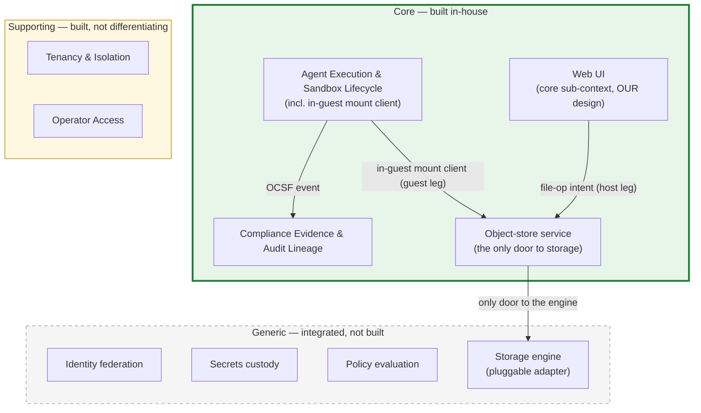
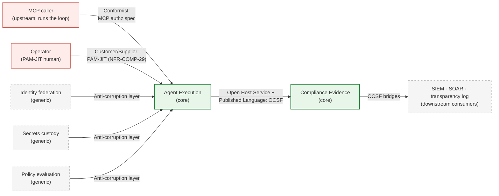

<!-- SPDX-License-Identifier: FSL-1.1-Apache-2.0 -->
<!-- Copyright (c) 2025 Open Computer Use Contributors -->

---
status: proposed
last-reviewed: 2026-06-14
owner: "@Wide-Moat/architects"
applies-to: next/v1
---

Cuts the domain into bounded contexts and classifies each as core, supporting, or generic — the buy-vs-build call. Audience: anyone deciding what we build and what we integrate.

## 1. Context layer vs trust zones

[`02-trust-boundaries.md`](02-trust-boundaries.md) §2 draws five zones — Control plane, Storage, Compute plane, Egress trust-edge, Audit pipeline. Those answer "where does it run and under what protection." This layer answers a different question: "which slices of the domain carry the competitive value, and which are solved problems we integrate." A trust zone is a deploy/protection slice; a bounded context is a domain slice. They do not map one-to-one, and the mismatches are the point.

The classification drives the next layer: a context marked `generic` becomes an integration in [`03-c4-context.md`](03-c4-context.md)'s external-actor set, not a container we build; a `core` context becomes containers we own in the C4 Container layer.

## 2. Subdomain classification

The storage split: the in-guest mount client sits inside Agent Execution, the Web UI is a core sub-context, the Object-store service is the one door both legs reach, and the storage engine behind it is a generic integration.

| Subdomain | Class | Value axis | Build-vs-buy |
|---|---|---|---|
| **Agent Execution & Sandbox Lifecycle** | core | domain complexity — safely executing adversarial agent-issued tool-calls and code in-perimeter | build |
| **Compliance Evidence & Audit Lineage** | core | domain complexity — binding every agent action into a replayable, hash-linked lineage that survives an adversarial workload (the lineage, not the OCSF schema or the SIEM sink, is the defensible part) | build |
| **Tenancy & Isolation** | supporting | owns the T0–T3 isolation-tier selection logic | build |
| **Operator Access** | supporting | owns the PAM-JIT human-to-platform contract ([NFR-COMP-29](manifesto/02-nfrs.md)); bespoke to us, sits outside the value axis | build |
| **In-guest mount client** | core (within Agent Execution) | the `filesystem_id`-scoped file-operation surface the session reaches; its invariants exist to serve the running session ([ADR-0015](adr/0015-storage-decomposition-by-trust-plane.md)) | build |
| **Web UI** | core sub-context (own component) | the client file API, embeddable SPA, and preview-render; an OCU design addition, not a reproduction; aggregate root is the artifact plus the embed-asserted principal, distinct from the session ([ADR-0015](adr/0015-storage-decomposition-by-trust-plane.md)) | build |
| **Object-store service** | core (the only door to storage) | the one door to the storage engine; the object-store wire protocol is a solved problem, so the engine is a pluggable adapter (local-volume / S3) behind it | build the service, integrate the engine ([ADR-0010](adr/0010-storage-backend-pluggable-adapter.md)) |
| **Identity federation** | generic | relying-party to customer IdP | integrate |
| **Secrets custody** | generic | key custody behind PKCS#11 / KMIP | integrate |
| **Policy evaluation** | generic | externalised authorization decisions | integrate |

Source availability is a go-to-market property, not a classification axis. The security primitives ship in the open artifact ([`01-audience-and-buyer.md`](manifesto/01-audience-and-buyer.md) §"Audience"); that does not demote Agent Execution to generic. Applying an open runtime correctly to adversarial in-perimeter agent-issued code is where the domain complexity sits.

Compliance Evidence is core for the lineage, not the schema. The OCSF schema, the pluggable SIEM sinks, and the customer-chosen transparency log are generic substrate we integrate; reconstructing a tamper-evident, replayable chain of agent actions across an adversarial workload is the part we build.

Storage classifies once split by counterparty. The in-guest mount client is core because its language is the running session's; the Web UI is a core sub-context because it fronts an external data-plane client with its own aggregate root; the Object-store service is the one door to the storage engine, which integrates as a pluggable adapter behind it. The storage signing key is held off-box by a separate issuer; no storage component holds one ([ADR-0013](adr/0013-storage-credential-custody.md)).

## 3. Trust zones to contexts

The five zones group into two core contexts.

| Trust zone (Layer 3 §2) | Bounded context | Why this grouping |
|---|---|---|
| Control plane | Agent Execution | session lifecycle is execution machinery |
| Compute plane (sandbox) | Agent Execution | the sandbox is where the tool-calls execute |
| Storage | Agent Execution | the session's in-guest mount client serves the running session's user data through the Object-store service |
| Egress trust-edge | Agent Execution | the single outbound path is part of running safely |
| Audit pipeline | Compliance Evidence | different reason to exist: prove, not run |

The Audit pipeline is its own zone in Layer 3 for retention/RPO/tamper-evidence reasons; it is its own context here for a domain reason — its value is regulatory proof, a separate axis from execution.

The four zones share one ubiquitous language: "execute the tool-calls a client sends, safely, in-perimeter." The Control plane and Compute plane speak that execution language directly. The in-guest mount client (file-operation terms: `filesystem_id`, scoped bearer, open / read / write / list, the whole-filesystem control verbs import / migrate / remove) and the Object-store service behind it (engine, `filesystem_id`→prefix, multipart) speak a narrower sub-language; the Egress trust-edge speaks another (`SNI`, per-host inspection leaf, the single governed hop). They sit *inside* Agent Execution because their invariants serve the running session and share its aggregate root (the session). The Web UI does not — it fronts an external data-plane client over an embed-token flow, with the artifact plus the embed-asserted principal as its aggregate root, so it is a sub-context of its own (§2), not part of the session's language ([ADR-0015](adr/0015-storage-decomposition-by-trust-plane.md)).

The supporting and generic contexts are not Layer 3 zones we own. Of the three generic contexts, two are Layer 3 §3 external actors — Identity federation (Customer IdP) and Secrets custody (Customer KMS / HSM). Policy evaluation is not yet drawn in Layer 3; it is consumed at the Egress trust-edge within Agent Execution, by the optional deny-by-default allow-list hardening on the baseline inspection hop ([ADR-0016](adr/0016-egress-baseline-inspection-hop-backend-scope.md)). The remaining Layer 3 §3 actors are not new contexts: Customer SIEM, SOAR, and the transparency log are downstream consumers of the Compliance Evidence context (§4); the customer outbound proxy and DLP-ICAP are configurations of the Egress trust-edge already inside Agent Execution. An LLM, if a sandbox tool reaches one, is just another allow-listed egress endpoint behind that edge — not a context we model.

## 4. Context map

| Relationship | From → To | Pattern | What it commits to |
|---|---|---|---|
| Execution emits evidence | Agent Execution → Compliance Evidence | Open Host Service + Published Language | OCSF v1.x is the published schema; Compliance Evidence is the host with fan-in from five Layer 3 zones and fan-out to multiple SIEMs. The emitter conforms to the schema, not to the consumer's internals ([glossary: OCSF](glossary.md#ocsf)) |
| Inbound tool calls | MCP caller → Agent Execution | Conformist | we conform to the MCP authorization spec; we do not define it |
| Operator access | Operator → Agent Execution | Customer/Supplier | PAM-JIT human-to-platform contract ([NFR-COMP-29](manifesto/02-nfrs.md)); host-rooted credential on the minimal shelf, OIDC-asserted claim on the full shelf |
| Generic integrations | {Identity, Secrets, Policy} → Agent Execution | Anti-corruption layer | each vendor's interface is translated at the boundary so a vendor swap does not reach the core |
| Evidence to sinks | Compliance Evidence → SIEM / SOAR / transparency log | Open Host Service | OCSF bridges and the submission envelope; the consumer adapts, not us |

The anti-corruption layer is what lets Identity, Secrets, and Policy stay `integrate`: the vendor (Keycloak, OpenBao, OPA) can change without the core's domain changing. An LLM is not among them — it is reached, if at all, as one allow-listed egress endpoint, and the agent loop that would call it runs in the MCP caller. The two core contexts share the OCSF event and nothing else — no shared identifier type, no shared library — so the Published Language is not a shared kernel.

## 5. Open questions

1. Does Tenancy & Isolation stay supporting, or split a `core` sub-slice once multi-tenant agent-execution grading lands? — [#165](https://github.com/Wide-Moat/open-computer-use/issues/165).
2. Does the PAM-JIT contract keep Operator Access as its own supporting context, or fold it into Agent Execution? — [#166](https://github.com/Wide-Moat/open-computer-use/issues/166).
3. Is workload-trust sandbox-tier grading (`workload_trust_profile`, AP-13) a sub-context of its own, distinct from the session-lifecycle language inside Agent Execution? — [#168](https://github.com/Wide-Moat/open-computer-use/issues/168).
