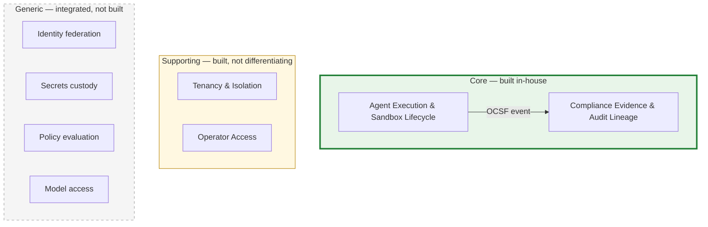
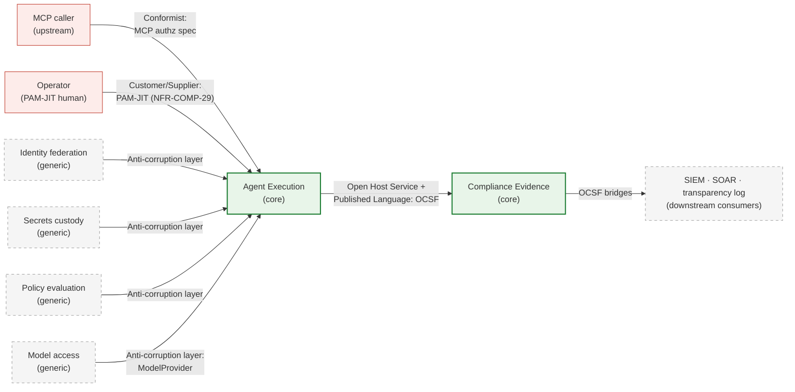

<!-- SPDX-License-Identifier: FSL-1.1-Apache-2.0 -->
<!-- Copyright (c) 2025 Open Computer Use Contributors -->

---
status: draft
last-reviewed: 2026-05-30
owner: "@Wide-Moat/architects"
applies-to: next/v1
---

Cuts the domain into bounded contexts and classifies each as core, supporting, or generic — the buy-vs-build decision made before any component exists. Audience is anyone deciding what we build ourselves and what we integrate.

## 1. Why this layer is not the trust-zone layer

[`02-trust-boundaries.md`](02-trust-boundaries.md) §2 draws five zones — Control plane, Credential broker, Compute plane, Egress trust-edge, Audit pipeline. Those answer "where does it run and under what protection." This layer answers a different question: "which slices of the domain carry the competitive value, and which are solved problems we integrate." A trust zone is a deploy/protection slice; a bounded context is a domain slice. They do not map one-to-one, and the mismatches are the point.

The classification drives the next layer: a context marked `generic` becomes an integration in [`03-c4-context.md`](03-c4-context.md)'s external-actor set, not a container we build; a `core` context becomes containers we own in the C4 Container layer.

## 2. Subdomain classification

The diagram shows only the core-to-core domain edge; the full set of context relationships (inbound, generic integrations, model upstream) is the context map in §4.

| Subdomain | Class | Value axis | Build-vs-buy |
|---|---|---|---|
| **Agent Execution & Sandbox Lifecycle** | core | domain complexity — safely running an adversarial agent loop in-perimeter | build |
| **Compliance Evidence & Audit Lineage** | core | domain complexity — binding every agent action into a replayable, hash-linked lineage that survives an adversarial loop (the lineage, not the OCSF schema or the SIEM sink, is the defensible part) | build |
| **Tenancy & Isolation** | supporting | owns the T0–T3 isolation-tier selection model; a model with its own logic, not a mere deployment flag | build |
| **Operator Access** | supporting | owns the PAM-JIT human-to-platform contract ([NFR-COMP-29](manifesto/02-nfrs.md)); specific to us, not a differentiator | build |
| **Identity federation** | generic | relying-party to customer IdP | integrate |
| **Secrets custody** | generic | key custody behind PKCS#11 / KMIP | integrate |
| **Policy evaluation** | generic | externalised authorization decisions | integrate |
| **Model access** | generic | multi-provider proxy; we host no model ([CLAUDE.md §"v1 non-goals"](../../CLAUDE.md#v1-non-goals-locked-early)) | integrate |

Source availability is a go-to-market property, not a classification axis. The security primitives ship in the open artifact ([`01-audience-and-buyer.md`](manifesto/01-audience-and-buyer.md) §"Audience"); that does not demote Agent Execution to generic. Applying an open runtime correctly to an adversarial in-perimeter agent loop is where the domain complexity sits, so it stays core.

Compliance Evidence is core for the same reason — domain depth, not deal-decisiveness. It clears the TPRM veto (the buyer chain in `01-audience-and-buyer.md`), but that proves it is commercially important, not that it is core. What makes it core is the *lineage*: the OCSF schema, the pluggable SIEM sinks, and the customer-chosen transparency log are generic substrate we integrate; reconstructing a tamper-evident, replayable chain of agent actions across an adversarial loop is the part no competitor hands over and the part we build.

## 3. Trust zones to contexts

The five zones group into two core contexts. The mismatch is deliberate: four zones collapse into one context, one zone is a context of its own.

| Trust zone (Layer 3 §2) | Bounded context | Why this grouping |
|---|---|---|
| Control plane | Agent Execution | session lifecycle is execution machinery |
| Compute plane (sandbox) | Agent Execution | the sandbox is where the loop runs |
| Credential broker | Agent Execution | scoped-token issuance serves the running session |
| Egress trust-edge | Agent Execution | the single outbound path is part of running safely |
| Audit pipeline | Compliance Evidence | different reason to exist: prove, not run |

The Audit pipeline is its own zone in Layer 3 for retention/RPO/tamper-evidence reasons; it is its own context here for a domain reason — its value is regulatory proof, a separate axis from execution.

Merging four zones into one context passes the linguistic test only because they share one model: "run an adversarial agent loop safely in-perimeter." The Control plane and Compute plane are unambiguously one execution model. The Credential broker (custody language: `scoped-JWT`, `TTL`, `reissue-on-revoke`) and the Egress trust-edge (enforcement language: `SNI pre-filter`, `MITM mode`, `x-deny-reason`) speak narrower sub-languages; they are sub-models *inside* Agent Execution, not separate contexts, because their invariants exist only to serve the running session and they share its aggregate root (the session). Whether the broker earns its own context is tracked in §5.

The supporting and generic contexts are not Layer 3 zones we own. Of the four generic contexts, two are Layer 3 §3 external actors — Identity federation (Customer IdP) and Secrets custody (Customer KMS / HSM). Model access is an outbound endpoint *behind* the egress policy, which Layer 3 §3 names as "not an actor against our contracts." Policy evaluation is not yet drawn in Layer 3; it is consumed at two sub-zones of Agent Execution — the Egress trust-edge (MCP allow-list) and the Credential broker (token scoping) — and Layer 6 splits the ACL accordingly. The remaining Layer 3 §3 actors are not new contexts: Customer SIEM, SOAR, and the transparency log are downstream consumers of the Compliance Evidence context (§4); the customer outbound proxy and DLP-ICAP are configurations of the Egress trust-edge already inside Agent Execution.

## 4. Context map

| Relationship | From → To | Pattern | What it commits to |
|---|---|---|---|
| Execution emits evidence | Agent Execution → Compliance Evidence | Open Host Service + Published Language | OCSF v1.x is the published schema; Compliance Evidence is the host with fan-in from four Layer 3 zones and fan-out to multiple SIEMs. The emitter conforms to the schema, not to the consumer's internals ([glossary: OCSF](glossary.md#ocsf)) |
| Inbound tool calls | MCP caller → Agent Execution | Conformist | we conform to the MCP authorization spec; we do not define it |
| Operator access | Operator → Agent Execution | Customer/Supplier | PAM-JIT human-to-platform contract ([NFR-COMP-29](manifesto/02-nfrs.md)); host-rooted credential on the minimal shelf, SAML-asserted attribute on the full shelf |
| Generic integrations | {Identity, Secrets, Policy, Model access} → Agent Execution | Anti-corruption layer | each vendor's model is translated at the boundary so a vendor swap does not reach the core |
| Evidence to sinks | Compliance Evidence → SIEM / SOAR / transparency log | Open Host Service | OCSF bridges and the submission envelope; the consumer adapts, not us |

Model access is the fourth anti-corruption layer: the `ModelProvider` adapter is ours, written precisely so an Anthropic/OpenAI/Bedrock/Vertex swap does not reach the core — the defining property of an anti-corruption layer, not Conformist. The same holds for Identity, Secrets, and Policy: the vendor (Keycloak, OpenBao, OPA) can change without the core domain model changing. Model traffic originates in the Compute plane and physically traverses the Egress trust-edge ([`02-trust-boundaries.md`](02-trust-boundaries.md) §2) — a deployment fact, kept out of this domain map. The two core contexts share the OCSF event and nothing else — no shared identifier type, no shared library — so the Published Language does not degrade into a shared kernel that would bind their release cadences.

## 5. Open questions

1. Does Tenancy & Isolation stay supporting, or split a `core` sub-slice once multi-tenant agent-execution grading lands? — [#165](https://github.com/Wide-Moat/open-computer-use/issues/165).
2. Does the PAM-JIT contract keep Operator Access as its own supporting context, or fold it into Agent Execution? — [#166](https://github.com/Wide-Moat/open-computer-use/issues/166).
3. Is workload-trust sandbox-tier grading (`workload_trust_profile`, AP-13) a sub-context of its own, distinct from the session-lifecycle model inside Agent Execution? — [#168](https://github.com/Wide-Moat/open-computer-use/issues/168).
4. Does the Credential broker earn its own supporting context (custody language distinct from the session model), or stay a sub-model of Agent Execution? — [#169](https://github.com/Wide-Moat/open-computer-use/issues/169).
