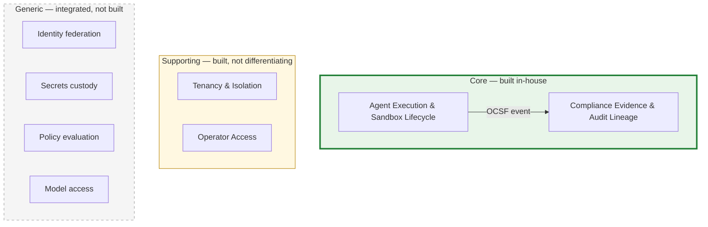
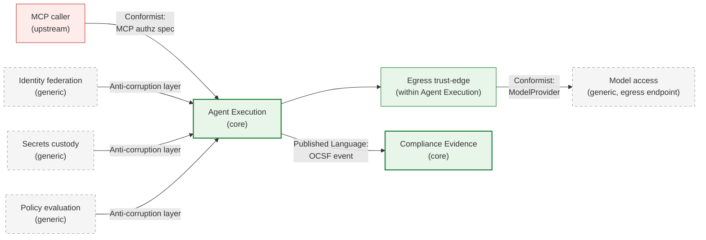

<!-- SPDX-License-Identifier: FSL-1.1-Apache-2.0 -->
<!-- Copyright (c) 2025 Open Computer Use Contributors -->

---
status: draft
last-reviewed: 2026-05-30
owner: "@Wide-Moat/architects"
applies-to: next/v1
---

Cuts the domain into bounded contexts and classifies each as core, supporting, or generic — the buy-vs-build decision made before any component exists. Audience is anyone deciding what we build ourselves and what we integrate.

## 1. Why this layer is not the trust-zone layer

[`02-trust-boundaries.md`](02-trust-boundaries.md) §2 draws five zones — Control plane, Credential broker, Compute plane, Egress trust-edge, Audit pipeline. Those answer "where does it run and under what protection." This layer answers a different question: "which slices of the domain carry the competitive value, and which are solved problems we integrate." A trust zone is a deploy/protection slice; a bounded context is a domain slice. They do not map one-to-one, and the mismatches are the point.

The classification drives the next layer: a context marked `generic` becomes an integration in [`03-c4-context.md`](03-c4-context.md)'s external-actor set, not a container we build; a `core` context becomes containers we own in the C4 Container layer.

## 2. Subdomain classification

The diagram shows only the core-to-core domain edge; the full set of context relationships (inbound, generic integrations, model upstream) is the context map in §4.

| Subdomain | Class | Value axis | Build-vs-buy |
|---|---|---|---|
| **Agent Execution & Sandbox Lifecycle** | core | domain complexity — safely running an adversarial agent loop in-perimeter | build |
| **Compliance Evidence & Audit Lineage** | core | commercial differentiation — the evidence that clears the TPRM veto ([`01-audience-and-buyer.md`](manifesto/01-audience-and-buyer.md) §"Buyer chain") | build |
| **Tenancy & Isolation** | supporting | cross-cutting deployment shape (T0–T3) | build |
| **Operator Access** | supporting | PAM-JIT human path; specific to us, not a differentiator | build |
| **Identity federation** | generic | relying-party to customer IdP | integrate |
| **Secrets custody** | generic | key custody behind PKCS#11 / KMIP | integrate |
| **Policy evaluation** | generic | externalised authorization decisions | integrate |
| **Model access** | generic | multi-provider proxy; we host no model ([CLAUDE.md §"v1 non-goals"](../../CLAUDE.md#v1-non-goals-locked-early)) | integrate |

Source availability is a go-to-market property, not a classification axis. The security primitives ship in the open artifact ([`01-audience-and-buyer.md`](manifesto/01-audience-and-buyer.md) §"Audience"); that does not demote Agent Execution to generic. Applying an open runtime correctly to an adversarial in-perimeter agent loop is where the domain complexity sits, so it stays core.

## 3. Trust zones to contexts

The five zones group into two core contexts. The mismatch is deliberate: four zones collapse into one context, one zone is a context of its own.

| Trust zone (Layer 3 §2) | Bounded context | Why this grouping |
|---|---|---|
| Control plane | Agent Execution | session lifecycle is execution machinery |
| Compute plane (sandbox) | Agent Execution | the sandbox is where the loop runs |
| Credential broker | Agent Execution | scoped-token issuance serves the running session |
| Egress trust-edge | Agent Execution | the single outbound path is part of running safely |
| Audit pipeline | Compliance Evidence | different reason to exist: prove, not run |

The Audit pipeline is its own zone in Layer 3 for retention/RPO/tamper-evidence reasons; it is its own context here for a domain reason — its value is regulatory proof, a separate axis from execution. The supporting and generic contexts are not Layer 3 zones we own. Tenancy is a cross-cutting deployment property of the Compute plane. Of the four generic contexts, two are Layer 3 §3 external actors — Identity federation (Customer IdP) and Secrets custody (Customer KMS / HSM); Model access is an outbound endpoint *behind* the egress policy, which Layer 3 §3 names as "not an actor against our contracts"; Policy evaluation is not yet drawn in Layer 3, introduced here as an integration the policy-enforcement components will consume.

## 4. Context map

| Relationship | From → To | Pattern | What it commits to |
|---|---|---|---|
| Execution emits evidence | Agent Execution → Compliance Evidence | Published Language | OCSF v1.x event schema is the contract; the emitter conforms to the schema, not to the consumer's internals ([glossary: OCSF](glossary.md#ocsf)) |
| Inbound tool calls | MCP caller → Agent Execution | Conformist | we conform to the MCP authorization spec; we do not define it |
| Model upstream | Agent Execution → Egress trust-edge → Model access | Conformist | the `ModelProvider` contract conforms to provider APIs; traffic originates in the Compute plane and traverses the Egress trust-edge ([`02-trust-boundaries.md`](02-trust-boundaries.md) §2), never a direct context edge; no hosted loop |
| Generic integrations | {Identity, Secrets, Policy} → Agent Execution | Anti-corruption layer | each vendor's model is translated at the boundary so a vendor swap does not reach the core |

The anti-corruption layer is what lets Identity federation, Secrets custody, and Policy evaluation stay `integrate`: the vendor (Keycloak, OpenBao, OPA) can change without the core domain model changing. The Published Language between the two core contexts is the OCSF event — it is the same contract Layer 3 §10 names, viewed as a domain boundary rather than a wire format.

## 5. Open questions

1. Does Tenancy & Isolation stay supporting, or split a `core` sub-slice once multi-tenant agent-execution grading lands? — [#165](https://github.com/Wide-Moat/open-computer-use/issues/165).
2. Is Operator Access one context or a slice of Agent Execution once the PAM-JIT contract is specified? — [#166](https://github.com/Wide-Moat/open-computer-use/issues/166).
