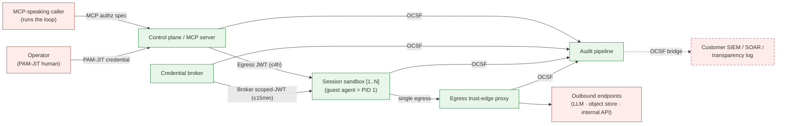

<!-- SPDX-License-Identifier: FSL-1.1-Apache-2.0 -->
<!-- Copyright (c) 2025 Open Computer Use Contributors -->

---
status: draft
last-reviewed: 2026-05-30
owner: "@Wide-Moat/architects"
applies-to: next/v1
---

Names the runnable units inside the OCU box that Layer 4 drew as one block, and what crosses between them. Audience: architects and security engineers who need to see the credential broker and egress edge as separate runnable units before reading a component spec.

## 1. Container vs zone vs context

A C4 container is a separately runnable unit — a process or data store that must be running for OCU to work ([c4model.com](https://c4model.com/abstractions/container)). That is a different axis from the two we have already cut:

- A **trust zone** ([`02-trust-boundaries.md`](02-trust-boundaries.md) §2) is a deploy/protection slice — where it runs and under what protection.
- A **bounded context** ([`04-bounded-contexts.md`](04-bounded-contexts.md) §2) is a domain slice — which part carries the competitive value.

The three axes line up here because the zones were already cut along runnable seams: each of the five zones is one container. Layer 5 grouped four of those zones into one bounded context (Agent Execution); that grouping is about domain ownership, not deployment, so it does not merge the boxes. Agent Execution is one bounded context realized as four cooperating containers.

## 2. Container diagram

Canonical source: [`diagrams/c4-container.mmd`](diagrams/c4-container.mmd). Edge labels name the protocol or token class that crosses; `1..N` marks the per-session container. The four Agent-Execution containers fan into the Audit pipeline over one Published Language (OCSF) — drawn as four edges, one label. External actors are drawn for orientation; their contracts are in [`03-c4-context.md`](03-c4-context.md) §4, not restated here.

## 3. The five containers

Each maps 1:1 to a Layer 3 zone and sits in a Layer 5 context. Responsibility is one line; technology is a Layer 10 component-spec decision and is named here only by role.

| Container | Zone | Context | Responsibility |
|---|---|---|---|
| **Control plane / MCP server** | Control plane | Agent Execution | Terminates inbound MCP calls, authenticates the caller, and drives session lifecycle. Holds no upstream credentials and runs no agent loop. |
| **Session sandbox** `[1..N]` | Compute plane | Agent Execution | Executes one session's tool-calls in an isolated runtime that holds no standing secrets and reaches the network only through the egress edge. Guest agent is PID 1. |
| **Credential broker** | Credential broker | Agent Execution | Issues short-lived scoped tokens to a named session on request; the sandbox never holds a long-lived secret. Host-side. |
| **Egress trust-edge proxy** | Egress trust-edge | Agent Execution | The single outbound path. Enforces the allow-list and denies off-list destinations; emits a structured deny reason. |
| **Audit pipeline** | Audit pipeline | Compliance Evidence | Captures session, tool, credential, and egress events into a hash-linked durable store and forwards to a customer-owned sink. |

The guest agent is the process that constitutes the sandbox container, not a sixth container: it has no lifecycle independent of the sandbox and dies with it. When the sandbox is decomposed at Layer 10, the agent's parts become components inside it.

## 4. Internal boundaries

The token classes and their TTLs are canonical in [`02-trust-boundaries.md`](02-trust-boundaries.md) §8; this layer names which boundary each crosses, not the TTL.

| Boundary | What crosses | Direction |
|---|---|---|
| Caller → Control plane | MCP authorization spec, audience-validated | inbound |
| Control plane → Session sandbox | Egress JWT, session-scoped | one-way dispatch |
| Credential broker → Session sandbox | Broker scoped-JWT, per-resource | one-way, on request |
| Session sandbox → Egress trust-edge | the only outbound network path | one-way |
| {Control plane, broker, sandbox, edge} → Audit pipeline | OCSF event (Published Language) | fan-in |

The sandbox has no direct path to the network or to a standing secret: both go through a dedicated container. That separation is the load-bearing property of this layer — it is why the broker and the egress edge are their own boxes.

## 5. Deployment shelves

The five containers are the same on both shelves; the substrate differs. The diagram draws the full shelf. Scaling topology — node placement, sandbox scheduling, replica counts — is a deployment-view concern, not drawn here. The egress-mode and identity-floor substitutions below are summarized from [`02-trust-boundaries.md`](02-trust-boundaries.md) §7–§8, which owns them.

| Container | Minimal shelf (one-click solo) | Full shelf |
|---|---|---|
| Control plane / MCP server | single process, co-located | scheduled, single instance per deployment |
| Session sandbox | local runtime, `runc` default | hardened or hardware-virt tier per workload |
| Credential broker | host-local signing key | customer-PKI workload identity |
| Egress trust-edge proxy | transparent pass-through | MITM-inspecting opt-in, customer CA |
| Audit pipeline | file-system sink | OCSF bridge to customer SIEM |

## 6. Open questions

1. Does the Session sandbox warrant a sub-container split once the workload-trust tier and guest-agent protocol are specified, or stay one container with internal components? — [#168](https://github.com/Wide-Moat/open-computer-use/issues/168).
2. Is the Credential broker one container per deployment or one per sandbox host, and does the answer change the diagram? — [#169](https://github.com/Wide-Moat/open-computer-use/issues/169).
