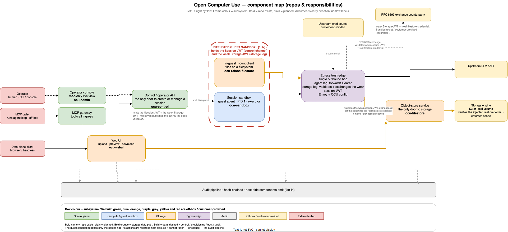

<!-- SPDX-License-Identifier: FSL-1.1-Apache-2.0 -->
<!-- Copyright (c) 2025 Open Computer Use Contributors -->

---
status: stub
last-reviewed: 2026-06-13
owner: "@Wide-Moat/architects"
applies-to: next/v1
---

This directory will hold the canonical enterprise solution architecture for `next/v1`. Read [`MANIFESTO.md`](./MANIFESTO.md) before anything else.

## At a glance

Source: [`diagrams/architecture-overview.drawio`](./diagrams/architecture-overview.drawio). Box colour marks the subsystem; we build the green, blue, orange, purple and grey components, while yellow and red are off-box or customer-provided. Two request paths are load-bearing: the **agent path** (MCP caller → MCP gateway → control plane → guest sandbox; the control plane is the only door to create or manage anything, and it dials into the guest) and the **storage path** (the guest mount client and the Web UI both call `ocu-filestore`, the only door to storage, which fronts a pluggable engine — S3 off-box or a local volume on-box). The guest holds only a short-lived, `filesystem_id`-scoped JWT; the egress edge passes it through untouched and the storage engine enforces the scope.

## Components we build

The platform is one product, not a set of SKUs; these are the parts OCU develops and ships (each in its own public repo under `Wide-Moat`). Everything else on the map — the credential issuer, the storage engine, the upstream LLM, the SIEM — is off-box or customer-provided.

| Component | Repo | What it does |
|---|---|---|
| Control / operator API | [`ocu-control`](https://github.com/Wide-Moat/ocu-control) | The only door to create or manage a session: lifecycle, quota, denylist, kill-switch, and delivery of the pre-signed storage JWT into the guest. Holds no signing key. |
| Session sandbox | [`ocu-sandbox`](https://github.com/Wide-Moat/ocu-sandbox) | The per-session guest executor (PID 1). Untrusted; holds only a scoped JWT. |
| In-guest mount client | [`ocu-rclone-filestore`](https://github.com/Wide-Moat/ocu-rclone-filestore) | Presents the backend files as a filesystem inside the guest; dials out and forwards the JWT unmodified. Object-store client and transport in one binary. |
| Object-store service | [`ocu-filestore`](https://github.com/Wide-Moat/ocu-filestore) | The only door to storage: a file API to its consumers, a storage client to the pluggable engine (S3 or local volume). |
| Web UI | [`ocu-webui`](https://github.com/Wide-Moat/ocu-webui) | File UI — upload, preview, download — over the object-store service. |
| Operator console | [`ocu-admin`](https://github.com/Wide-Moat/ocu-admin) | Read-only live view of sessions for operators. Opt-in. |
| MCP gateway · Egress trust-edge · Audit pipeline | planned | The agent tool-call ingress, the single TLS-inspecting outbound hop (Envoy + OCU config), and the hash-chained audit fan-in. OCU-owned; repos land when each spec hardens. |

## Files in this directory

| File | Status | Purpose |
|---|---|---|
| [`MANIFESTO.md`](./MANIFESTO.md) | stub | Non-negotiables, NFRs by reference, governance. Read first. |
| [`glossary.md`](./glossary.md) | stub | Canonical terms (tenant, sandbox, session, agent, runtime, …). |
| [`PROCESS.md`](./PROCESS.md) | draft | 3-step playbooks for adding a component, ADR, NFR, dependency, or TBD. |
| `manifesto/` | partial | Expanded Manifesto sections — appear one at a time via PRs. Currently `01-audience-and-buyer.md`, `02-nfrs.md`. |
| `components/` | partial | Per-component design contracts — appear one at a time. See [`components/00-overview.md`](./components/00-overview.md) for the index. |
| `adr/` | partial | Contains `README.md` (index) and `0000-template.md`. ADRs appear on demand. |
| `diagrams/` | partial | Diagram sources. [`architecture-overview.drawio`](./diagrams/architecture-overview.drawio) (+ rendered `.svg`) is the component map above; Mermaid `.mmd` sources accompany the specs that cite them. |
| `compliance/` | empty | Per-framework mappings (SOC 2, ISO 27001, DORA, EU AI Act, GDPR, SR 11-7, HIPAA, PCI-DSS). |

## Not yet present

The tree grows one artifact per PR, after discussion. See [`PROCESS.md`](./PROCESS.md).

The in-progress materials at [`docs/future-architecture/`](../future-architecture/) remain a working buffer until coverage here reaches 100%; at that point a `SUPERSEDED.md` marker points back here and that directory becomes legacy.

## Implementation repositories

The specs here are the source of truth; the code lives in the repos listed under [Components we build](#components-we-build) above. The per-container mapping is in [`components/00-overview.md`](./components/00-overview.md#3-implementation-repositories).

## Reading order

1. [`MANIFESTO.md`](./MANIFESTO.md) — what the project is and what's non-negotiable.
2. [`glossary.md`](./glossary.md) — vocabulary.
3. [`PROCESS.md`](./PROCESS.md) — how to add new content.
4. Specific ADRs and component specs as needed; start from [`components/00-overview.md`](./components/00-overview.md).
