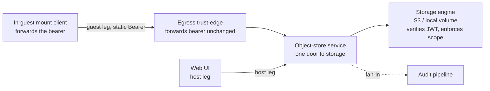

<!-- SPDX-License-Identifier: FSL-1.1-Apache-2.0 -->
<!-- Copyright (c) 2025 Open Computer Use Contributors -->

---
status: draft
last-reviewed: 2026-06-15
owner: "@Wide-Moat/architects"
applies-to: next/v1
compliance: []
threat-model: 06-threat-model.md
contract: [contracts/storage/mount-config.schema.json, contracts/storage/file-ops.schema.json]
adr: [0003, 0010, 0013, 0014, 0015, 0016]
---

The only door to storage. Audience: engineers and security reviewers implementing or auditing the storage path.

# Component-04: Object-store service

## Purpose

It exposes a file API to its two callers — the in-guest mount client (guest leg) and the [Web UI](08-web-ui.md) (host leg) — and is a client to one pluggable storage engine (S3 or a local volume, [ADR-0010](../adr/0010-storage-backend-pluggable-adapter.md)). It forwards the off-box-issued storage JWT to the engine unchanged and holds no signing key. The engine verifies the JWT and enforces the `filesystem_id` scope ([ADR-0013](../adr/0013-storage-credential-custody.md)).

## Boundaries

- **Guest leg in:** In-guest mount client → [Egress trust-edge](06-egress-trust-edge.md) → this service. The guest leg crosses the egress hop ([ADR-0014](../adr/0014-storage-transport-tier-universal-network-leg.md)).
- **Host leg in:** [Web UI](08-web-ui.md) → this service. The host leg does not cross the egress hop ([ADR-0015](../adr/0015-storage-decomposition-by-trust-plane.md)).
- **Engine out:** this service → storage engine. Neither caller reaches the engine directly ([ADR-0010](../adr/0010-storage-backend-pluggable-adapter.md)).
- **Audit out:** this service → [Audit pipeline](07-audit-pipeline.md), host-side, on the fan-in flow.

The file-operation verb names are fixed in [`file-ops`](../../../contracts/storage/file-ops.schema.json): `createFile`, `readFile`, `readMetadata`, `getFileMetadata`, `copyFile`, `moveFile`, `removeFile`, `listFiles`, `listDirectory`, `makeDirectory`, `moveDirectory`, `removeDirectory`, `fileUpload`, `fileDownload`, `importFiles`, `importZip`, `migrateFilesystem`, `removeFilesystem`. Each verb carries per-request `{intent, downloadable}` metadata alongside the `filesystem_id` scope; the three authorization axes are fixed and the per-operation message bodies are TBD in the schema. `migrateFilesystem` and `removeFilesystem` act on a whole filesystem, a filesystem-scope decision distinct from a per-file one ([ADR-0015](../adr/0015-storage-decomposition-by-trust-plane.md)).

### Owned state

| Owns | Does NOT hold |
|---|---|
| The `filesystem_id`→engine-prefix mapping | No storage-JWT signing key — it is off-box at the credential issuer ([ADR-0013](../adr/0013-storage-credential-custody.md)) |
| The storage-engine adapter selection (S3 or local volume) and its chunked-multipart transfer policy ([ADR-0010](../adr/0010-storage-backend-pluggable-adapter.md)) | No authorization authority — the engine validates the `filesystem_id` claim and rejects a foreign scope ([ADR-0013](../adr/0013-storage-credential-custody.md)) |
| The engine credential where one exists — a network-engine key or a local-volume host-filesystem permission ([NFR-SEC-60](../manifesto/02-nfrs.md)) | No client-file API, embeddable SPA, or preview-render — those are the [Web UI](08-web-ui.md) |

The credential flow: the control plane delivers the pre-signed JWT into the mount config, the guest forwards it unmodified as a static `Authorization: Bearer`, and the engine verifies it ([ADR-0013](../adr/0013-storage-credential-custody.md)). The operation names and the three authorization axes are fixed in the bound schema; the per-operation field types are TBD there, not invented here ([`mount-config`](../../../contracts/storage/mount-config.schema.json), [`file-ops`](../../../contracts/storage/file-ops.schema.json)).

## Invariants

1. No file-op resolves a path or object handle outside the request's host-attested `filesystem_id` prefix; traversal, symlink, absolute-path, and URL-shaped handles are rejected before any engine call (property-test, [NFR-SEC-25](../manifesto/02-nfrs.md)).
2. No caller request names a backend object directly; the service maps a verb to an engine request bound to the mapped prefix. A caller-supplied scope id is treated as a hint and rejected if it does not match the host-attested `filesystem_id` binding (property-test, [NFR-SEC-43](../manifesto/02-nfrs.md)).
3. The service mints no credential and signs no request; it forwards the off-box-issued bearer unmodified, and a build or runtime that gives it a signing path fails admission (unit-test, [ADR-0013](../adr/0013-storage-credential-custody.md)).
4. Scope is the engine's decision, not the service's; a foreign-`filesystem_id` token is rejected at the engine (HTTP 401), not here (integration test on foreign-scope rejection, [NFR-SEC-25](../manifesto/02-nfrs.md)).
5. `downloadable` is resolved at read from the host-attested session, never from a caller-supplied claim; a non-downloadable object is readable in-session but yields no egress-eligible artifact, and `intent=preview` stays read-only regardless of stored tag (property-test, [NFR-SEC-73](../manifesto/02-nfrs.md)).
6. A large transfer crosses as chunked multipart, never one message; the size ceiling lives in the chunk policy and every engine adapter translates chunking to the backend's transfer model (property-test, [NFR-SEC-46](../manifesto/02-nfrs.md), [ADR-0010](../adr/0010-storage-backend-pluggable-adapter.md)).
7. Every backend file-activity emits an OCSF File System Activity event into the hash-chained pipeline before the operation is acknowledged; an audit-write failure denies the operation (fail-closed) (unit-test, [NFR-SEC-79](../manifesto/02-nfrs.md)).
8. A network-engine leg opens no second outbound path beyond the single governed egress hop; a direct backend dial bypassing that hop is forbidden, and a local-volume engine opens no network leg at all. The hop is baseline-permissive: it terminates and forwards the leg unchanged, and a destination allow-list is optional hardening (network-policy assertion, [NFR-SEC-85](../manifesto/02-nfrs.md), [NFR-SEC-16](../manifesto/02-nfrs.md), [ADR-0014](../adr/0014-storage-transport-tier-universal-network-leg.md), [ADR-0016](../adr/0016-egress-baseline-inspection-hop-backend-scope.md)).
9. A long-lived host-local backend-engine credential is admitted only where `workload_trust_profile = trusted_operator` and the deployment is single-tenant. Any other profile or a multi-tenant deployment requires the per-session backend credential. This gates the engine key, not the storage JWT (per-profile admission test, [NFR-SEC-60](../manifesto/02-nfrs.md), [ADR-0013](../adr/0013-storage-credential-custody.md)).

## Failure modes

Each row traces to one P4-mount STRIDE row in [`06-threat-model.md`](../06-threat-model.md) §3; the Trace column names that row and the controlling NFRs this service carries for it — engine-side and Session-sandbox NFRs on the row's full anchor live in those components. The Recovery column carries the contract. The reaching actor on the file-op path is A1 (in-sandbox guest). The Web UI's failure modes (A2 external data-plane client, embed-token, preview-render, CSRF) are P4-artifact rows in [component 08](08-web-ui.md), not here. Fail-closed is the default on every prefix-resolution and audit boundary.

| Failure | Trace | Recovery behaviour |
|---|---|---|
| Guest crafts traversal/symlink/oversized file-op to escape the prefix | P4-mount-T1 ([NFR-SEC-25](../manifesto/02-nfrs.md) + SEC-46) | Resolve inside the host-attested `filesystem_id` prefix and reject pre-engine; an oversized write is rejected by the chunk-policy ceiling, never partially staged. |
| Cross-session read of leftover content on a reused mount, or list beyond prefix | P4-mount-I2 ([NFR-SEC-25](../manifesto/02-nfrs.md); remanence re-homed to SEC-54 + SEC-13 + SEC-64 in [component 05](05-session-sandbox.md)) | Erase-before-reuse and page-cache/backend-residue drop are the Session sandbox's invariants ([component 05](05-session-sandbox.md)); list and read stay prefix-confined here. |
| Guest floods file-ops / huge writes / fd exhaustion against a shared service | P4-mount-D1 ([NFR-SEC-46](../manifesto/02-nfrs.md)) | Per-session file-ops/s, in-flight-bytes, and fd ceilings throttle fail-closed at the mount-plane. Residual: resource-exhaustion theme, [#188](https://github.com/Wide-Moat/open-computer-use/issues/188). |
| Guest drives backend traffic to exhaust quota or backend cost | P4-mount-D2 ([NFR-SEC-85](../manifesto/02-nfrs.md) + SEC-16) | A network-engine leg leaves on the single governed hop ([component 06](06-egress-trust-edge.md)) as one observable destination and the bypass dial is forbidden; a local-volume engine has no network leg, so per-session ceilings are the gate. Residual: per-session backend rate ceiling, [#188](https://github.com/Wide-Moat/open-computer-use/issues/188). |
| Guest smuggles a backend object/prefix through a file-op argument (confused deputy) | P4-mount-E1 ([NFR-SEC-25](../manifesto/02-nfrs.md) + SEC-43 + SEC-76) | The service maps the verb to the host-attested `filesystem_id` prefix and the engine validates the claim, so a foreign object is unreachable; the service holds no key to widen with. Residual: per-action authz, [#187](https://github.com/Wide-Moat/open-computer-use/issues/187). |
| Service opens a direct backend dial bypassing the governed hop | P4-mount-E2 ([NFR-SEC-85](../manifesto/02-nfrs.md) + SEC-16) | The bypass dial is refused; a network-engine leg must traverse the single governed hop, so a compromised service cannot silence the audit event; a local-volume engine opens no network leg to bypass ([ADR-0014](../adr/0014-storage-transport-tier-universal-network-leg.md)). Residual: deep content DLP, [#182](https://github.com/Wide-Moat/open-computer-use/issues/182). |
| Leaked guest bearer replayed against another filesystem | P4-mount-S2 ([NFR-SEC-25](../manifesto/02-nfrs.md) + SEC-31) | The engine rejects the bearer for a foreign `filesystem_id` (HTTP 401), so a root read of the mount config yields at most this filesystem for the token's remaining window — not a backend key ([ADR-0013](../adr/0013-storage-credential-custody.md)). Residual: no mid-session refresh, [#267](https://github.com/Wide-Moat/open-computer-use/issues/267). |
| Engine credential disclosed via process compromise / memory scrape | P4-mount-I1 ([NFR-SEC-25](../manifesto/02-nfrs.md) + SEC-33) | The storage-JWT signing key is off-box at the issuer and never enters this service or the guest; the worst guest-side disclosure is the scoped, time-bounded bearer, and the host-side engine key is narrowed to a per-session backend credential on the full shelf ([ADR-0013](../adr/0013-storage-credential-custody.md)). Residual: minimal-shelf long-lived host-local engine credential, [#187](https://github.com/Wide-Moat/open-computer-use/issues/187). |

P4-mount-T2 (backend leg in transit, [NFR-SEC-25](../manifesto/02-nfrs.md) + SEC-85 + SEC-33) and P4-mount-S1 / R1 (mount-plane spoofing and attribution, [NFR-SEC-43](../manifesto/02-nfrs.md) + SEC-03 + SEC-25) are mitigated at the [`05-c4-container.md`](../05-c4-container.md) §4 boundaries and the engine's scope check.

## Operational concerns

Config surface: the `filesystem_id`→prefix map, the engine-adapter selection and its backend endpoint ([ADR-0010](../adr/0010-storage-backend-pluggable-adapter.md)), and the chunk-policy size ceiling (literal defaults in [`08-contracts.md`](../08-contracts.md) §3). The bearer, `service_url`, CA root certificate, and paths arrive in the mount config over the host→guest provisioning push before the mount client starts ([ADR-0014](../adr/0014-storage-transport-tier-universal-network-leg.md)); the service does not fetch them.

Observability: the OCSF File System Activity stream (invariant 7) plus per-session rate counters, emitted on the audit fan-in flow, fail-closed ([`audit-fanin`](../../../contracts/audit/audit-fanin.asyncapi.yaml), [NFR-SEC-79](../manifesto/02-nfrs.md)). The audit and log surface redacts secrets so a bearer never reaches a log line. The engine's scope denial appears in the stream as an upstream 401, not a service-authored deny event ([ADR-0013](../adr/0013-storage-credential-custody.md)).

Deployable boundary: a host-side process distinct from the in-guest mount client and from the [Web UI](08-web-ui.md), each its own deployable; the repo map is in [`00-overview.md`](00-overview.md).

Scaling axis: per-tenant instantiation — one principal per tenant filesystem scope ([NFR-SEC-76](../manifesto/02-nfrs.md)). Capacity is bounded by the per-session file-op ceilings ([NFR-SEC-46](../manifesto/02-nfrs.md)), so one service serving many sessions is not an unbounded shared-DoS surface.

Shelf delta (from [`05-c4-container.md`](../05-c4-container.md) §5): both engines serve both shelves and differ only in the engine credential's substrate and blast radius. The minimal shelf runs a local-volume engine with a host-filesystem permission and no network leg, admitted under `workload_trust_profile = trusted_operator` and single-tenant. The full shelf runs a network engine reached over the single governed hop with a per-session backend credential. The storage-JWT signing key is off-box on both shelves. The egress hop is a property of the network-engine leg, not an invariant. The service runs at the [NFR-SEC-02](../manifesto/02-nfrs.md) hardened-`runc` floor (seccomp BPF, Landlock, cap-drop ALL, read-only rootfs); it executes no agent-issued code, so it carries no `workload_trust_profile` tier axis and no tier ladder ([ADR-0003](../adr/0003-sandbox-runtime-tier-ladder.md)).

## Open questions

1. Is the service one instance per deployment or one per sandbox host, and does the answer change the container diagram? — [#175](https://github.com/Wide-Moat/open-computer-use/issues/175).
2. Mid-session bearer refresh / rotation posture beyond the fixed window — [#267](https://github.com/Wide-Moat/open-computer-use/issues/267).
3. Per-action / per-object authorization granularity beyond resource-class — [#187](https://github.com/Wide-Moat/open-computer-use/issues/187).

---

Hard cap: 600 lines. Sections appear in this fixed order. No additional H2 headings outside this list.
