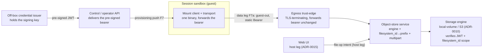

<!-- SPDX-License-Identifier: FSL-1.1-Apache-2.0 -->
<!-- Copyright (c) 2025 Open Computer Use Contributors -->

---
status: draft
last-reviewed: 2026-06-14
owner: "@Wide-Moat/architects"
applies-to: next/v1
compliance: []
threat-model: 06-threat-model.md
contract: [contracts/storage/mount-config.schema.json, contracts/storage/file-ops.schema.json]
adr: [0003, 0010, 0013, 0014, 0015, 0016]
---

The only door to storage — engine adapter, `filesystem_id`→prefix mapping, and multipart. Both the in-guest mount client and the Web UI call it; only it speaks to the storage engine. It holds no signing key. Audience: engineers and security reviewers implementing or auditing the storage backend path.

# Component-04: Object-store service

## Purpose

Speaks the first-party filestore HTTP/RPC surface ([`05-c4-container.md`](../05-c4-container.md) §3) — the file-operation verb set, the engine adapter, the `filesystem_id`→prefix mapping, and chunked multipart. It is the one door to storage: the in-guest mount client (guest leg) and the [Web UI](08-web-ui.md) (host leg) both call it, and only it speaks to the storage engine. The storage JWT is minted by an off-box issuer, held in the guest, and forwarded unmodified by the in-guest mount client; the storage engine verifies the JWT and enforces the `filesystem_id` scope ([ADR-0013](../adr/0013-storage-credential-custody.md)). It is not the authorization authority, not the credential holder, and not the data-plane API — those sit at the storage engine, the off-box issuer, and the [Web UI](08-web-ui.md).

## Boundaries

This service is the object-store-service part of the storage decomposition ([ADR-0015](../adr/0015-storage-decomposition-by-trust-plane.md)): the door to the backend protocol, generalized to a pluggable engine ([ADR-0010](../adr/0010-storage-backend-pluggable-adapter.md)). Both the guest leg (in-guest mount client) and the host leg ([Web UI](08-web-ui.md)) reach it; only it speaks to the storage engine. One backend leg, two callers — never two backend legs.

The in-guest mount client and its transport are one binary, one config, one process: the guest dials the egress hop and forwards the host-issued bearer to this service ([ADR-0014](../adr/0014-storage-transport-tier-universal-network-leg.md)). The data leg is one tier-universal outbound network endpoint resolved per tier ([ADR-0003](../adr/0003-sandbox-runtime-tier-ladder.md), [ADR-0014](../adr/0014-storage-transport-tier-universal-network-leg.md)); the inter-container edges — the host→guest mount-provisioning push (F7), the guest-out data leg (F7a), and the audit fan-in (F10) — are the boundaries [`05-c4-container.md`](../05-c4-container.md) §4 names, defined once there. This spec adds the engine-facing detail below.

The signing key sits off-box at the issuer; the control plane only delivers, and neither the mount client, the Web UI, nor this service signs. The file-operation verb set (create / read with `Range` / readMetadata / copy / move / remove / listFiles / listDirectory with recursive cursor / makeDirectory / moveDirectory / removeDirectory / chunked upload / download / import-zip / import-files) carries per-request `{intent, downloadable}` authorization metadata alongside the `filesystem_id` scope; it is frozen in [`file-ops`](../../../contracts/storage/file-ops.schema.json). The whole-filesystem control verbs (import / migrate / remove) act on a filesystem, not a file, so their authorization is a filesystem-scope decision distinct from a per-file one ([ADR-0015](../adr/0015-storage-decomposition-by-trust-plane.md)). A `memory_store_id` mount is a sibling mount-type behind a `MemoryProvider`-style seam — selected per mount entry, mutually exclusive with `filesystem_id`, sharing the one governed egress with its own scoped bearer, quota dimensions, and verb set; it is not folded into the filestore ([ADR-0015](../adr/0015-storage-decomposition-by-trust-plane.md)). The in-guest VFS substrate (FUSE / virtio-fs / 9p) and the Connect-RPC message set are component-spec choices, not contract; the leg's direction and endpoint are not — they are pinned to a tier ([ADR-0014](../adr/0014-storage-transport-tier-universal-network-leg.md)).

### Owned state

| Owns (sole custodian) | Provably does NOT hold |
|---|---|
| The `filesystem_id`→backend-prefix mapping | No storage-JWT signing key — it is off-box at the credential issuer; the control plane delivers, the guest forwards, the storage engine verifies ([ADR-0013](../adr/0013-storage-credential-custody.md)) |
| The storage-engine adapter selection (local-volume reference, S3) and its chunked-multipart transfer policy ([ADR-0010](../adr/0010-storage-backend-pluggable-adapter.md)) | No authorization authority — the storage engine validates the `filesystem_id` claim and rejects a foreign scope ([ADR-0013](../adr/0013-storage-credential-custody.md)) |
| Per-object `downloadable` disposition, resolved at read on the file-op path ([NFR-SEC-73](../manifesto/02-nfrs.md)) | No client-file API, embeddable SPA, or preview-render — those front the external data-plane client and are the [Web UI](08-web-ui.md) |
| The backend-engine credential where one exists — a network-engine backend key or a local-volume host-filesystem permission ([ADR-0010](../adr/0010-storage-backend-pluggable-adapter.md), [NFR-SEC-60](../manifesto/02-nfrs.md)) | No kill-switch state and no route to the denylist (those are the [Control / operator API](02-control-operator-api.md)); no upstream-LLM credential (that reaches the Egress trust-edge over Envoy SDS, [ADR-0007](../adr/0007-egress-auth-mechanism.md)); no second outbound path ([NFR-SEC-16](../manifesto/02-nfrs.md)) |

The guest mount-plane holds the host-issued, `filesystem_id`+workspace+org-scoped JWT (root-readable in the mount config, scrubbed from the on-disk source after the mount client loads it, sent as a static `Authorization: Bearer` on every request) and the inspection-CA root certificate — never the backend signing key. The custody table for that bearer is canonical in [ADR-0013](../adr/0013-storage-credential-custody.md): the sole signing-key holder is the off-box issuer, the bearer is delivered into the mount config over the host control channel before the mount client starts, and the guest forwards it unmodified. The engine credential is a distinct thing from that JWT — the adapter's own backend key (network engine) or host-filesystem permission (local-volume engine), admitted by the [NFR-SEC-60](../manifesto/02-nfrs.md) shelf split, never a storage-JWT signing key. The `workspace_cmek_enabled` toggle routes the engine through a customer-KMS-envelope branch (a DEK wrapped by a customer-held KEK), the runtime signal of the BYOK/HYOK posture ([NFR-SEC-60](../manifesto/02-nfrs.md)); that branch sits at the storage engine, not in this service and not in the token custody. The frozen field types and error envelope live in the bound schema files ([`mount-config`](../../../contracts/storage/mount-config.schema.json), [`file-ops`](../../../contracts/storage/file-ops.schema.json)).

## Invariants

Each rule holds independent of the engine and is falsifiable by the named check. The reaching actor on the file-op path is A1 (in-sandbox guest). Cross-cutting properties (zone membership, in-transit encryption, retention floor, runtime tier) are Layer 3 and excluded here. Authorization scope, fail-closed audit, and per-session ceilings are re-anchored to their enforcement edge — the storage engine (scope), the audit fan-in (record), the mount-plane (ceilings) — and the rules below are the ones this service itself must satisfy.

1. No file-op resolves a path or object handle outside the request's host-attested `filesystem_id` prefix; traversal, symlink, absolute-path, and URL-shaped handles are rejected before any engine call (property-test, [NFR-SEC-25](../manifesto/02-nfrs.md)). The host-attested scope is the mount-plane's; this service maps it to a prefix and refuses to widen it.
2. No request the caller issues names a backend object directly; the service maps a file-op verb to an engine request bound to the mapped prefix, and a caller-supplied scope id is a hint cross-checked against the `filesystem_id` binding, never the object identity itself (property-test, [NFR-SEC-43](../manifesto/02-nfrs.md)).
3. This service mints no credential and signs no request — it forwards the host-issued bearer unmodified, and a build or runtime that gives it a signing path fails admission; scope is the storage engine's decision and a foreign-`filesystem_id` token is rejected at the engine (HTTP 401), not here ([ADR-0013](../adr/0013-storage-credential-custody.md); unit-test + integration test on foreign-scope rejection, [NFR-SEC-25](../manifesto/02-nfrs.md)).
4. `downloadable` is resolved at read on the file-op path from the host-attested session, never from a caller-supplied claim; a non-downloadable object is readable in-session but yields no egress-eligible artifact, and `intent=preview` stays read-only and non-downloadable regardless of stored tag (property-test, [NFR-SEC-73](../manifesto/02-nfrs.md)).
5. A large transfer crosses as chunked multipart, never one message; the size ceiling lives in the client's chunk policy and obliges every engine adapter to translate chunking to the backend's transfer model ([ADR-0010](../adr/0010-storage-backend-pluggable-adapter.md); property-test, [NFR-SEC-46](../manifesto/02-nfrs.md)).
6. The data leg is one tier-universal outbound network endpoint on every tier; the guest opens no second outbound path and bakes no host-dialled in-guest socket, the in-guest mount client and its transport stay one binary, and a direct dial bypassing the single governed hop on a network-engine shelf is forbidden ([NFR-SEC-16](../manifesto/02-nfrs.md), [ADR-0014](../adr/0014-storage-transport-tier-universal-network-leg.md); network-policy assertion).
7. Every backend file-activity emits an OCSF File System Activity event into the hash-chained pipeline before the operation is acknowledged; an audit-write failure denies the operation (fail-closed) (unit-test, [NFR-SEC-79](../manifesto/02-nfrs.md)).
8. A `memory_store_id` mount is mutually exclusive with `filesystem_id` per mount entry, carries its own scoped bearer and quota dimensions, and rides the same single governed egress with no bypass; the `MemoryProvider` seam adds no second outbound path ([ADR-0015](../adr/0015-storage-decomposition-by-trust-plane.md); schema-validation + property-test).
9. A long-lived host-local backend-engine credential is admitted only where `workload_trust_profile = trusted_operator` and the deployment is single-tenant; any other profile or a multi-tenant deployment requires the per-session backend credential, and admission rejects otherwise — this gates the engine key, not the storage JWT, whose signing key is always off-box ([NFR-SEC-60](../manifesto/02-nfrs.md), [ADR-0013](../adr/0013-storage-credential-custody.md); per-profile admission test).

## Failure modes

Each row traces to one P4-mount STRIDE row in [`06-threat-model.md`](../06-threat-model.md) §3; the Trace column points at the row for threat detail, the Recovery column carries the contract. The reaching actor on the file-op path is A1 (in-sandbox guest). The Web UI's failure modes (the A2 external data-plane client, embed-token, preview-render, CSRF / framing) are P4-artifact rows in [component 08](08-web-ui.md), not here; P4 splits into P4-mount (the guest) and P4-artifact (the external client) ([ADR-0015](../adr/0015-storage-decomposition-by-trust-plane.md)). Fail-closed is the default on every prefix-resolution and audit boundary.

| Failure | Trace | Recovery behaviour |
|---|---|---|
| Guest crafts traversal/symlink/oversized file-op to escape the prefix | P4-mount-T1 ([NFR-SEC-25](../manifesto/02-nfrs.md) + SEC-46) | Resolve inside the host-attested `filesystem_id` prefix and reject pre-engine; an oversized write is rejected by the chunk-policy ceiling, never partially staged. |
| Cross-session read of leftover content on a reused mount, or list beyond prefix | P4-mount-I2 ([NFR-SEC-54](../manifesto/02-nfrs.md) + SEC-13 + SEC-64 + SEC-25) | Erase-before-reuse and page-cache/backend-residue drop are the Session sandbox's invariants ([component 05](05-session-sandbox.md), NFR-SEC-54 / SEC-13 / SEC-64); list/read stays prefix-confined here (NFR-SEC-25). |
| Guest floods file-ops / huge writes / fd exhaustion against a shared service | P4-mount-D1 ([NFR-SEC-46](../manifesto/02-nfrs.md)) | Per-session file-ops/s, in-flight-bytes, and fd ceilings throttle fail-closed at the mount-plane, not client-wide degradation. Residual: resource-exhaustion theme, [#188](https://github.com/Wide-Moat/open-computer-use/issues/188). |
| Guest drives backend traffic to exhaust quota / blow up backend cost | P4-mount-D2 ([NFR-SEC-16](../manifesto/02-nfrs.md)) | A network-engine leg leaves on the single governed hop ([component 06](06-egress-trust-edge.md)) as one observable destination and the bypass dial is forbidden; a local-volume engine ([ADR-0010](../adr/0010-storage-backend-pluggable-adapter.md)) has no network leg, so per-session ceilings (P4-mount-D1) are the gate. Residual: per-session backend rate ceiling — resource-exhaustion theme, [#188](https://github.com/Wide-Moat/open-computer-use/issues/188). |
| Guest smuggles a backend object/prefix through a file-op argument (confused deputy) | P4-mount-E1 ([NFR-SEC-25](../manifesto/02-nfrs.md) + SEC-43) | The service maps the verb to the host-attested `filesystem_id` prefix and the storage engine validates the claim, so a foreign object is unreachable; the service holds no key to widen with. Residual: per-action authz, [#187](https://github.com/Wide-Moat/open-computer-use/issues/187). |
| Service opens a direct backend dial bypassing the governed hop | P4-mount-E2 ([NFR-SEC-16](../manifesto/02-nfrs.md)) | The bypass dial is refused; a network-engine leg must traverse the single governed hop, out-of-process from this service, so a compromised service cannot silence the audit event; a local-volume engine opens no network leg to bypass ([ADR-0014](../adr/0014-storage-transport-tier-universal-network-leg.md)). Residual: deep content DLP on legitimately-written objects stays service-side ([NFR-SEC-81](../manifesto/02-nfrs.md)) — content-blind theme, [#182](https://github.com/Wide-Moat/open-computer-use/issues/182). |
| Leaked guest bearer replayed against another filesystem | P4-mount-S2 ([NFR-SEC-31](../manifesto/02-nfrs.md) + SEC-25) | The storage engine rejects the host-issued bearer for a foreign `filesystem_id` (HTTP 401), so a root read of the mount config yields at most this filesystem for the token's remaining window — not a backend key ([ADR-0013](../adr/0013-storage-credential-custody.md)). Residual: no mid-session refresh — refresh theme, [#267](https://github.com/Wide-Moat/open-computer-use/issues/267). |
| Engine credential disclosed via process compromise / memory scrape | P4-mount-I1 ([NFR-SEC-25](../manifesto/02-nfrs.md) + SEC-33) | The storage-JWT signing key is off-box at the issuer and never enters this service or the guest; the worst guest-side disclosure is the scoped, time-bounded bearer, and the host-side engine key is narrowed to a per-session backend credential on the full shelf ([ADR-0013](../adr/0013-storage-credential-custody.md)). Residual: minimal-shelf long-lived host-local engine credential, [#187](https://github.com/Wide-Moat/open-computer-use/issues/187). |

P4-mount-T2 (backend leg in transit, [NFR-SEC-05](../manifesto/02-nfrs.md) + SEC-33) and P4-mount-S1 / R1 (mount-plane spoofing and attribution, [NFR-SEC-43](../manifesto/02-nfrs.md) + SEC-03 + SEC-25) are mitigated at the [`05-c4-container.md`](../05-c4-container.md) §4 boundaries and at the storage engine's scope check ([ADR-0013](../adr/0013-storage-credential-custody.md)), and are not live failure modes here.

## Operational concerns

Config surface: the `filesystem_id`→prefix map, the engine-adapter selection and its backend endpoint ([ADR-0010](../adr/0010-storage-backend-pluggable-adapter.md)), the chunk-policy size ceiling ([NFR-SEC-46](../manifesto/02-nfrs.md); literal defaults fixed in [`08-contracts.md`](../08-contracts.md) §3), and the `MemoryProvider` seam binding for a `memory_store_id` mount. The host-issued bearer, `service_url`, CA root certificate, and paths arrive in the mount config over the host→guest provisioning push before the mount client starts ([ADR-0014](../adr/0014-storage-transport-tier-universal-network-leg.md)); this client does not fetch them. Observability is the OCSF File System Activity stream (invariant 7) plus per-session rate counters; the audit and log surface carries a secret-redaction primitive so a bearer never reaches a log line ([NFR-SEC-79](../manifesto/02-nfrs.md)).

The container emits OCSF on the audit fan-in flow F10, fail-closed, per the audit contract ([`audit-fanin`](../../../contracts/audit/audit-fanin.asyncapi.yaml)) and [NFR-SEC-03](../manifesto/02-nfrs.md) / [NFR-SEC-79](../manifesto/02-nfrs.md). The backend leg's scope denial is a storage-engine-authored response, observable in the stream as an upstream 401, not a hop- or service-authored deny event ([ADR-0013](../adr/0013-storage-credential-custody.md)).

Deployable boundary: this service is a host-side process distinct from the in-guest mount transport (which forwards the bearer over the guest-out data leg) and from the [Web UI](08-web-ui.md) ([component 08](08-web-ui.md), its own deployable); the repo/deployable map is carried in [`00-overview.md`](00-overview.md). The in-guest mount client and the in-guest transport stay one binary, not a split this spec mandates ([ADR-0014](../adr/0014-storage-transport-tier-universal-network-leg.md), [ADR-0015](../adr/0015-storage-decomposition-by-trust-plane.md)).

Scaling axis: per-tenant instantiation ([NFR-SEC-76](../manifesto/02-nfrs.md)) — one principal per tenant filesystem scope. Capacity is bounded by the per-session file-op ceilings ([NFR-SEC-46](../manifesto/02-nfrs.md)) at the mount-plane, not per-service, so a one-per-host service serving many sessions is not a shared-DoS surface those ceilings cannot bound. The current container count is a then-true observation, not an invariant ([`05-c4-container.md`](../05-c4-container.md) §1).

Shelf delta (from [`05-c4-container.md`](../05-c4-container.md) §5): both engines serve both shelves and differ only in the engine credential's substrate and blast radius. The minimal shelf runs a local-volume engine — a host-filesystem permission, no network leg, admitted under `workload_trust_profile = trusted_operator` and single-tenant ([NFR-SEC-60](../manifesto/02-nfrs.md)); the full shelf runs a network engine reached over the single governed hop with a per-session backend credential ([NFR-SEC-25](../manifesto/02-nfrs.md)). The storage-JWT signing key is off-box at the issuer on both shelves ([ADR-0013](../adr/0013-storage-credential-custody.md)); the shelf split changes the engine credential, and the P4-mount-S2 / I1 residual rides the engine-credential substrate. The egress hop is a shelf property of the network-engine leg, not an invariant: a local-volume engine opens no network leg and does not traverse the gateway ([ADR-0010](../adr/0010-storage-backend-pluggable-adapter.md), [ADR-0014](../adr/0014-storage-transport-tier-universal-network-leg.md)). The service runs at the [NFR-SEC-02](../manifesto/02-nfrs.md) hardened-`runc` floor (seccomp BPF + Landlock + cap-drop ALL + read-only rootfs), profile-independent: it executes no agent-issued code, so it carries no `workload_trust_profile` tier axis (that axis is the sandbox's, [NFR-SEC-38](../manifesto/02-nfrs.md)) and no separate tier ladder ([ADR-0003](../adr/0003-sandbox-runtime-tier-ladder.md)). Its blast radius is bounded by the engine-credential substrate ([NFR-SEC-60](../manifesto/02-nfrs.md) / [NFR-SEC-25](../manifesto/02-nfrs.md)) and host-peer accept ([NFR-SEC-76](../manifesto/02-nfrs.md)), not by a runtime-tier ladder.

## Open questions

1. Is the service one instance per deployment or one per sandbox host, and does the answer change the container diagram? — [#175](https://github.com/Wide-Moat/open-computer-use/issues/175).
2. Mid-session bearer refresh / rotation posture beyond the fixed window — refresh theme, [#267](https://github.com/Wide-Moat/open-computer-use/issues/267).
3. Whether `memory_store_id` is a recognized v1 mount-plane scope class or scoped out with a tracking issue — [#188](https://github.com/Wide-Moat/open-computer-use/issues/188).
4. Per-action / per-object authorization granularity and minimum lease scope beyond resource-class — [#187](https://github.com/Wide-Moat/open-computer-use/issues/187).

---

Hard cap: 600 lines. Sections appear in this fixed order. No additional H2 headings outside this list.
