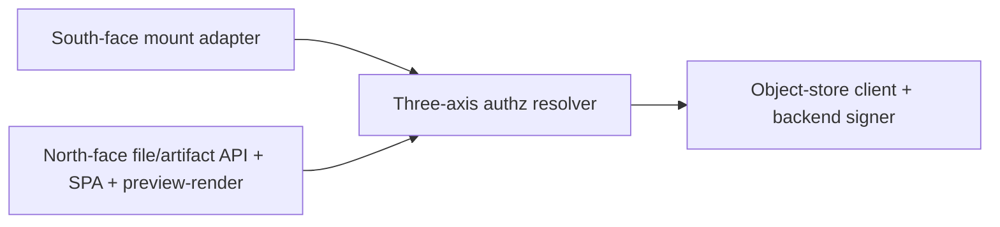

<!-- SPDX-License-Identifier: FSL-1.1-Apache-2.0 -->
<!-- Copyright (c) 2025 Open Computer Use Contributors -->

---
status: draft
last-reviewed: 2026-06-03
owner: "@Wide-Moat/architects"
applies-to: next/v1
compliance: []
threat-model: 06-threat-model.md
contract: [contracts/storage/mount-config.schema.json, contracts/storage/file-ops.schema.json, contracts/storage/file-artifact-api.schema.json]
adr: [0002, 0010]
---

The host-side object-store client that custodies the backend credential and resolves file authorization for the guest mount and an external data-plane client, so neither holds a backend key. Audience: engineers and security reviewers implementing or auditing the storage surface.

# Component-04: Storage broker

## Purpose

Custodies the backend object-store credential and resolves file authorization for two callers — the guest mount and an external data-plane client ([`05-c4-container.md`](../05-c4-container.md) §3). Both faces are components inside one container, sharing one backend credential and one egress backend leg; the `downloadable` axis is resolved at read on both faces, not stamped at write.

## Boundaries

Intra-container, the broker is one process whose two faces call a shared authorization resolver and a single object-store client. The inter-container edges — the broker→sandbox mount, the broker→edge→backend leg, the broker→audit fan-in, and the data-plane-client→broker crossing — are the boundaries [`05-c4-container.md`](../05-c4-container.md) §4 names (their `F7`/`F10`/`F11`/`F12` flow labels are defined in [`06-threat-model.md`](../06-threat-model.md) §1); this spec adds only the intra-container split below.

The south-face mount adapter terminates the `filesystem_id`-scoped file-operation interface from the guest; the north-face component terminates the file/artifact API plus the authenticated SPA and the preview-render path. The files surface is one entry in the data-plane UI's descriptor-driven view list ([ADR-0002](../adr/0002-session-view-descriptor.md)); the broker serves that entry, while the descriptor shell and the deferred live-view surfaces sit outside this container. Both call one authz resolver, which calls one object-store client — the sole component that speaks the backend protocol and signs every backend request. The substrate under the mount (FUSE / virtio-fs / 9p) and the message-set transport are component-spec choices, not contract.

### Owned state

| Owns (sole custodian) | Provably does NOT hold |
|---|---|
| The backend object-store credential | No upstream-API credential (that reaches the Egress trust-edge over Envoy SDS) |
| The `filesystem_id` → backend prefix mapping | No kill-switch state and no route to the denylist (those are the Control / operator API) |
| Per-object `downloadable` disposition, resolved at read | No second outbound path; a direct broker→backend dial bypassing the edge is forbidden (NFR-SEC-16) |
| The north-face first-party session minted after embed-token verify | No long-lived caller identity: it verifies a peer-minted embed token, it does not issue it |

The guest holds only the Storage-mount handle (a `filesystem_id`); the data-plane client presents only an embed token. The Storage-mount handle is canonical in [`02-trust-boundaries.md`](../02-trust-boundaries.md) §8 (session-scoped); the embed token is a peer-minted relying-party credential, not an OCU §8 class — its `exp` is fixed by NFR-SEC-82 — referenced, not restated. The backend signature is produced once, in the object-store client; the egress edge forwards the broker-signed leg allow-list-only without TLS termination. The frozen field types, error envelope, and embed/CSP/CSRF wire detail live in the three bound schema files ([`mount-config`](../../../contracts/storage/mount-config.schema.json), [`file-ops`](../../../contracts/storage/file-ops.schema.json), [`file-artifact-api`](../../../contracts/storage/file-artifact-api.schema.json)).

## Invariants

Each rule holds independent of the caller and is falsifiable by the named check. Cross-cutting properties (zone membership, in-transit encryption, retention floor, runtime tier) are Layer 3 and excluded here.

1. No file-op or API call resolves a path or object handle outside the request's host-attested `filesystem_id` prefix; traversal, symlink, absolute-path, and URL-shaped handles are rejected before any backend call (property-test, NFR-SEC-25).
2. No request the guest or data-plane client issues names a backend object directly; the broker maps a file-op verb / API intent to a request signed with its own credential, and a caller-supplied session/tenant id is a hint cross-checked against host-attested identity, never the identity itself (property-test, NFR-SEC-43).
3. `downloadable` is resolved broker-side at read on both faces from the host-attested session, never from a client-supplied claim; a non-downloadable object is readable in-session but yields no egress-eligible artifact, and `intent=preview` stays read-only and non-downloadable regardless of stored tag (property-test, NFR-SEC-73).
4. Three-axis authorization (scope `filesystem_id` + intent `read`/`write`/`preview` + downloadable) is re-derived broker-side per request, deny-by-default keyed on the authenticated caller; a `preview`-authorized caller cannot invoke `download`/`write` (property-test, NFR-SEC-49).
5. A north-face inbound body above the configured ceiling is rejected pre-buffer, never partially staged; archive bodies are validated (uncompressed-total / entry-count / ratio / traversal / symlink) before extraction and content-classified on ingest before becoming mount-visible (schema-validation + property-test, NFR-SEC-78, NFR-SEC-80, NFR-SEC-81).
6. The north face accepts no request without a signature-valid, in-audience, unexpired embed token before any session state is set, then 401s a missing/invalid session with no anonymous fallback, requires a server-validated CSRF token on every state-mutating call, and sends `CSP: frame-ancestors` from the per-deployment allowlist on every UI/artifact response (schema-validation, NFR-SEC-82, NFR-SEC-83, NFR-SEC-84). The header values are fixed in [`08-contracts.md`](../08-contracts.md) §3 and the bound schema.
7. No OCU upstream secret crosses to the browser; the embed token is peer-minted and the backend credential never leaves the object-store client (unit-test + property-test, NFR-SEC-82).
8. Every file-activity on either face emits an OCSF File System Activity event into the hash-chained pipeline before the operation is acknowledged; an audit-write failure denies the operation (fail-closed) (unit-test, NFR-SEC-79).
9. For a multi-tenant deployment the broker is instantiated per tenant — one broker principal per tenant filesystem scope; a multiplexed broker is admitted only on a single-tenant `trusted_operator` shelf (IaC-policy assertion, NFR-SEC-76).
10. A long-lived host-local backend credential is admitted only where `workload_trust_profile = trusted_operator` and the deployment is single-tenant; any other profile or a multi-tenant deployment requires the STS-scoped-per-session credential, and admission rejects otherwise (per-profile admission test, NFR-SEC-60).

## Failure modes

Each row traces to one P4 STRIDE row in [`06-threat-model.md`](../06-threat-model.md) §3; the Trace column points at the row for threat detail, the Recovery column carries the container-internal contract. The reaching actor is A1 (in-sandbox guest) on the south/backend legs and A2 (external data-plane client) on the north face. Fail-closed is the default on every authz, audit, and ingest boundary.

| Failure | Trace | Recovery behaviour |
|---|---|---|
| Guest crafts traversal/symlink/oversized file-op to escape the prefix | P4-T1 (NFR-SEC-25 + SEC-46) | Resolve inside the host-attested prefix and reject pre-backend; oversized write rejected pre-buffer at the max-object ceiling, never partially staged. |
| Cross-session read of leftover content on a reused mount, or list beyond prefix | P4-I2 (NFR-SEC-54 + SEC-13 + SEC-64 + SEC-25 + SEC-73) | Erase-before-reuse zeroizes a recycled substrate before a session-2 handle binds (NFR-SEC-54), the per-session DEK is destroyed on session end (NFR-SEC-13), page-cache/backend residue is dropped before the next session runs (NFR-SEC-64), and list/read stays prefix-confined (NFR-SEC-25 + SEC-73). |
| Guest floods file-ops / huge writes / fd exhaustion against a shared broker | P4-D1 (NFR-SEC-46) | Per-session file-ops/s, in-flight-bytes, and fd ceilings throttle fail-closed, not broker-wide degradation. Residual: resource-exhaustion theme, [#188](https://github.com/Wide-Moat/open-computer-use/issues/188). |
| Guest drives backend traffic to exhaust STS quota / blow up backend cost | P4-D2 (NFR-SEC-16 + SEC-27) | A network backend engine's traffic traverses the single egress as one observable destination and the bypass dial is forbidden, so the leg is policy-gated; a local-volume engine ([ADR-0010](../adr/0010-storage-backend-pluggable-adapter.md)) has no network leg, so per-session file-op ceilings (P4-D1) are the gate. Residual: per-session backend rate ceiling — resource-exhaustion theme, [#188](https://github.com/Wide-Moat/open-computer-use/issues/188). |
| Guest smuggles a backend key/prefix through a file-op argument (confused deputy) | P4-E1 (NFR-SEC-25 + SEC-43 + SEC-76) | The broker signs with its own credential against the host-attested mapping; broker-per-tenant bounds the deputy. Residual: per-action authz, [#187](https://github.com/Wide-Moat/open-computer-use/issues/187). |
| Broker opens a direct backend dial bypassing the edge | P4-E2 (NFR-SEC-16 + SEC-27) | The bypass dial is refused; a network backend engine's leg must traverse the single egress, while a local-volume engine ([ADR-0010](../adr/0010-storage-backend-pluggable-adapter.md)) opens no network leg to bypass. Residual: transparent-mode egress is content-blind on F10, needing broker-side DLP — content-blind-egress theme, [#182](https://github.com/Wide-Moat/open-computer-use/issues/182). |
| Data-plane client replays / forges / frames the embed token | P4-S3 (NFR-SEC-82 + SEC-83) | Verify before minting a first-party session; `frame-ancestors` allowlist denies cross-origin framing. Residual: no replay-binding (`jti`/nonce) within TTL — embed-token replay, [#217](https://github.com/Wide-Moat/open-computer-use/issues/217). |
| Cross-site forgery against the first-party cookie / token leak via `Referer` | P4-T3 (NFR-SEC-84 + SEC-82) | First-party cookie with server-validated CSRF token on every mutating call; 401 on missing/invalid session. Residual: token-pattern + `exp`-in-URL hardening, [#187](https://github.com/Wide-Moat/open-computer-use/issues/187). |
| Forged/swapped id read, preview leak via `postMessage('*')`, or `downloadable=false` bytes shipped | P4-I3 (NFR-SEC-49 + SEC-73 + SEC-83) | Three-axis authz re-derived from the host-attested session; preview read-only and non-downloadable; framing closed by the allowlist. Residual: per-object authz granularity, [#187](https://github.com/Wide-Moat/open-computer-use/issues/187); preview-render parser isolation, [#218](https://github.com/Wide-Moat/open-computer-use/issues/218). |
| North-face inbound-byte flood: pre-auth verify-cost, oversized upload, zip-bomb preview | P4-D3 (NFR-SEC-78 + SEC-80) | Body capped and rejected pre-buffer on a file/UI ingress distinct from the MCP listener; archive validated before extraction; content classified on ingest. Residual: pre-auth verify-cost flood — resource-exhaustion theme, [#188](https://github.com/Wide-Moat/open-computer-use/issues/188). |
| North-face upload/download/delete/preview later disputed | P4-R2 (NFR-SEC-79 + SEC-09) | OCSF File System Activity event per operation, fail-closed, under host-attested identity, before the response is issued. Residual: binding OCSF `actor` to the embed-asserted principal, [#181](https://github.com/Wide-Moat/open-computer-use/issues/181). |
| Client flips intent/tag to escalate `preview`→`download`/`write`, or crafted id drives SSRF/path escape | P4-E3 (NFR-SEC-49 + SEC-73 + SEC-80) | Lease scoped to verb + exact prefix, failing at the backend not only at policy; preview stays read-only; traversal/polyglot rejected pre-extraction. Residual: per-action granularity, [#187](https://github.com/Wide-Moat/open-computer-use/issues/187). |
| Compromised/impersonated broker reaches backend objects outside any live session | P4-S2 (NFR-SEC-25) | Full shelf: STS-scoped-per-session backend creds, so only the narrow per-session role is assumable. Residual: minimal-shelf host-local credential is broader (whole-bucket on broker-host compromise), admitted only under single-tenant `trusted_operator` (NFR-SEC-60) — called out by the shelf split (§Operational concerns). |
| Backend credential disclosed via process compromise / memory scrape / leak onto mount | P4-I1 (NFR-SEC-25 + SEC-33) | Credential host-side only, no object-store protocol toward the guest; full shelf narrows the held secret to an STS-scoped-per-session credential. Residual: minimal-shelf long-lived host-local credential, [#187](https://github.com/Wide-Moat/open-computer-use/issues/187). |

P4-S1 (south-face spoofing, NFR-SEC-43 + SEC-25), P4-T2 (backend leg in transit, NFR-SEC-05 + SEC-33), and P4-R1 (south-face attribution, NFR-SEC-43 + SEC-03 + SEC-25) are MITIGATED in §4 and are not live failure modes here.

## Operational concerns

Config surface: the `filesystem_id`→prefix map, the north-face ingress binding (distinct from the MCP listener), the embed-token issuer/audience, the `frame-ancestors` per-deployment allowlist, and the inbound-body / archive ceilings (NFR-SEC-78, NFR-SEC-80; literal defaults fixed in [`08-contracts.md`](../08-contracts.md) §3). Observability is the OCSF File System Activity stream (invariant 8) plus per-session rate counters.

The container emits OCSF on the audit fan-in flow F11, fail-closed, per the audit contract ([`audit-fanin`](../../../contracts/audit/audit-fanin.asyncapi.yaml)) and NFR-SEC-03 / NFR-SEC-79 — both faces author the same File System Activity event class.

Scaling axis: per-tenant instantiation (NFR-SEC-76) — one broker principal per tenant filesystem scope. Whether that principal is also per-sandbox-host or per-deployment, and whether that changes the container diagram, is open ([#175](https://github.com/Wide-Moat/open-computer-use/issues/175)). Capacity is bounded by the per-session file-op and inbound-byte ceilings (NFR-SEC-46, NFR-SEC-78); a one-per-host broker serving many sessions is a shared DoS surface, which is why those ceilings are per-session, not per-broker.

Shelf delta (from [`05-c4-container.md`](../05-c4-container.md) §5): the minimal shelf holds a host-local backend credential, admitted only under `workload_trust_profile = trusted_operator` and single-tenant (NFR-SEC-60); the full shelf uses a customer-PKI workload identity with STS scoped per session (NFR-SEC-25). All invariants hold on both shelves; only the credential substrate and its blast radius (P4-S2 / P4-I1 residual) change. The backend engine is a pluggable adapter behind the object-store client ([ADR-0010](../adr/0010-storage-backend-pluggable-adapter.md)): a local-volume engine (the solo-reference, no network leg) and an S3 engine are both present from day one, and the egress-transit invariant applies only to a network engine's leg. The runtime tier that hosts the broker is deferred (`needs ADR:` broker runtime tier); this spec records the two-face split and the cardinality question, it picks no tier.

## Open questions

1. Is the broker one instance per deployment or one per sandbox host, and does the answer change the container diagram? — [#175](https://github.com/Wide-Moat/open-computer-use/issues/175).
2. Embed-token replay-binding (`jti`/nonce single-use or token↔channel binding) within the `exp` window — [#217](https://github.com/Wide-Moat/open-computer-use/issues/217).
3. Preview-render parser isolation for untrusted artifact bodies on the north face — [#218](https://github.com/Wide-Moat/open-computer-use/issues/218).
4. Per-action / per-object authorization granularity and minimum lease scope beyond resource-class — [#187](https://github.com/Wide-Moat/open-computer-use/issues/187).
