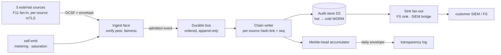

<!-- SPDX-License-Identifier: FSL-1.1-Apache-2.0 -->
<!-- Copyright (c) 2025 Open Computer Use Contributors -->

---
status: draft
last-reviewed: 2026-05-31
owner: "@Wide-Moat/architects"
applies-to: next/v1
compliance: []
threat-model: 06-threat-model.md
contract: contracts/audit/audit-fanin.asyncapi.yaml
adr: []
---

Internal design of the Audit pipeline container: how host-attested source events fan into one hash-linked durable store and reach a customer-owned sink. Audience: engineers and security reviewers on the audit path.

## Purpose

The Compliance Evidence container that turns each source's OCSF event into a durable, ordered, tamper-evident record and forwards it to a customer sink ([`05-c4-container.md`](../05-c4-container.md) §3). Ingest is the trust boundary: the OCSF `source` field is the host-attested identity of the connecting channel ([NFR-SEC-09](../manifesto/02-nfrs.md)), never a value read from the payload, so a compromised source can author events only as itself.

## Boundaries

The inter-container fan-in edge (F11, defined in [`06-threat-model.md`](../06-threat-model.md) §1; the descriptive boundary is in [`05-c4-container.md`](../05-c4-container.md) §4) carries events from the producer containers into this box. This section names the components inside the box and the calls between them.

### Internal components

The pipeline receives over five channels: four external host-attested producer channels — control-plane (carrying both MCP-gateway and Control/operator-API events), storage-broker, session-sandbox, egress-edge — each an mTLS-terminated peer, plus the pipeline's own self-emit channel for compute-metering and saturation events.

- **Ingest face** terminates the five external channels (one address per source), verifies the per-source mTLS peer identity, binds the OCSF `source` to that verified identity, and discards any payload-supplied source claim. The self-emit metering/saturation channel is internally originated, not an mTLS-terminated wire peer. Per-source ingest fairness is applied before admission.
- **Durable bus** holds admitted events ordered and append-only; an event is committed here before the source's publish is acknowledged.
- **Chain writer** assigns per-source hash linkage over the bus-committed stream, deriving chain order from the source's monotonic `sequence` envelope field, and writes to the store.
- **Merkle-head accumulator** batches the chain and produces the daily head submitted to the transparency log; it signs only the submission envelope.
- **Sink fan-out** drives the always-present file-system sink and the opt-in SIEM bridge, replaying from the store on recovery.

### Owned state

The container is sole custodian of the **audit store** (threat-model element D2) — the hash-linked append-only log and its hot/cold tiers — and of the **Merkle-head accumulator** and the **envelope signing key**. The store is write-once from the chain writer's view: no internal path rewrites or deletes a committed record.

It holds **no upstream credential, no kill-switch route, and no session-mutation path**. The fan-in contract models every source operation as `receive` and the SIEM fan-out as a separate `send` surface, so no event admitted here can issue a control-plane or egress action (Invariant 1). The hash-chain linkage (`prev_hash`/`chain_hash`) is authored at ingest, not part of any source's publish payload, so a source cannot pre-compute or forge chain position.

### Wire surface

The fan-in contract is [`contracts/audit/audit-fanin.asyncapi.yaml`](../../../contracts/audit/audit-fanin.asyncapi.yaml); field types, the shared `MessageEnvelope`, and the OCSF class `$ref`s are fixed there and not restated. The schema does not encode where work happens: the ingest face terminates the per-source mTLS channel and binds source identity; the chain writer (not the source) authors `prev_hash`/`chain_hash`; the durable-bus substrate is named by role only (the protocol token in the contract is a default binding, the product is an ADR — Open questions). The two self-emitted payloads (compute metering, saturation) carry a stable channel and envelope but an open payload schema — no OCSF v1.x class fits (Open questions).

Source-to-pipeline calls authenticate with the **Generic internal token** class from [`02-trust-boundaries.md`](../02-trust-boundaries.md) §8; TTLs are owned there, not repeated here.

## Invariants

1. **Source identity is host-attested at ingest, never payload-derived.** No admitted event carries an OCSF `source` value read from its payload; the value is the verified mTLS channel identity, and the contract surface is `receive`-only with no source-issued `send`. *(property-test on the ingest decoder asserting a payload `source` claim is discarded + AsyncAPI lint asserting zero source-side `send` operations; [NFR-SEC-09](../manifesto/02-nfrs.md), [NFR-SEC-47](../manifesto/02-nfrs.md))*
2. **A source may publish only to its own channel.** An event addressed to another source's channel from a given peer identity is rejected. *(integration test driving one source's credential against every other channel; [NFR-SEC-09](../manifesto/02-nfrs.md))*
3. **Chain linkage is pipeline-authored and append-only.** `prev_hash`/`chain_hash` are never accepted from a publish payload; no internal path rewrites or deletes a committed record; the chain has zero breaks. *(schema-validation rejecting payload-supplied chain fields + chain-continuity check; [NFR-SEC-03](../manifesto/02-nfrs.md))*
4. **Every event commits to the durable bus before its publish is acknowledged.** No source receives an ack for an event not yet committed; no synchronous database write sits on the critical path. *(chaos test asserting bus-on-path for every event; [NFR-REL-12](../manifesto/02-nfrs.md))*
5. **Chain order derives from the per-source monotonic sequence and the host-side trusted-time floor, not wall-clock.** Ordering uses the source's monotonic `sequence`; the wall-clock value is a recorded field, not the ordering key. *(red-team clock-rollback harness; [NFR-SEC-48](../manifesto/02-nfrs.md))*
6. **No single source starves co-tenant sources at the fan-in.** A source exceeding its provisioned ingest share is rate-shaped (not dropped), counted, and emits a saturation event; co-tenant sources keep headroom and the chain stays unbroken. *(chaos test flooding one source against its share; [NFR-SEC-56](../manifesto/02-nfrs.md), [NFR-PERF-10](../manifesto/02-nfrs.md))*
7. **The daily Merkle head is submitted to a transparency log; the pipeline signs only the submission envelope.** The chain produces a head each day; the log operator signs the head, the pipeline signs the submission envelope. *(daily transparency-log probe; [NFR-SEC-03](../manifesto/02-nfrs.md))*
8. **Every event carries the mandatory envelope out-of-band of its OCSF payload.** The `MessageEnvelope` required fields are present and validated independent of the OCSF class, so the record survives transform to CEF/ECS/UDM. *(schema-conformance gate against the `MessageEnvelope` in [`contracts/audit/audit-fanin.asyncapi.yaml`](../../../contracts/audit/audit-fanin.asyncapi.yaml); [NFR-MAINT-AUDIT-SCHEMA](../manifesto/02-nfrs.md))*

## Failure modes

Each row traces to one Layer 7 STRIDE row ([`06-threat-model.md`](../06-threat-model.md) §3) by element-ID and repeats that row's controlling NFR. The primary reaching actor is A1, the in-sandbox guest, acting through the session-sandbox source channel; A2/A3 rows are marked.

| Pn-Xn | Trigger | Container-internal behaviour | Controlling NFR |
|---|---|---|---|
| **P7-S1** (A1) | A compromised source forges an OCSF `source` claiming another, trusted source. | Fail-closed at the ingest face: the event is admitted only under the verified channel identity; a payload `source` mismatching the channel is rejected, not re-tagged. Residual: guest-self-audit / out-of-band capture, [#181](https://github.com/Wide-Moat/open-computer-use/issues/181). | [NFR-SEC-47](../manifesto/02-nfrs.md) |
| **P7-R2** (A1) | The guest, its own source for purely in-sandbox actions, omits or falsifies events before fan-in. | The pipeline records faithfully what it receives and cannot detect origin-side suppression; corroboration is against the host-authored sources (egress, broker file-op, control-plane RPC, runtime-monitor) arriving on their own channels. Residual: purely in-sandbox actions with no host-side side-effect, [#181](https://github.com/Wide-Moat/open-computer-use/issues/181). | [NFR-SEC-47](../manifesto/02-nfrs.md) |
| **P7-D1** (A1) | The downstream sink slows or is unreachable; backpressure fills the durable bus. | Fail-closed against loss, not against availability: events commit to the durable bus and the always-present file-system sink before ack; the SIEM bridge is decoupled and replays from the store on recovery rather than dropping or blocking sources. Residual: no measurable end-to-end backpressure / saturation-spill target, [#150](https://github.com/Wide-Moat/open-computer-use/issues/150), [#188](https://github.com/Wide-Moat/open-computer-use/issues/188). | [NFR-REL-12](../manifesto/02-nfrs.md) |
| **P7-D2** (A1) | A compromised guest floods well-formed OCSF to exhaust collector ingest or dilute true events. | Per-source ingest fairness keyed to the host-attested source ([NFR-SEC-56](../manifesto/02-nfrs.md)) rate-shapes the over-share (not dropped), counts it, and emits a saturation event; co-tenant sources keep headroom and the chain stays unbroken under the aggregate no-drop budget. Residual: per-source retention-budget cap and forensic-dilution-within-budget, [#188](https://github.com/Wide-Moat/open-computer-use/issues/188). | [NFR-PERF-10](../manifesto/02-nfrs.md) |
| **P7-T2** (A3) | Clock rollback backdates events or stalls/forges the daily Merkle cadence so a tampered batch lands in a legitimate signing window. | Chain order and the Merkle cadence key off the per-source monotonic sequence and the host-side trusted-time floor, not the wall clock; on resume the wall clock is corrected before any time-bound check runs ([NFR-SEC-63](../manifesto/02-nfrs.md)). Residual: trusted-time anchor for the cadence, [#185](https://github.com/Wide-Moat/open-computer-use/issues/185). | [NFR-SEC-48](../manifesto/02-nfrs.md) + [SEC-63](../manifesto/02-nfrs.md) |
| **P7-R3** (A3+A2) | A privileged operator/SOAR action beyond tier-downgrade reaches the pipeline without a mandatory record. | The pipeline is the fail-closed sink for the enumerated privileged-action set: a privileged action is denied at its source if its chain-linked OCSF event cannot be written here. The pipeline enforces the write-before-ack contract; it does not originate the action. Residual: mandatory audit of the full enumerated set, [#186](https://github.com/Wide-Moat/open-computer-use/issues/186). | [NFR-SEC-45](../manifesto/02-nfrs.md) |
| **P7-T3** (A3) | A snapshot/hibernation image of the audit/forensic state captures a live session token at rest. | A live token is cleaned before stop and excluded from image scope ([NFR-SEC-44](../manifesto/02-nfrs.md)); snapshot artifacts are encrypted and integrity-authenticated at rest, and restore rejects an unauthenticated image ([NFR-SEC-61](../manifesto/02-nfrs.md)). Residual: snapshot live-secret at rest, [#184](https://github.com/Wide-Moat/open-computer-use/issues/184). | [NFR-SEC-44](../manifesto/02-nfrs.md) + [SEC-61](../manifesto/02-nfrs.md) |

Element rows already MITIGATED in [`06-threat-model.md`](../06-threat-model.md) §4 are not relisted as live.

## Operational concerns

This container is the F11 fan-in consumer ([`05-c4-container.md`](../05-c4-container.md) §4): it receives OCSF from the source containers and is the enforcement point for the write-before-ack property of [NFR-SEC-03](../manifesto/02-nfrs.md), [NFR-SEC-45](../manifesto/02-nfrs.md), and [NFR-SEC-72](../manifesto/02-nfrs.md) (system-initiated lifecycle transitions).

| Concern | Detail | Target / anchor |
|---|---|---|
| Config surface | five external source-channel addresses + per-source mTLS trust; self-emit channel; per-source ingest share; retention tier; sink bindings (FS always-on, SIEM opt-in); transparency-log endpoint | [NFR-COMP-01](../manifesto/02-nfrs.md), [NFR-MAINT-AUDIT-SCHEMA](../manifesto/02-nfrs.md) |
| Observability | per-source ingest rate vs share, saturation events, bus depth / backpressure, chain-continuity, sink replay lag; self-emitted on its own channel | [NFR-PERF-10](../manifesto/02-nfrs.md), [NFR-COST-05](../manifesto/02-nfrs.md) |
| Scaling axis | per-deployment (single durable bus + store); sources scale `[1..N]` independently; whether the store partitions per tenant is a deployment concern | [NFR-REL-12](../manifesto/02-nfrs.md) |
| Capacity model | ingest headroom with no silent drop and zero chain breaks; hot tier then cold tier to the retention floor | [NFR-PERF-10](../manifesto/02-nfrs.md), [NFR-COMP-01](../manifesto/02-nfrs.md) |
| Recovery | no event loss; the SIEM bridge replays from the durable store on recovery | [NFR-REL-03](../manifesto/02-nfrs.md) |
| Upgrade / rotation | OCSF schema upgrade with N-1 backward-compat; envelope-signing-key rotation per the key-custody floor | [NFR-MAINT-AUDIT-SCHEMA](../manifesto/02-nfrs.md) |

Backpressure behaviour is spill, not block: events commit to the durable bus and the file-system sink before ack, so a stalled SIEM sink fills the bus toward its bound and replays on recovery; sources are never blocked and events are never silently dropped. The measurable end-to-end saturation / spill target is open ([#150](https://github.com/Wide-Moat/open-computer-use/issues/150)).

**Shelf delta** (from [`05-c4-container.md`](../05-c4-container.md) §5 and [`02-trust-boundaries.md`](../02-trust-boundaries.md) §10). Minimal shelf: file-system sink only; the Merkle-head submission envelope is signed with a host-local key. Full shelf: an opt-in OCSF bridge to a customer SIEM as a fan-out; the same envelope signed with an HSM-rooted key when customer KMS is wired. The boundary properties — host-attested source identity, hash-linked append-only chain, write-before-ack, per-source fairness — hold on both shelves; only the sink substrate and the envelope signer change. The durable-bus product and the WORM cold-tier substrate are ADR-level picks (Open questions); neither is decided here.

## Open questions

1. SIEM-bridge transport and end-to-end backpressure: the pluggable-sink contract needs a measurable transport and saturation-spill target — [#150](https://github.com/Wide-Moat/open-computer-use/issues/150).
2. Transparency-log publishing path (auth, retry, RPO if the log is unreachable) and whether the minimal shelf publishes at all — [#151](https://github.com/Wide-Moat/open-computer-use/issues/151).
3. Out-of-band evidence for in-sandbox actions and host-attested binding of the OCSF source at ingestion (the P7-S1 / P7-R2 residual) — [#181](https://github.com/Wide-Moat/open-computer-use/issues/181).
4. Per-source retention-budget cap and forensic-dilution-within-budget at the audit fan-in — [#188](https://github.com/Wide-Moat/open-computer-use/issues/188).
5. ComputeMetering / SaturationEvent payload schema: OCSF v1.x ships no metering or saturation class, so the channel surface is stable but the payload `$ref` is held TBD. needs issue: split the metering/saturation OCSF-class payload-schema TBD off [#150](https://github.com/Wide-Moat/open-computer-use/issues/150) so the Published-Language gap is tracked separately from SIEM-bridge transport.
