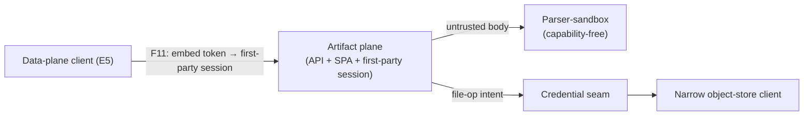

<!-- SPDX-License-Identifier: FSL-1.1-Apache-2.0 -->
<!-- Copyright (c) 2025 Open Computer Use Contributors -->

---
status: draft
last-reviewed: 2026-06-14
owner: "@Wide-Moat/architects"
applies-to: next/v1
compliance: []
threat-model: 06-threat-model.md
contract: [contracts/storage/file-artifact-api.schema.json]
adr: [0002, 0013, 0015, 0016, 0017]
---

OCU's own design: the host-side file/artifact HTTP API, embeddable SPA, and preview-render an external data-plane client reaches over an embed-token→first-party-session flow, holding no backend key. Audience: engineers and security reviewers implementing or auditing the file/artifact data-plane surface.

# Component-08: Artifact plane

## Purpose

Serves the file/artifact data plane — the HTTP file API (upload / list / download / preview), the embeddable SPA, and preview-render — to an external data-plane client (E5, [`03-c4-context.md`](../03-c4-context.md) §4) over an embed-token→first-party-session flow. This is OCU's design addition, not a reproduction of the observed reference; the reference surfaces user data only through the guest mount. The artifact plane holds no backend key: it calls the narrow object-store client ([`04-storage-broker.md`](04-storage-broker.md)) behind the credential seam for every file operation, and the storage signing key stays with the off-box host-side issuer ([ADR-0013](../adr/0013-storage-credential-custody.md) custody table).

## Boundaries

The artifact plane fronts one counterparty — an external data-plane client (E5) — distinct from the guest-mount counterparty (the untrusted guest) on [`05-session-sandbox.md`](05-session-sandbox.md) and [`04-storage-broker.md`](04-storage-broker.md). Bytes flow client↔OCU directly, never through a calling peer and never to the object store; the plane resolves authorization and calls the narrow object-store client for the backend leg. Storage is cut into four parts by counterparty — the guest mount, the artifact plane, the parser-sandbox, and the narrow object-store client — not by a diagram direction ([ADR-0015](../adr/0015-storage-decomposition-by-trust-plane.md)); this spec is the artifact-plane part.

| Direction | What | From / to | Protocol |
|---|---|---|---|
| inbound | SPA + file/artifact API (upload / list / download / preview), embed-token verified → first-party session | Data-plane client (E5) → artifact plane (F11) | HTTP+JSON on a dedicated file/UI ingress, not the MCP listener |
| internal | file-operation intent after three-axis authorization | artifact plane → narrow object-store client | intra-deployment request behind the credential seam |
| internal | untrusted artifact body for validation / preview-render | artifact plane → parser-sandbox | capability-free sub-boundary (below) |
| outbound (fan-in) | OCSF File System Activity event per operation, fail-closed | artifact plane → Audit pipeline (F10) | Published Language (OCSF) |

The `F#` flow labels are defined once in [`05-c4-container.md`](../05-c4-container.md) §4. The files surface is one entry in the data-plane UI's descriptor-driven view list ([ADR-0002](../adr/0002-session-view-descriptor.md)); the artifact plane serves that entry, while the descriptor shell and the deferred live-view surfaces ([#210](https://github.com/Wide-Moat/open-computer-use/issues/210)) sit outside it. The operation set, route shape, three-axis authorization, embed-token verify contract, cookie/CSRF/CSP response envelope, and body/archive/classification ceilings are the frozen [`file-artifact-api`](../../../contracts/storage/file-artifact-api.schema.json) surface; per-operation message bodies are TBD there and not invented here.

### Parser-sandbox sub-boundary

Preview-render and archive ingest validate an untrusted artifact body, so that work runs in the parser-sandbox — a capability-free sub-boundary holding no signer and no key ([ADR-0015](../adr/0015-storage-decomposition-by-trust-plane.md)). A malformed or hostile body reaches code that can mint no session and reach no credential, so the session-minting authority (the artifact plane) and the untrusted-body parser are not co-resident — the [#218](https://github.com/Wide-Moat/open-computer-use/issues/218) isolation the prior single storage component lacked a boundary for. The substrate (process boundary vs in-language capability confinement) is open ([#218](https://github.com/Wide-Moat/open-computer-use/issues/218)).

### Owned state

| Owns (sole) | Provably does NOT hold |
|---|---|
| The first-party session minted after embed-token verify | No backend storage key and no signing path — the off-box host-side issuer holds the storage signing key, the control plane delivers it ([ADR-0013](../adr/0013-storage-credential-custody.md)); the narrow object-store client speaks the backend behind the credential seam |
| The `frame-ancestors` per-deployment allowlist and the file/UI ingress binding | No long-lived caller identity: it verifies a peer-minted embed token, it does not mint or issue it; no OCU upstream secret reaches the browser |
| The artifact aggregate — an artifact bound to the embed-asserted principal | No kill-switch state and no lifecycle-mutation route (those are the [Control / operator API](02-control-operator-api.md)); no MCP listener (that is the [MCP gateway](01-mcp-gateway.md)) |

The aggregate root is the artifact plus the embed-asserted principal, not the running sandbox session — the artifact plane's consistency boundary is the file and the verified caller, distinct from the guest mount whose root is the session ([ADR-0015](../adr/0015-storage-decomposition-by-trust-plane.md)). The data-plane client presents only an embed token, a peer-minted relying-party credential, not an OCU [`02-trust-boundaries.md`](../02-trust-boundaries.md) §8 token class; its `exp` is fixed by [NFR-SEC-82](../manifesto/02-nfrs.md) ([glossary: Embed token](../glossary.md#embed-token)), referenced, not restated. The frozen field types, embed/CSP/CSRF wire detail, and the operation set live in [`file-artifact-api`](../../../contracts/storage/file-artifact-api.schema.json).

## Invariants

Each rule holds independent of the caller and is falsifiable by the named check. The reaching actor is A2 (external data-plane client). Cross-cutting properties (zone membership, in-transit encryption, retention floor, runtime tier) are Layer 3 and excluded here.

1. The artifact plane accepts no request without a signature-valid, in-audience, unexpired embed token before any session state is set, then 401s a missing/invalid session with no anonymous fallback, requires a server-validated CSRF token on every state-mutating call, and sends `CSP: frame-ancestors` from the per-deployment allowlist on every UI/artifact response (schema-validation, NFR-SEC-82, NFR-SEC-83, NFR-SEC-84). The header values are fixed in [`08-contracts.md`](../08-contracts.md) §3 and the bound schema.
2. No OCU upstream secret crosses to the browser, and the artifact plane holds no backend key; the embed token is peer-minted and the backend credential is the host-issued bearer the narrow object-store client forwards, never minted or held here ([ADR-0013](../adr/0013-storage-credential-custody.md)) (unit-test + property-test, NFR-SEC-82, NFR-SEC-25).
3. Three-axis authorization (scope `filesystem_id` + intent `read`/`write`/`preview` + downloadable) is re-derived per request, deny-by-default keyed on the authenticated caller; a `preview`-authorized caller cannot invoke `download`/`write`, and `downloadable` is resolved at read from the host-attested principal, never a client-supplied claim — a non-downloadable object is previewable but yields no egress-eligible artifact, and `intent=preview` stays read-only and non-downloadable regardless of stored tag (property-test, NFR-SEC-49, NFR-SEC-73).
4. No file-op resolves a path or object handle outside the request's `filesystem_id` scope; the object handle is the `{filesystem_id, path}` pair, and traversal, symlink, absolute-path, and URL-shaped handles are rejected before any object-store-client call — no opaque object id is admitted, since inventing one is a traversal risk the frozen schema forbids (property-test, NFR-SEC-49, NFR-SEC-80).
5. An inbound body above the configured ceiling is rejected pre-buffer, never partially staged; archive bodies are validated (uncompressed-total / entry-count / ratio / traversal / symlink) before extraction and content-classified on ingest before becoming mount-visible (schema-validation + property-test, NFR-SEC-78, NFR-SEC-80, NFR-SEC-81).
6. Preview-render and archive validation of an untrusted body run in the parser-sandbox, a capability-free sub-boundary holding no signer and no key; a body the parser rejects mints no session state and reaches no credential ([#218](https://github.com/Wide-Moat/open-computer-use/issues/218)) (process/capability-isolation assertion, NFR-SEC-25, NFR-SEC-49).
7. Every file-activity emits an OCSF File System Activity event into the hash-chained pipeline before the operation is acknowledged, under host-attested identity, with the data-plane client never the authoritative author of its own event; an audit-write failure denies the operation (fail-closed) (unit-test, NFR-SEC-79).

## Failure modes

Each row traces to one P4-artifact STRIDE row in [`06-threat-model.md`](../06-threat-model.md) §3; the Trace column points at the row for threat detail, the Recovery column carries the contract. The reaching actor is A2 (external data-plane client). Fail-closed is the default on every authz, audit, and ingest boundary. P4 splits into P4-mount (the guest) and P4-artifact (the E5 client) ([ADR-0015](../adr/0015-storage-decomposition-by-trust-plane.md)); the P4-artifact rows live here.

| Failure | Trace | Recovery behaviour |
|---|---|---|
| Data-plane client replays / forges / frames the embed token | P4-S3 (NFR-SEC-82 + SEC-83) | Verify before minting a first-party session; `frame-ancestors` allowlist denies cross-origin framing. Residual: no replay-binding (`jti`/nonce) within TTL — embed-token replay, [#217](https://github.com/Wide-Moat/open-computer-use/issues/217). |
| Cross-site forgery against the first-party cookie / token leak via `Referer` | P4-T3 (NFR-SEC-84 + SEC-82) | First-party cookie with server-validated CSRF token on every mutating call; 401 on missing/invalid session. Residual: token-pattern + `exp`-in-URL hardening, [#187](https://github.com/Wide-Moat/open-computer-use/issues/187). |
| Forged/swapped id read, preview leak via `postMessage('*')`, or `downloadable=false` bytes shipped | P4-I3 (NFR-SEC-49 + SEC-73 + SEC-83) | Three-axis authz re-derived from the host-attested principal; preview read-only and non-downloadable; framing closed by the allowlist. Residual: per-object authz granularity, [#187](https://github.com/Wide-Moat/open-computer-use/issues/187); preview-render parser isolation, [#218](https://github.com/Wide-Moat/open-computer-use/issues/218). |
| Inbound-byte flood: pre-auth verify-cost, oversized upload, zip-bomb preview | P4-D3 (NFR-SEC-78 + SEC-80) | Body capped and rejected pre-buffer on a file/UI ingress distinct from the MCP listener; archive validated before extraction; content classified on ingest. Residual: pre-auth verify-cost flood — resource-exhaustion theme, [#188](https://github.com/Wide-Moat/open-computer-use/issues/188). |
| Upload / download / delete / preview later disputed | P4-R2 (NFR-SEC-79 + SEC-09) | OCSF File System Activity event per operation, fail-closed, under host-attested identity, before the response is issued. Residual: binding OCSF `actor` to the embed-asserted principal, [#181](https://github.com/Wide-Moat/open-computer-use/issues/181). |
| Client flips intent/tag to escalate `preview`→`download`/`write`, or crafted id drives SSRF/path escape | P4-E3 (NFR-SEC-49 + SEC-73 + SEC-80) | Authorization scoped to verb + exact `filesystem_id` prefix, failing at the object-store-client boundary not only at policy; preview stays read-only; traversal/polyglot rejected pre-extraction in the parser-sandbox. Residual: per-action granularity, [#187](https://github.com/Wide-Moat/open-computer-use/issues/187). |

The backend leg, its custody, and the backend-scope enforcement are not the artifact plane's failure modes: the plane holds no backend key, and the host-issued bearer's scope is enforced at the backend origin ([ADR-0013](../adr/0013-storage-credential-custody.md), [ADR-0016](../adr/0016-egress-baseline-inspection-hop-backend-scope.md)). Guest-mount spoofing, the in-transit backend leg, and mount/cache remanence are P4-mount rows on [`04-storage-broker.md`](04-storage-broker.md) and [`05-session-sandbox.md`](05-session-sandbox.md), not live here.

## Operational concerns

Config surface: the file/UI ingress binding (distinct from the MCP listener), the embed-token issuer/audience, the `frame-ancestors` per-deployment allowlist, and the inbound-body / archive ceilings (NFR-SEC-78, NFR-SEC-80; literal defaults fixed in [`08-contracts.md`](../08-contracts.md) §3 and the bound schema). Observability is the OCSF File System Activity stream (invariant 7) plus per-validated-caller rate counters. The plane emits OCSF on the audit fan-in flow F10, fail-closed, per the audit contract ([`audit-fanin`](../../../contracts/audit/audit-fanin.asyncapi.yaml)) and NFR-SEC-03 / NFR-SEC-79.

Deployable boundary: the artifact plane is its own deployable — repository `ocu-webui` — distinct from the narrow object-store client and the per-session executor. Its counterparty is external (E5), its aggregate root differs (artifact + principal, not the session), and the parser-sandbox needs a process/capability boundary for #218 — the three reasons [ADR-0015](../adr/0015-storage-decomposition-by-trust-plane.md) cuts it out rather than re-welding it. The container count is a then-true observation, not an invariant, so this carve-out is not pre-rejected on count ([ADR-0017](../adr/0017-control-plane-repo-boundary.md)); that ADR records `ocu-webui` and the maturity column, and whether the deployable stays its own repository or co-houses as a binary is the owner decision it carries. It runs at the [NFR-SEC-02](../manifesto/02-nfrs.md) hardened-`runc` floor; it executes no agent-issued code, so it carries no `workload_trust_profile` tier axis (that axis is the sandbox's, [NFR-SEC-38](../manifesto/02-nfrs.md)).

Scaling axis: per validated caller, not per sandbox session — the artifact plane fronts the E5 counterparty, so its capacity is bounded by the per-caller inbound-byte and rate ceilings (NFR-SEC-78), distinct from the per-session file-op ceilings the guest mount carries. Shelf delta: on the minimal shelf the embed flow is a pre-issued token with `frame-ancestors 'self'` and no IdP; on the full shelf it is an OIDC embed via the customer IdP with the `frame-ancestors` allowlist configured per deployment (NFR-SEC-82, NFR-SEC-83). All invariants hold on both shelves.

## Open questions

1. Parser-sandbox substrate for untrusted preview/archive bodies — process boundary vs in-language capability confinement — [#218](https://github.com/Wide-Moat/open-computer-use/issues/218).
2. Embed-token replay-binding (`jti`/nonce single-use or token↔channel binding) within the `exp` window — [#217](https://github.com/Wide-Moat/open-computer-use/issues/217).
3. Per-action / per-object authorization granularity and minimum lease scope beyond resource-class — [#187](https://github.com/Wide-Moat/open-computer-use/issues/187).
4. Binding the OCSF `actor` to the embed-asserted principal on the artifact-plane event — [#181](https://github.com/Wide-Moat/open-computer-use/issues/181).

---

Hard cap: 600 lines. Sections appear in this fixed order. No additional H2 headings outside this list.
