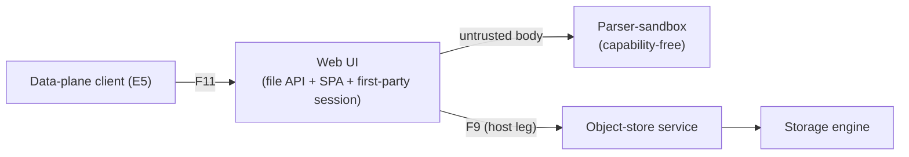

<!-- SPDX-License-Identifier: FSL-1.1-Apache-2.0 -->
<!-- Copyright (c) 2025 Open Computer Use Contributors -->

---
status: draft
last-reviewed: 2026-06-15
owner: "@Wide-Moat/architects"
applies-to: next/v1
compliance: []
threat-model: 06-threat-model.md
contract: [contracts/storage/file-artifact-api.schema.json]
adr: [0002, 0013, 0015, 0016, 0017, 0023, 0025]
---

The host-side file API and embeddable SPA an external data-plane client reaches to upload, preview, and download files; it calls the object-store service for every backend operation. Audience: engineers implementing or auditing the file data-plane surface.

# Component-08: Web UI

## Purpose

Serve file upload, list, preview, and download to an external data-plane client (E5, [`03-c4-context.md`](../03-c4-context.md) §4) through an HTTP file API and an embeddable SPA. The Web UI is an OCU design addition: a host-side data-plane surface that reaches storage only through the [object-store service](04-object-store-service.md).

## Boundaries

The Web UI fronts one counterparty: the external data-plane client (E5). It does not serve the untrusted guest, which reaches storage through its own mount client ([`05-session-sandbox.md`](05-session-sandbox.md)).

| Direction | What | From / to | Protocol |
|---|---|---|---|
| inbound | file API (upload / list / download / preview) and SPA; embed token verified, then a first-party session | Data-plane client (E5) → Web UI (F11) | HTTP+JSON on a dedicated file/UI ingress, not the MCP listener |
| internal | file operation after authorization (the host leg) | Web UI → object-store service (F9) | intra-deployment request |
| internal | untrusted artifact body for validation and preview-render | Web UI → parser-sandbox | capability-free sub-boundary (below) |
| outbound | OCSF File System Activity event per operation, durable-first (local commit before fan-out, fail-open producer) | Web UI → Audit pipeline (F10) | Published Language (OCSF) |

The Web UI never reaches the storage engine; the object-store service is the one door to storage and speaks the backend leg ([ADR-0015](../adr/0015-storage-decomposition-by-trust-plane.md)). `F#` flow labels are defined in [`05-c4-container.md`](../05-c4-container.md) §4. The files surface is one entry in the descriptor-driven view list ([ADR-0002](../adr/0002-session-view-descriptor.md)); the deferred live-view surfaces ([#210](https://github.com/Wide-Moat/open-computer-use/issues/210)) sit outside this spec. The public north op-shape is the Files-API (`/v1/files`) with an opaque, scope-bound `file_id` ([ADR-0023](../adr/0023-files-api-north-contract.md)); the embed-token verify, cookie/CSRF/CSP response envelope, three-axis authorization axes, and size ceilings survive as the auth/transport wrapper, frozen in [`file-artifact-api`](../../../contracts/storage/file-artifact-api.schema.json), and per-operation message bodies are TBD there and not invented here. The F9 host leg reaches the object-store service over its dedicated north listener — the five Files-API verbs against the durable handle-store, not the south mount RPC ([ADR-0025](../adr/0025-f9-internal-transport.md)).

### Parser-sandbox sub-boundary

Preview-render and archive ingest read an untrusted artifact body, so that work runs in the parser-sandbox: a capability-free boundary holding no signer and no key ([ADR-0015](../adr/0015-storage-decomposition-by-trust-plane.md)). A hostile body reaches code that can mint no session and reach no credential, so the session-minting authority and the untrusted-body parser are never co-resident ([#218](https://github.com/Wide-Moat/open-computer-use/issues/218)). The isolation substrate — process boundary versus in-language capability confinement — is open ([#218](https://github.com/Wide-Moat/open-computer-use/issues/218)).

### Owned state

| Owns | Does NOT hold |
|---|---|
| The first-party session minted after embed-token verify | No signing path; storage is reached only through the object-store service ([ADR-0015](../adr/0015-storage-decomposition-by-trust-plane.md)) |
| The `frame-ancestors` per-deployment allowlist and the file/UI ingress binding | No caller identity it mints: it verifies a peer-minted embed token; no OCU secret reaches the browser |
| The artifact bound to the embed-asserted principal | No kill-switch or lifecycle route (the [Control / operator API](02-control-operator-api.md)); no MCP listener (the [MCP gateway](01-mcp-gateway.md)) |

The aggregate root is the artifact plus its embed-asserted principal, not a running sandbox session. The data-plane client presents only an embed token. The OCU token taxonomy ([`02-trust-boundaries.md`](../02-trust-boundaries.md) §8) names three OCU-issued classes; the embed token is none of them — it is a peer-minted relying-party credential ([glossary: Embed token](../glossary.md#embed-token)), and its `exp` is fixed by [NFR-SEC-82](../manifesto/02-nfrs.md). The embed token is signed by the relying party — the embedding application or the customer IdP — off the OCU credential issuer and off the scoped storage JWT path; it is not the scoped storage JWT. Field types and wire detail live in [`file-artifact-api`](../../../contracts/storage/file-artifact-api.schema.json).

## Invariants

Each rule holds for any caller and is falsifiable by the named check. The reaching actor is A2 (external data-plane client). Cross-cutting properties (zone membership, in-transit encryption, retention floor, runtime tier) are Layer 3 and excluded here.

1. The Web UI sets no session state without a signature-valid, in-audience, unexpired embed token; a missing or invalid session yields 401 with no anonymous fallback (schema-validation, NFR-SEC-82).
2. Every state-mutating call requires a server-validated CSRF token, and every UI/artifact response carries `CSP: frame-ancestors` from the per-deployment allowlist (NFR-SEC-83, NFR-SEC-84). Header values are fixed in [`08-contracts.md`](../08-contracts.md) §3.
3. The Web UI holds no backend key and sends no OCU secret to the browser; the object-store service is the one door to storage and the Web UI reaches it over the host leg, never the storage engine directly ([ADR-0015](../adr/0015-storage-decomposition-by-trust-plane.md)) (unit-test + property-test, NFR-SEC-82, NFR-SEC-25).
4. Authorization (scope `filesystem_id` + intent `read`/`write`/`preview` + downloadable) is re-derived per request, deny-by-default, keyed on the authenticated caller; a `preview`-authorized caller cannot invoke `download` or `write`, and `intent=preview` stays read-only and non-downloadable regardless of stored tag (property-test, NFR-SEC-49, NFR-SEC-73).
5. The handle is an opaque, server-minted, scope-bound `file_id` ([ADR-0023](../adr/0023-files-api-north-contract.md)); the resolver always takes scope from the host-attested channel (embed-token + cookie) and refuses any `file_id` outside the attested `filesystem_id` scope, returning `not_found` (never `forbidden`) so a cross-scope or unknown id is indistinguishable from non-existence (anti-enumeration); traversal, symlink, absolute-path, and URL-shaped inputs are still rejected before any object-store-service call (property-test, NFR-SEC-49, NFR-SEC-80).
6. An inbound body above the configured ceiling is rejected pre-buffer, never partially staged; an archive body is validated (uncompressed total, entry count, traversal, symlink) and content-classified before extraction (schema-validation + property-test, NFR-SEC-78, NFR-SEC-80, NFR-SEC-81).
7. Preview-render and archive validation run in the parser-sandbox; a body the parser rejects mints no session state and reaches no credential ([#218](https://github.com/Wide-Moat/open-computer-use/issues/218)) (isolation assertion, NFR-SEC-25, NFR-SEC-49).
8. Every file operation commits an OCSF File System Activity event to a local durable record before the operation is acknowledged, under host-attested identity, then fans it out to the hash-chained pipeline; the durable commit is the non-repudiation point, so a downstream sink failure does not deny or stall the operation (durable-first fail-open) — a dropped fan-out is counted and reconciled, never silently lost (unit-test, NFR-SEC-79).

## Failure modes

Each row names its P4-artifact STRIDE row in [`06-threat-model.md`](../06-threat-model.md) §3 and that row's controlling NFRs. The reaching actor is A2. Fail-closed is the default on every authorization and ingest boundary; the file-op audit boundary is durable-first fail-open (local commit before fan-out, a downstream sink failure does not deny the operation), while a privileged operator/SOAR action stays fail-closed (NFR-SEC-45/P7-R3).

| Failure | Trace | Recovery behaviour |
|---|---|---|
| Client replays, forges, or frames the embed token | P4-artifact-S3 (NFR-SEC-82, SEC-83) | Verify before minting a first-party session; `frame-ancestors` allowlist denies cross-origin framing. Residual: no replay-binding within TTL — [#217](https://github.com/Wide-Moat/open-computer-use/issues/217). |
| Cross-site forgery against the first-party cookie, or token leak via `Referer` | P4-artifact-T3 (NFR-SEC-84, SEC-82) | First-party cookie with server-validated CSRF token on every mutating call; 401 on invalid session. Residual: token-pattern and `exp`-in-URL hardening — [#187](https://github.com/Wide-Moat/open-computer-use/issues/187). |
| Forged-id read, preview leak via `postMessage('*')`, or `downloadable=false` bytes shipped | P4-artifact-I3 (NFR-SEC-49, SEC-73, SEC-83) | Authorization re-derived from the host-attested principal; preview read-only and non-downloadable; framing closed by the allowlist. Residual: per-object authz granularity — [#187](https://github.com/Wide-Moat/open-computer-use/issues/187); parser isolation — [#218](https://github.com/Wide-Moat/open-computer-use/issues/218). |
| Inbound flood: pre-auth verify cost, oversized upload, zip-bomb preview | P4-artifact-D3 (NFR-SEC-78, SEC-80) | Body capped pre-buffer on a file/UI ingress distinct from the MCP listener; archive validated before extraction. Residual: pre-auth verify-cost flood — [#188](https://github.com/Wide-Moat/open-computer-use/issues/188). |
| Upload, download, delete, or preview later disputed | P4-artifact-R2 (NFR-SEC-79, SEC-09) | OCSF event per operation, committed to the local durable record (fsync) before fan-out and under host-attested identity; that durable commit is the non-repudiation point, so a downstream sink failure neither denies nor stalls the operation — a dropped fan-out is counted and reconciled. Residual: binding OCSF `actor` to the embed-asserted principal — [#181](https://github.com/Wide-Moat/open-computer-use/issues/181). |
| Client flips intent or tag to escalate `preview`→`download`/`write`, or a crafted id drives path escape | P4-artifact-E3 (NFR-SEC-49, SEC-73, SEC-80) | Authorization scoped to verb plus exact `filesystem_id` prefix, enforced at the object-store-service boundary; preview stays read-only; traversal rejected pre-extraction in the parser-sandbox. Residual: per-action granularity — [#187](https://github.com/Wide-Moat/open-computer-use/issues/187). |

The backend leg is the object-store service's concern, not the Web UI's: scope is enforced at the storage engine ([ADR-0013](../adr/0013-storage-credential-custody.md)). Guest-mount spoofing and mount remanence are P4-mount rows on the [object-store service](04-object-store-service.md) and [`05-session-sandbox.md`](05-session-sandbox.md).

## Operational concerns

Config surface: the file/UI ingress binding (distinct from the MCP listener), the embed-token issuer and audience, the `frame-ancestors` per-deployment allowlist, and the inbound-body and archive ceilings (NFR-SEC-78, NFR-SEC-80; defaults fixed in [`08-contracts.md`](../08-contracts.md) §3). Observability is the OCSF File System Activity stream (invariant 8) plus per-caller rate counters. The Web UI commits each OCSF event to a local durable record before fan-out on the audit fan-in flow F10; that durable commit is the non-repudiation point, so a downstream sink failure neither denies nor stalls the file operation, and a dropped fan-out is counted and reconciled, not lost (per the audit contract ([`audit-fanin`](../../../contracts/audit/audit-fanin.asyncapi.yaml)) and NFR-SEC-03 / NFR-SEC-79).

Deployable: the Web UI is its own deployable — repository `ocu-webui` — distinct from the object-store service and the per-session executor ([ADR-0015](../adr/0015-storage-decomposition-by-trust-plane.md)). Whether it stays a separate repository or co-houses as a binary is an open owner decision ([ADR-0017](../adr/0017-control-plane-repo-boundary.md)). It runs at the [NFR-SEC-02](../manifesto/02-nfrs.md) hardened-`runc` floor; it executes no agent-issued code, so it carries no `workload_trust_profile` tier (that axis is the sandbox's, [NFR-SEC-38](../manifesto/02-nfrs.md)).

Scaling: per validated caller, not per sandbox session. Capacity is bounded by the per-caller inbound-byte and rate ceilings (NFR-SEC-78). Shelf delta: on the minimal shelf the embed flow is a pre-issued token with `frame-ancestors 'self'` and no IdP; on the full shelf it is an OIDC embed via the customer IdP with the allowlist configured per deployment (NFR-SEC-82, NFR-SEC-83). All invariants hold on both shelves.

## Open questions

1. ~~Parser-sandbox substrate for untrusted preview and archive bodies — process boundary versus in-language capability confinement — [#218](https://github.com/Wide-Moat/open-computer-use/issues/218).~~ Resolved by [ADR-0026](../adr/0026-parser-sandbox-substrate.md): ingest stays in-language capability-free; body render runs in a browser null-origin sandboxed iframe under a body content-CSP; a server-side heavy parser flips to a process boundary deferred behind an adoption trigger.
2. Embed-token replay-binding (`jti`/nonce single-use or token↔channel binding) within the `exp` window — [#217](https://github.com/Wide-Moat/open-computer-use/issues/217).
3. Per-action and per-object authorization granularity beyond resource class — [#187](https://github.com/Wide-Moat/open-computer-use/issues/187).
4. Binding the OCSF `actor` to the embed-asserted principal on the Web UI event — [#181](https://github.com/Wide-Moat/open-computer-use/issues/181).

---

Hard cap: 600 lines. Sections appear in this fixed order. No additional H2 headings outside this list.
