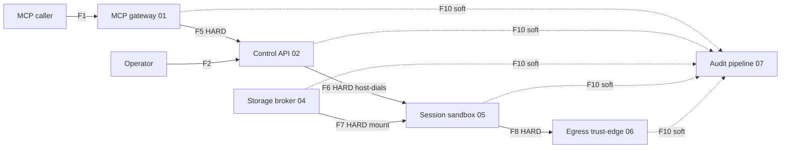

<!-- SPDX-License-Identifier: FSL-1.1-Apache-2.0 -->
<!-- Copyright (c) 2025 Open Computer Use Contributors -->

---
status: draft
last-reviewed: 2026-06-07
owner: "@Wide-Moat/architects"
applies-to: next/v1
---

Dependency-ordered build plan for the minimal-shelf implementation — contract-freeze first, a thin end-to-end thread next, then parallel fan-out — for the team implementing `next/v1` in the code repository.

# Implementation roadmap — minimal shelf

The architecture set (`docs/architecture/`) is settled enough to build: six components, eleven inter-component edges (F1–F11), six drafted contracts, and eleven ADRs (ADR-0001 `accepted`, 0002–0011 `proposed` with settled decisions). This roadmap orders the build so a team working in parallel proves integration early and never codes against a moving contract.

Scope: the **minimal shelf** only — one-click solo deployment, `trusted_operator` profile, `runc` runtime, local-volume storage engine, host-local credentials, file-system audit sink. No IdP, no KVM, no SIEM, no external store. Full-shelf features are listed once, at the end, as deferred.

## Components and edges

The six containers and the directed edges between them ([`05-c4-container.md`](../architecture/05-c4-container.md) §4 defines the F-labels). HARD = the target must exist for the source's critical path; SOFT = the source emits without blocking.

| Edge | Source → Target | Crosses | Type |
|---|---|---|---|
| F1 | MCP caller → MCP gateway (01) | MCP authz spec | inbound |
| F5 | MCP gateway (01) → Control API (02) | session create/status, service identity | HARD |
| F2 | Operator → Control API (02) | operator-only ingress, kill-switch | HARD (privileged) |
| F6 | Control API (02) → Session sandbox (05) | Session JWT, host dials guest | HARD |
| F7 | Storage broker (04) → Session sandbox (05) | mount, `filesystem_id` handle | HARD |
| F8 | Session sandbox (05) → Egress trust-edge (06) | single outbound path | HARD |
| F9 | Storage broker (04) → Egress trust-edge (06) | broker-signed backend leg (network engine only) | HARD (network engine) |
| F10 | every container → Audit pipeline (07) | OCSF event | SOFT (async fan-in) |
| F11 | data-plane client → Storage broker (04) north face | file/artifact API | SOFT (post-v1) |

The graph is acyclic. `F1 → F5 → F6` is the integration spine; every other edge is either deferred or async fan-in.

## Build order

Freeze the spine contracts before any component code; prove the end-to-end thread before thickening any single component (walking skeleton, not horizontal layers). The audit fan-in (F10) is async, so it is stubbed during the skeleton and the real pipeline is built in parallel afterward.

### Phase 0 — Contract freeze (no service code)

Two spine edges are stubs ([#205](https://github.com/Wide-Moat/open-computer-use/issues/205)); freeze them before opening any consumer.

| Task | Edge | Contract | State today |
|---|---|---|---|
| Freeze session set-up RPC | F5 (gateway↔Control), F6 lifecycle | session-setup (Protobuf/gRPC) | stub, [#205](https://github.com/Wide-Moat/open-computer-use/issues/205) |
| Freeze operator REST surface | F2 | operator OpenAPI | stub, [#205](https://github.com/Wide-Moat/open-computer-use/issues/205) |
| Confirm exec channel | F6 dial | [`exec/exec-channel.schema.json`](../../contracts/exec/exec-channel.schema.json) | drafted — confirm, do not redesign |
| Confirm audit envelope | F10 | [`audit/audit-fanin.asyncapi.yaml`](../../contracts/audit/audit-fanin.asyncapi.yaml) | drafted — emitters code against it |

### Phase 1 — Tracer slice (single thread, minimal parallelism)

Build the narrowest path that proves the three load-bearing HARD edges (F5, F6, exec contract) end to end: a caller issues one exec and gets a result. The Session sandbox is the core and the most self-contained piece — it builds first, against a thin Control driver that does only what the sandbox needs to come up. Everything else on the slice exists to stand the sandbox up and carry one call. Audit writes to a NULL sink. This is sequential by nature — it is the integration proof the team merges into.

1. **Session sandbox (05)** — the core. Guest agent as PID 1, host-side exec supervisor terminating the dialled channel over the frozen [`exec/exec-channel.schema.json`](../../contracts/exec/exec-channel.schema.json). `runc` + hardened posture (seccomp BPF, Landlock, cap-drop ALL, read-only rootfs; [ADR-0003](../architecture/adr/0003-sandbox-runtime-tier-ladder.md) `trusted_operator` × `runc` cell). One container; the sub-container split ([#174](https://github.com/Wide-Moat/open-computer-use/issues/174)) is deferred.
2. **Control / operator API (02)** — thin driver only at this phase: the lifecycle controller's two ordered steps — **create** the container (runc orchestration), then **dial** into it (Session JWT bound to `container_name` over the host-opened exec channel; the guest listens, non-host peers dropped at accept). Minimal-shelf auth is a host-rooted local operator credential ([ADR-0004](../architecture/adr/0004-operator-authentication-substrate.md) minimal variant). The session registry, denylist, quota, and kill-switch are not on the slice — they land in Phase 2.
3. **MCP gateway (01)** — inbound MCP validator ([`mcp/2025-06-18/ocu-constraints.schema.json`](../../contracts/mcp/2025-06-18/ocu-constraints.schema.json)) forwarding session create/status to the Control driver over the frozen F5 RPC. Stateless per request.

### Phase 2 — Parallel fan-out

Each track hangs off the proven spine behind a frozen contract, so the team runs them concurrently.

- **Track A — Control / operator API (02), full surface.** Thicken the Phase-1 driver into the session registry, the denylist (kill-switch authority, NFR-SEC-01), quota counters, and the operator/SOAR ingress (F2/F4). The customer-IdP + PAM-JIT path is full-shelf ([ADR-0004](../architecture/adr/0004-operator-authentication-substrate.md), [#225](https://github.com/Wide-Moat/open-computer-use/issues/225)).
- **Track B — Audit pipeline (07).** Swap the NULL sink for the real pipeline behind the F10 envelope: host-attested ingest, fsync-then-ack local durable commit, hash-chain writer, daily Merkle head, file-system sink ([ADR-0009](../architecture/adr/0009-audit-pipeline-pluggable-by-contract.md), minimal shelf). The bus, WORM store, SIEM bridge, and transparency log are pluggable seams, off on the minimal shelf.
- **Track C — Storage broker (04), south face.** The `filesystem_id`-scoped mount (F7) over the built storage contracts ([`mount-config`](../../contracts/storage/mount-config.schema.json), [`file-ops`](../../contracts/storage/file-ops.schema.json)). Local-volume backend engine — no network leg, so no F9 ([ADR-0010](../architecture/adr/0010-storage-backend-pluggable-adapter.md)). Host-local backend credential, admitted only single-tenant `trusted_operator` (NFR-SEC-60). The north face (F11, SPA) is deferred ([ADR-0002](../architecture/adr/0002-session-view-descriptor.md), post-v1).
- **Track D — Egress trust-edge (06), minimal rung.** Deny-all or transparent pass-through only (NFR-FLEX-15 ladder; [`02-trust-boundaries.md`](../architecture/02-trust-boundaries.md) §7): a deny-by-default forward route with the `x-deny-reason` structured deny and the content-blind egress tripwire (NFR-SEC-57). No CA, no SDS, no credential injection — those are the bump rung and above (full shelf).

## Deferred to the full shelf (not minimal Phase 1–2)

Each is a clean abstraction boundary the minimal shelf builds against, activated later.

| Feature | Anchor | Gate |
|---|---|---|
| Customer IdP + PAM-JIT operator auth | [ADR-0004](../architecture/adr/0004-operator-authentication-substrate.md) full variant | [#225](https://github.com/Wide-Moat/open-computer-use/issues/225) |
| STS-scoped-per-session backend credential | [ADR-0010](../architecture/adr/0010-storage-backend-pluggable-adapter.md), NFR-SEC-25 | full shelf |
| gVisor / microVM runtime tiers | [ADR-0003](../architecture/adr/0003-sandbox-runtime-tier-ladder.md) | [#161](https://github.com/Wide-Moat/open-computer-use/issues/161) |
| Egress bump rung + SDS minter + credential injection | [ADR-0005](../architecture/adr/0005-egress-credential-delivery-envoy-sds.md), [ADR-0007](../architecture/adr/0007-egress-auth-mechanism.md) | [#240](https://github.com/Wide-Moat/open-computer-use/issues/240) |
| Broker north face / live-session views | [ADR-0002](../architecture/adr/0002-session-view-descriptor.md) | [#210](https://github.com/Wide-Moat/open-computer-use/issues/210) |
| WORM store, SIEM bridge, transparency log | [ADR-0009](../architecture/adr/0009-audit-pipeline-pluggable-by-contract.md) | [#150](https://github.com/Wide-Moat/open-computer-use/issues/150), [#151](https://github.com/Wide-Moat/open-computer-use/issues/151) |

## Test coverage moves with the code

Each component's verification method is named in its owning NFR row ([`manifesto/02-nfrs.md`](../architecture/manifesto/02-nfrs.md) verification column) and in the STRIDE rows it must exercise ([`06-threat-model.md`](../architecture/06-threat-model.md)). Tests ship in the same PR as the code, using the method the NFR names: unit and property tests on parsers and the policy resolver, integration tests on each HARD edge, the exec golden-path E2E on the Phase 1 slice. The CI gates already enforced on every PR (secrets, SAST, SCA, IaC, contract-schema, doc-lint) bound it; the performance baselines are the NFR-PERF rows (session-create p99, exec overhead, egress latency, audit backpressure). A consolidated test-strategy doc lands once the first component's code does, when at least one verification cell is enforced rather than planned.

## Open questions

1. Broker and edge cardinality — one instance per deployment or per sandbox host — picks a topology at build time; the diagram may change, the component specs do not. [#175](https://github.com/Wide-Moat/open-computer-use/issues/175).
2. Session sandbox sub-container split (exec supervisor vs guest as separate containers). [#174](https://github.com/Wide-Moat/open-computer-use/issues/174).
